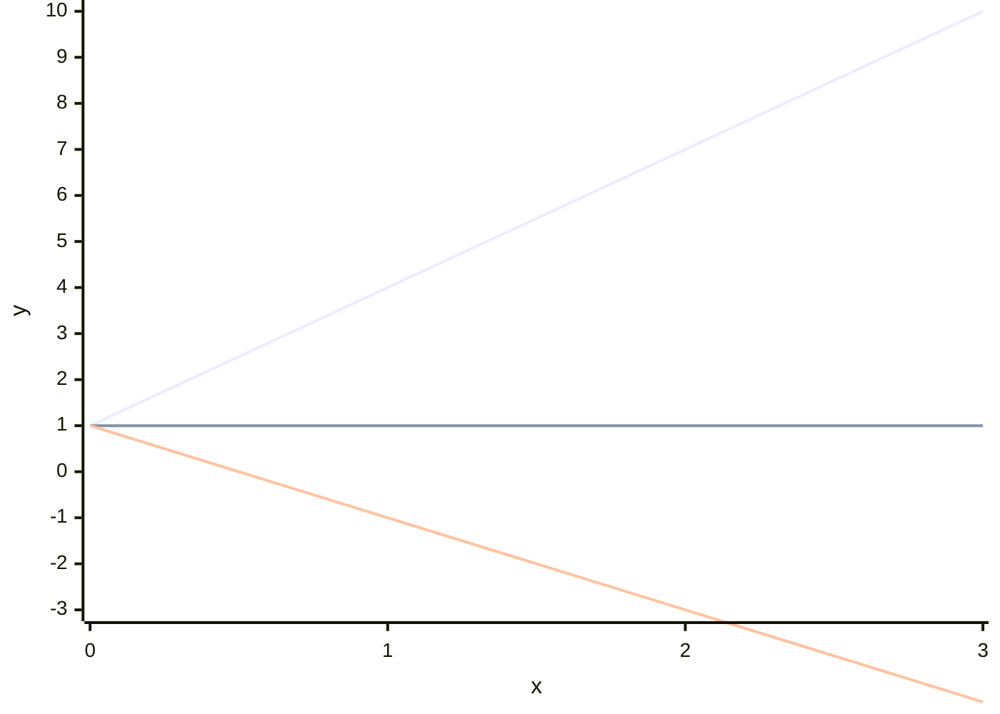

# 3.3 Linear Functions and Gradient

Tags: #maths/functions #maths/graphs #cs/linear

## Position in the Course
Prerequisites: [[3.2 Function Notation and Mapping]], [[2.5 Solving Linear Equations]]

Used later in: [[7.10 Orthogonality and Least Squares]], [[9.9 Gradient Descent and Optimisation]]

Mastery threshold: 90% overall, and 100% on the New Words section.

> [!tip] How to study this note
> Read one breadcrumb, cover it, then explain it aloud in your own words. After each example, sketch the line on paper and label gradient and intercept.

---

## Introduction

A **linear function** changes at a constant rate. Its graph is always a straight line, written as `y = mx + c` where **m** is the **gradient** (steepness) and **c** is the **y-intercept** (where the line crosses the y-axis). The **rate of change** is constant: every step of 1 in x changes y by exactly m.

If a taxi charges £3 to start plus £2 per mile, the total cost grows by £2 for every extra mile. That steady add-on is a linear rate of change.

> [!example] Everyday idea
> Filling a pool at 5 litres per minute: after 1 minute you have 5 L, after 2 minutes 10 L, after 3 minutes 15 L. The amount grows by the same amount each minute.

## New Words

- [[gradient]] — the steepness of a line; change in y divided by change in x.
- [[intercept]] — where a graph crosses an axis, often the y-value when x = 0.
- [[slope]] — another name for gradient — how much y changes per unit change in x.
- [[rate of change]] — how fast one quantity changes relative to another; constant for linear functions.
- [[y equals mx plus c]] — the form y = mx + c where m is gradient and c is y-intercept.

---

## Breadcrumbs

### Breadcrumb 1: The Form y = mx + c

**Builds on:** [[3.2 Breadcrumb 2|Function Notation f(x)]] (f(x) replaces y), [[2.6 Breadcrumb 3|Isolating with Inverse Operations]] (rearranging to y = mx + c)

A linear function is usually written:

```text
y = mx + c
```

- **m** = [[gradient]] (steepness)
- **c** = y-[[intercept]] (where the line crosses the y-axis when x = 0)

Example:

```text
y = 2x + 3
```

- gradient m = 2 (y increases by 2 when x increases by 1)
- y-intercept c = 3 (line crosses y-axis at (0, 3))

```mermaid
xychart-beta
  x-axis "x" [0, 1, 2, 3, 4]
  y-axis "y" 0 --> 12
  line [3, 5, 7, 9, 11]
```

> [!important] m and c are fixed numbers
> In a linear function, m and c are constants. Only x and y vary.

#### Chunked Example
Question: In `y = -x + 5`, state the gradient and y-intercept.

Step 1: Compare to `y = mx + c`.

```text
m = -1,  c = 5
```

Step 2: Interpret.

Gradient = **-1** (line goes down as x increases).
Y-intercept = **5** (crosses y-axis at (0, 5)).

Answer: **m = -1**, **c = 5**.

---

### Breadcrumb 2: Gradient as Rate of Change

**Builds on:** [[3.3 Breadcrumb 1|The Form y = mx + c]] (m is the gradient), [[2.5 Breadcrumb 3|One-Step Equations]] (dividing to find m)

The [[gradient]] (or [[slope]]) measures **change in y ÷ change in x**:

```text
m = (y₂ - y₁) / (x₂ - x₁)
```

From points (1, 3) and (3, 7):

```text
m = (7 - 3) / (3 - 1) = 4/2 = 2
```

So y increases by **2** for every **1** unit increase in x.

> [!tip] Rise over run
> "Rise" = vertical change. "Run" = horizontal change. Gradient = rise ÷ run.

#### Chunked Example
Question: Find the gradient through (2, 5) and (6, 13).

Step 1: Subtract y-values.

```text
13 - 5 = 8
```

Step 2: Subtract x-values.

```text
6 - 2 = 4
```

Step 3: Divide.

```text
m = 8/4 = 2
```

Answer: **Gradient = 2**.

---

### Breadcrumb 3: Positive, Negative, and Zero Gradient

**Builds on:** [[3.3 Breadcrumb 2|Gradient as Rate of Change]] (m can be any number), [[1.8 Breadcrumb 4|Ordering Negative Numbers]] (negative slope goes down)

- **m > 0** → line slopes **up** left to right
- **m < 0** → line slopes **down** left to right
- **m = 0** → **horizontal** line (y stays constant)



> [!warning] Division order matters
> Always use `(y₂ - y₁) / (x₂ - x₁)`, not the reverse.

#### Chunked Example
Question: A line passes through (0, 4) and (4, 4). What is the gradient?

Step 1: Calculate changes.

```text
Δy = 4 - 4 = 0
Δx = 4 - 0 = 4
```

Step 2: Divide.

```text
m = 0/4 = 0
```

Answer: **Gradient = 0** (horizontal line).

---

### Breadcrumb 4: The y-Intercept

**Builds on:** [[3.3 Breadcrumb 1|The Form y = mx + c]] (c is the y-intercept), [[3.1 Breadcrumb 3|Negative Coordinates]] (intercept can be negative)

The y-[[intercept]] is where the line crosses the **y-axis** (x = 0).

For `y = mx + c`, the y-intercept is simply **c** because:

```text
y = m(0) + c = c
```

Point: **(0, c)**.

> [!example] CS connection
> In `y = 0.05x + 100`, the 100 is a fixed base cost (y-intercept) and 0.05 is cost per unit (gradient) — typical pricing linear models.

#### Chunked Example
Question: Find the y-intercept of the line through (0, -2) and (3, 4).

Step 1: The point (0, -2) has x = 0.

Step 2: When x = 0, y = -2.

Answer: **Y-intercept = -2** at point **(0, -2)**.

---

### Breadcrumb 5: Finding the Equation of a Line

**Builds on:** [[3.3 Breadcrumb 2|Gradient as Rate of Change]] (know m), [[3.3 Breadcrumb 4|The y-Intercept]] (find c), [[2.5 Breadcrumb 4|Two-Step Equations]] (solve for c)

Given gradient **m** and y-intercept **c**:

```text
y = mx + c
```

Given gradient **m** and one point (x₁, y₁):

Substitute into `y = mx + c` and solve for c.

Example: m = 2, point (1, 5):

```text
5 = 2(1) + c
c = 3
```

Equation: **y = 2x + 3**.

> [!important] Check with a second point
> Substitute another known point to verify.

#### Chunked Example
Question: A line has gradient 3 and passes through (2, 11). Find its equation.

Step 1: Start with `y = 3x + c`.

Step 2: Substitute (2, 11).

```text
11 = 3(2) + c
11 = 6 + c
c = 5
```

Step 3: Write the equation.

Answer: **y = 3x + 5**.

---

### Breadcrumb 6: Parallel Lines

**Builds on:** [[3.3 Breadcrumb 1|The Form y = mx + c]] (same m = parallel), [[2.8 Breadcrumb 6|Consistent and Inconsistent Systems]] (parallel lines never meet)

Two lines are **parallel** when they have the **same gradient** but different y-intercepts.

```text
y = 2x + 1
y = 2x - 4   ← parallel (both m = 2)
```

Parallel lines never meet (unless they are the same line).

> [!example] CS connection
> Linear interpolation between two points uses the gradient between them:

```python
def lerp(a, b, t):
    return a + t * (b - a)  # gradient (b-a) over t from 0 to 1
```

#### Chunked Example
Question: Are `y = 4x + 1` and `y = 4x - 3` parallel?

Step 1: Read gradients. Both have **m = 4**.

Step 2: Compare y-intercepts: 1 ≠ -3, distinct lines.

Step 3: Same gradient → parallel.

Answer: **Yes**, they are parallel.

---

## Why This Works

Linear functions work because the [[rate of change]] is **constant**. Every step of 1 in x changes y by exactly m.

That constancy produces a straight line on the coordinate plane. The y-[[intercept]] fixes where the line starts vertically; the [[gradient]] fixes how steeply it climbs or falls.

---

## Worked Examples

For fully worked solutions, use [[3.3 Linear Functions and Gradient - Worked Examples]].

### Example 1 - Read m and c
Question: State gradient and y-intercept of `y = -2x + 7`.

Solution: m = **-2**, c = **7**.

### Example 2 - Find gradient from two points
Question: Gradient through (1, 2) and (4, 11)?

Solution: m = (11-2)/(4-1) = 9/3 = **3**.

### Example 3 - Apply to CS
Question: Data transfer at 50 MB/s starting from 200 MB already sent. Write y = mx + c for total MB after t seconds.

Solution: m = 50, c = 200 → **y = 50t + 200**.

---

## Common Mistakes

- Swapping rise and run: using (x₂-x₁)/(y₂-y₁) instead of (y₂-y₁)/(x₂-x₁).
- Confusing x-intercept with y-intercept.
- Thinking parallel lines must have the same y-intercept.
- Forgetting that horizontal lines have gradient 0.
- Sign errors when m is negative.

> [!failure] Mistake pattern
> If your gradient has the wrong sign, check whether y increased or decreased as x increased.

---

## Where This Shows Up in CS

Linear functions appear in:

- **Linear interpolation** — animation, audio crossfade
- **Big-O comparison lines** — n, n log n on log-log plots
- **Cost models** — base fee + per-unit charge
- **Simple regression** — trend lines through data
- **Gradient descent** — update rule uses a step along a linear direction

```python
# Cost: £5 base + £0.02 per API call
def cost(calls):
    return 0.02 * calls + 5
```

---

## Checkpoint Questions

1. What do m and c mean in y = mx + c?
2. How do you calculate gradient from two points?
3. What gradient does a horizontal line have?
4. What does a negative gradient look like?
5. Where is the y-intercept on a graph?
6. Are y = 3x + 1 and y = 3x + 8 parallel?
7. Find the gradient through (0, 0) and (2, 6).
8. Write the equation of a line with m = 1 and c = -4.
9. What real quantity might m represent in a phone bill model?
10. How does a linear function relate to f(x) notation?

---

## Mini-Quiz

1. Define [[gradient]] in your own words.
2. Define [[intercept]] in your own words.
3. Define [[slope]] in your own words.
4. Define [[rate of change]] in your own words.
5. Define [[y equals mx plus c]] in your own words.
6. State m and c in `y = 5x - 2`.
7. Find m through (1, 4) and (3, 10).
8. Find the y-intercept of `y = -x + 6`.
9. Write the equation with m = 2 and c = 0.
10. Explain one CS use of a linear cost model.

---

## Pass Gate

You may move to [[3.4 Quadratic Functions]] only when you can:

- define every term in [[#New Words]]
- find gradient from two points
- identify m and c from an equation
- write y = mx + c given m and a point
- recognise parallel lines
- answer at least 9 out of 10 mini-quiz questions correctly
- complete [[3.3 Linear Functions and Gradient - Mastery Test]]

---

## Related Notes

Backward links: [[3.2 Function Notation and Mapping]], [[2.5 Solving Linear Equations]], [[3.1 Coordinates and Axes]]

Forward links: [[7.10 Orthogonality and Least Squares]], [[9.9 Gradient Descent and Optimisation]]

Assessment links: [[3.3 Linear Functions and Gradient - Worked Examples]], [[3.3 Linear Functions and Gradient - Practice Questions]], [[3.3 Linear Functions and Gradient - Mastery Test]], [[3.3 Linear Functions and Gradient - Answers]]
