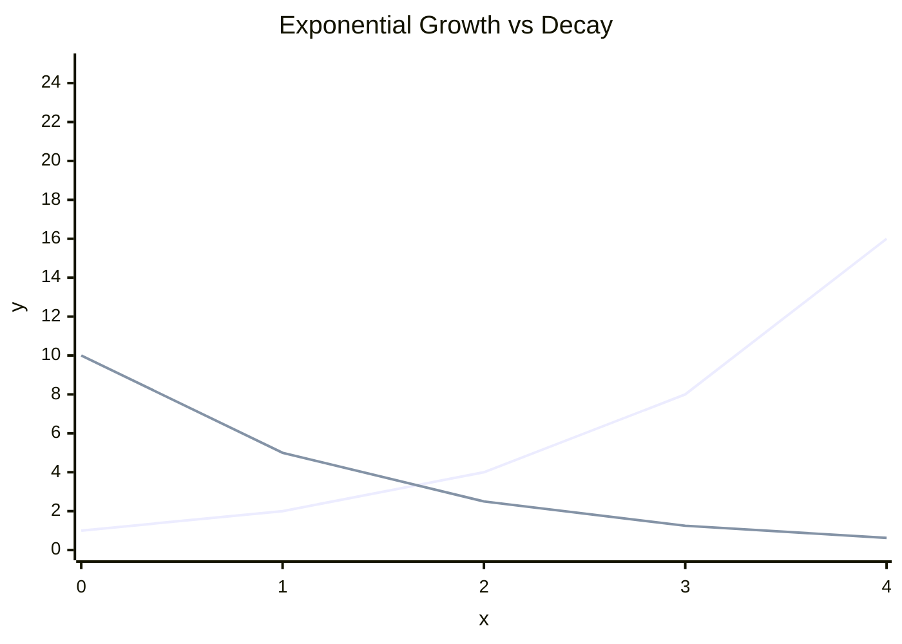
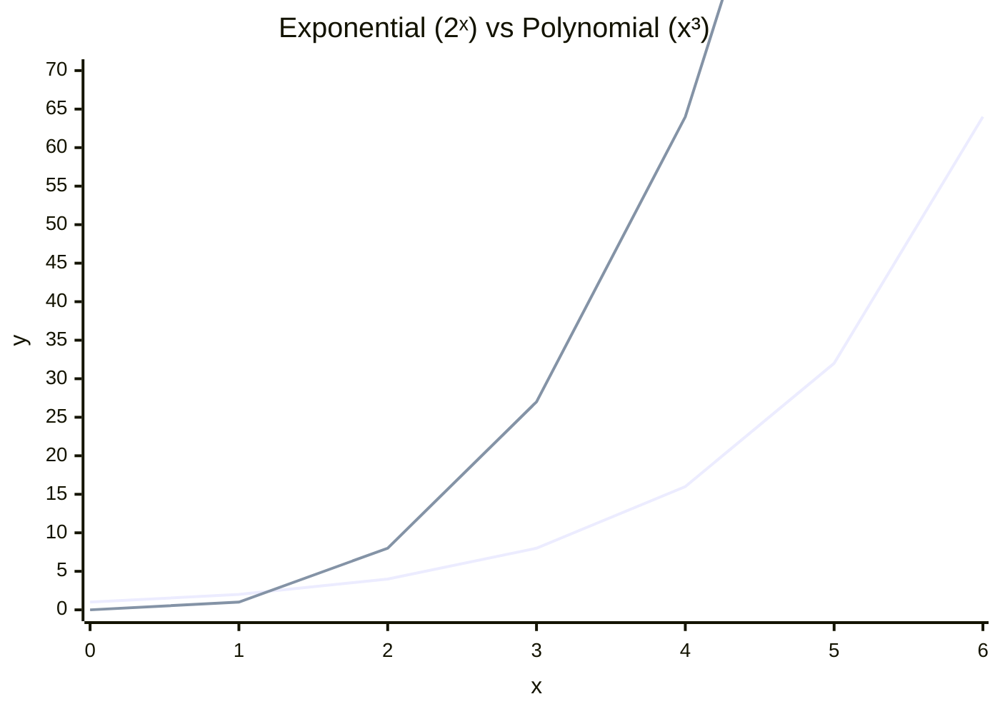

# 3.6 Exponential Functions

Tags: #maths/functions #maths/graphs #maths/indices #cs/algorithms

## Position in the Course
Prerequisites: [[2.9 Indices and Powers]], [[3.2 Function Notation and Mapping]], [[3.3 Linear Functions and Gradient]]

Used later in: [[6.6 Recurrence Relations]], [[10.1 Big O Theta and Omega]], [[10.4 Floating Point and Rounding Error]]

Mastery threshold: 90% overall, and 100% on the New Words section.

> [!tip] How to study this note
> Build tables before drawing graphs. Exponential functions are easiest when you can see each output being made by repeated multiplication.

---

## Introduction

An **exponential function** changes by multiplying by the same factor each step. Linear functions add the same amount each step; exponentials put the input in the exponent. That makes them grow or shrink very quickly. The general form is `y = a · bˣ`, where `a` is the starting value and `b` is the per-step multiplier.

The **base** `b` determines whether the function grows (b > 1) or decays (0 < b < 1). The **growth factor** or **decay factor** is the multiplier used each step. A horizontal **asymptote** is a line the graph approaches but never reaches — for simple exponentials it is `y = 0`.

> [!example] Everyday idea
> If a population doubles every hour, it multiplies by 2 each step: 10, 20, 40, 80, 160. That repeated multiplication is exponential growth.

## New Words

- [[exponential growth]] — increase by a fixed multiplier per step.
- [[growth factor]] — the multiplier greater than 1 used each step in exponential growth.
- [[decay factor]] — the multiplier between 0 and 1 used each step in exponential decay.
- [[base]] — the number being raised to a power.
- [[asymptote]] — a line a graph gets closer to but does not reach.

---

## Breadcrumbs

### Breadcrumb 1: Exponential Means the Input Is in the Power

**Builds on:** [[2.9 Breadcrumb 1|Repeated Multiplication as a Power]] (bˣ means repeated multiplication)

An exponential function often has the form:

```text
y = a * bˣ
```

- **a** is the starting amount when x = 0.
- **b** is the [[base]] and multiplier per step.
- **x** is the input, used as the power.

Compare the three main function types:

```text
linear:      y = 3x      repeated addition
polynomial:  y = x³      input raised to fixed power
exponential: y = 3ˣ      fixed base raised to input power
```

> [!important] Do not confuse x² with 2ˣ
> `x²` is polynomial. `2ˣ` is exponential. The position of x changes the whole behaviour.

#### Chunked Example
Question: Which functions are exponential? A: y = 5 · 2ˣ, B: y = x⁵, C: y = 3 · 0.5ˣ, D: y = 2x + 7.

Step 1: Look for x in the exponent. A has 2ˣ. C has 0.5ˣ.

Step 2: Exclude powers where x is the base — B is polynomial.

Step 3: Exclude linear rules — D has x to power 1.

Answer: **A and C are exponential functions**.

---

### Breadcrumb 2: Growth Factor

**Builds on:** [[3.6 Breadcrumb 1|Exponential Means the Input Is in the Power]] (b is the base), [[3.3 Breadcrumb 2|Slope as Constant Change]] (linear adds; exponential multiplies)

When the [[base]] is greater than 1, the function shows [[exponential growth]].

```text
y = 4 * 3ˣ
```

At x = 0: y = 4 · 3⁰ = 4. Each time x increases by 1, y multiplies by 3: 4, 12, 36, 108, 324.

The [[growth factor]] is 3.

> [!example] CS connection
> If each server sends a message to 3 new servers each round, the count follows powers of 3.

#### Chunked Example
Question: For `y = 10 * 2ˣ`, find y when x = 0, 1, 2, 3 and name the growth factor.

Step 1: x = 0 → y = 10 · 2⁰ = 10.

Step 2: Multiply by 2 each step: 20, 40, 80.

Answer: Values are **10, 20, 40, 80**; growth factor is **2**.

---

### Breadcrumb 3: Decay Factor

**Builds on:** [[3.6 Breadcrumb 2|Growth Factor]] (same repeated multiplication, different base range), [[1.6 Breadcrumb 2|Equivalent Fractions]] and [[1.7 Breadcrumb 3|Percentage as Multiplier]] (0.5 = ½, 80% = 0.8)

When the [[base]] is between 0 and 1, the function shows exponential decay.

```text
y = 100 * 0.5ˣ
```

Each step multiplies by 0.5: 100, 50, 25, 12.5, 6.25.

The [[decay factor]] is 0.5.

> [!warning] Decay does not mean subtract the same amount
> Subtracting 10 each step is linear. Multiplying by 0.9 each step is exponential decay.

Here is a visual comparison of growth and decay:



#### Chunked Example
Question: A cache keeps 80% of a signal each second. Starting from 500, model the amount after 3 seconds.

Step 1: 80% = 0.8.

Model: A(t) = 500 · 0.8ᵗ.

Step 2: t = 3 → A(3) = 500 · 0.8³ = 500 · 0.512 = 256.

Answer: The amount after 3 seconds is **256**.

---

### Breadcrumb 4: Tables and Graph Shape

**Builds on:** [[3.6 Breadcrumb 1|Exponential Means the Input Is in the Power]] (compute values), [[3.1 Breadcrumb 4|Plotting Points]] (table rows become points)

For `y = 2ˣ`:

```text
x     -2    -1     0     1     2     3
y    1/4   1/2     1     2     4     8
```

The graph rises slowly on the left and very quickly on the right.

For `y = (½)ˣ`:

```text
x      0     1     2     3
y      1    1/2   1/4   1/8
```

The graph decays toward zero.

> [!important] Exponential graphs do not have constant gradient
> The graph gets steeper during growth and flatter during decay.

#### Chunked Example
Question: Make a table for `y = 3ˣ` from x = 0 to x = 4.

Start at x = 0: 3⁰ = 1. Multiply by 3 each step: 3, 9, 27, 81.

Answer: y-values are **1, 3, 9, 27, 81**.

---

### Breadcrumb 5: Initial Value and the y-Intercept

**Builds on:** [[3.6 Breadcrumb 4|Tables and Graph Shape]] (read a from x = 0), [[2.9 Breadcrumb 1|Repeated Multiplication as a Power]] (b⁰ = 1), [[3.3 Breadcrumb 5|y-Intercept]] (intercept from x = 0)

In `y = a * bˣ`, the y-intercept is **a** because x = 0 gives y = a · 1 = a.

> [!example] Model reading
> In `P(t) = 250 * 1.04ᵗ`, the initial value is 250 and the growth factor is 1.04, meaning 4% growth per time step.

#### Chunked Example
Question: For `M(t) = 600 * 1.25ᵗ`, state the initial value, growth factor, and percentage growth per step.

a = 600, b = 1.25. 1.25 = 1 + 0.25 → 25% growth.

Answer: Initial value **600**, growth factor **1.25**, growth **25% per step**.

---

### Breadcrumb 6: Asymptotes

**Builds on:** [[3.6 Breadcrumb 3|Decay Factor]] (values approach zero), [[3.1 Breadcrumb 2|Axes and Origin]] (reference line on graph)

An [[asymptote]] is a line the graph approaches but does not reach.

For simple exponential functions `y = 2ˣ` and `y = 0.5ˣ`, the horizontal asymptote is `y = 0`.

For decay: 100, 50, 25, 12.5, 6.25, ... — approach zero but never reach it.

> [!warning] Very small is not the same as zero
> In computing, very small numbers may round to zero, but the mathematical model has not actually reached zero.

```mermaid
xychart-beta
    title "y = 2ˣ with Horizontal Asymptote y = 0"
    x-axis "x" [-3, -2, -1, 0, 1, 2, 3]
    y-axis "y" 0 --> 9
    line "y = 2ˣ" [0.125, 0.25, 0.5, 1, 2, 4, 8]
```

#### Chunked Example
Question: What is the horizontal asymptote of `y = 3 * 0.2ˣ`?

Base 0.2 is between 0 and 1, so the function decays toward y = 0.

Answer: Horizontal asymptote is **y = 0**.

---

### Breadcrumb 7: Exponential vs Polynomial Growth

**Builds on:** [[3.6 Breadcrumb 2|Growth Factor]] (repeated multiplication), [[2.9 Breadcrumb 1|Repeated Multiplication as a Power]] (compute powers)

Exponentials like `2ˣ` eventually overtake any fixed polynomial like `x³`:

```text
x       2ˣ      x³
1        2       1
2        4       8
4       16      64
8      256     512
16   65536    4096
```

At small values the polynomial can be larger. Later, repeated multiplication wins.

> [!important] Big-O cares about large-input behaviour
> Do not decide growth type by checking only x = 2 or x = 3.



#### Chunked Example
Question: Compare `n²` and `2ⁿ` at n = 4 and n = 10.

n = 4: 4² = 16, 2⁴ = 16 (equal).

n = 10: 10² = 100, 2¹⁰ = 1024 (2ⁿ much larger).

Answer: Equal at n = 4; by n = 10, **2ⁿ is much larger**.

---

### Breadcrumb 8: Exponentials in CS

**Builds on:** [[3.6 Breadcrumb 7|Exponential vs Polynomial Growth]] (feasibility), [[3.2 Breadcrumb 9|Functions in Algorithm Modelling]] (inputs → outputs)

Exponential patterns appear in recursion trees, brute-force search, binary sizes, and growth/decay models.

- A binary decision tree can have `2ᵈ` leaves at depth d.
- Exhaustive search over n yes/no choices can have `2ⁿ` cases.
- Repeated doubling models memory growth.
- Repeated halving models decay, cooling, or backoff.
- ML training curves may decay toward a limit.

This links forward to [[6.6 Recurrence Relations]].

> [!example] Brute force
> If a password has n binary choices, there are `2ⁿ` possible bit strings.

#### Chunked Example
Question: A recursive algorithm splits into 2 calls at each level for 5 levels. How many leaves are possible?

Base = 2, depth = 5. Leaves = 2⁵ = 32.

Answer: **32 possible leaves**.

---

## Why This Works

Exponentials work by repeated multiplication. `bˣ` means multiply by b repeatedly. The function form from [[3.2 Function Notation and Mapping]] lets us treat the number of steps as the input.

Linear functions have constant difference; exponential functions have constant ratio:

```text
linear:      add 5 each step
exponential: multiply by 5 each step
```

Growth type controls feasibility. An `n³` algorithm can be expensive; a `2ⁿ` brute-force algorithm often becomes impossible much sooner.

---

## Worked Examples

For fully worked solutions, use [[3.6 Exponential Functions - Worked Examples]].

### Example 1 - Quick Model Read
Question: In `A(t) = 50 * 1.1ᵗ`, what are the initial value and growth factor?

Answer: Initial value **50**, growth factor **1.1**.

---

## Common Mistakes

- Treating exponential growth as repeated addition (it multiplies).
- Confusing `x²` with `2ˣ` (x in exponent = exponential).
- Saying a decay model reaches zero (approaches, never reaches).
- Forgetting `b⁰ = 1` (y-intercept is a).
- Calling any multiplier > 0 "growth" (b > 1 is growth; 0 < b < 1 is decay).
- Comparing growth types only at small input sizes.

> [!failure] Mistake pattern
> If y-values have constant difference, you made a linear model. If they have constant ratio, you made an exponential model.

---

## Where This Shows Up in CS

Exponentials are central to algorithm limits, data size, recursion, and numerical modelling.

There are `2ⁿ` subsets of n items, so brute-force subset search grows exponentially. This is why some correct algorithms are unusable for large n.

Exponential decay appears in backoff algorithms:

```text
wait = base_wait * 2^attempt
```

Each failed retry doubles the wait time.

---

## Checkpoint Questions

1. What makes a function exponential?
2. How is `2ˣ` different from `x²`?
3. In `y = 7 * 3ˣ`, what are a and b?
4. What is a growth factor?
5. What is a decay factor?
6. Make a table for `y = 2ˣ` from x = 0 to 4.
7. What is the y-intercept of `y = 12 * 0.5ˣ`?
8. What is the asymptote of a simple exponential decay function?
9. Which grows faster for large n: `n⁴` or `2ⁿ`?
10. Name one CS situation with exponential growth.

---

## Mini-Quiz

1. Define [[exponential growth]].
2. Define [[growth factor]].
3. Define [[decay factor]].
4. Define [[base]].
5. Define [[asymptote]].
6. State whether `y = x⁴` is exponential.
7. Find the first four values of `y = 3 * 2ˣ` for x = 0, 1, 2, 3.
8. In `A(t) = 200 * 0.9ᵗ`, identify the decay factor.
9. Explain why `2ⁿ` eventually beats `n³`.
10. Explain one CS use of exponential functions.

---

## Pass Gate

You may move to [[3.7 Logarithms]] only when you can:

- define every term in [[#New Words]]
- identify whether the input is in the exponent
- read initial value and base from `a * bˣ`
- build a table for exponential growth and decay
- distinguish growth factors from decay factors
- name the asymptote of simple exponential decay
- compare exponential and polynomial growth in a CS setting
- answer at least 9 out of 10 mini-quiz questions correctly
- complete [[3.6 Exponential Functions - Mastery Test]]

---

## Related Notes

Backward links: [[2.9 Indices and Powers]], [[3.2 Function Notation and Mapping]], [[3.3 Linear Functions and Gradient]]

Forward links: [[6.6 Recurrence Relations]], [[10.1 Big O Theta and Omega]], [[10.4 Floating Point and Rounding Error]]

Assessment links: [[3.6 Exponential Functions - Worked Examples]], [[3.6 Exponential Functions - Practice Questions]], [[3.6 Exponential Functions - Mastery Test]], [[3.6 Exponential Functions - Answers]]
