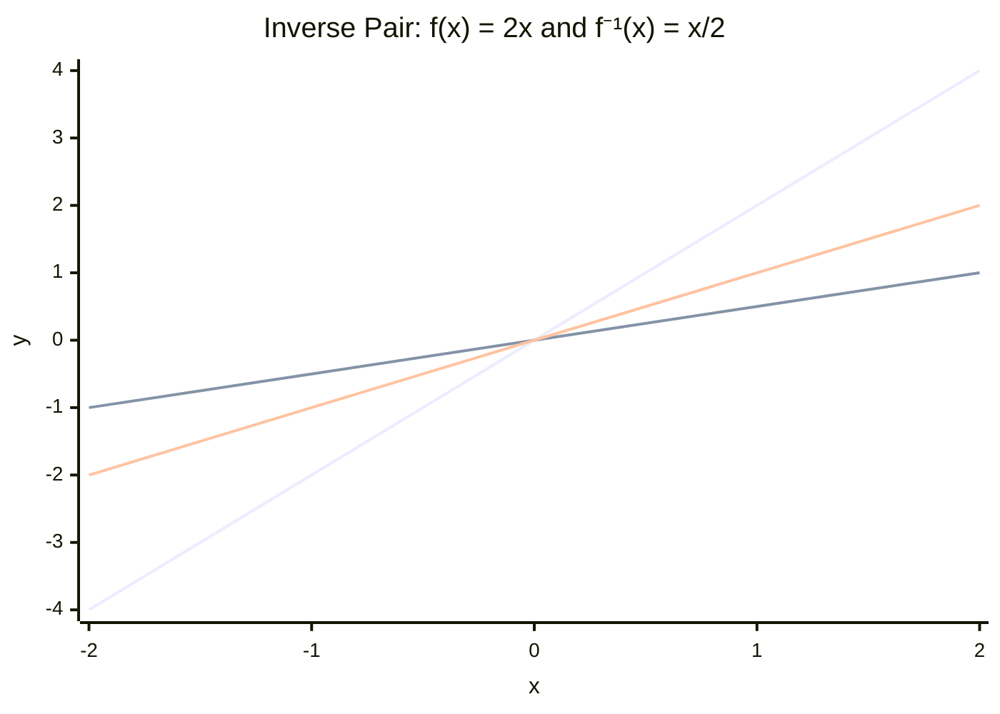

# 3.8 Inverse and Composite Functions

Tags: #maths/functions #maths/algebra #cs/programming #cs/security

## Position in the Course
Prerequisites: [[3.2 Function Notation and Mapping]], [[2.5 Solving Linear Equations]], [[2.6 Rearranging Formulae]], [[3.7 Logarithms]]

Used later in: [[10.11 Type Theory and Program Logic Intro]], [[11.12 Lambda Calculus and Formal Semantics]], [[5.10 Proof by Contradiction and Contrapositive]]

Mastery threshold: 90% overall, and 100% on the New Words section.

> [!tip] How to study this note
> Draw arrows. Composition is "do this, then that"; inverses are "undo and get back where you started."

---

## Introduction

Functions can be chained together or undone. A **composite function** feeds one function's output into another function. An **inverse function** reverses a function, like decoding reverses encoding. The **identity function** returns its input unchanged. A function must be **one-to-one** (different inputs → different outputs) to have a full inverse. A **nested function** is one function written inside another.

> [!example] Everyday idea
> If you put on socks then shoes, the inverse order is not shoes then socks. To undo, you remove shoes first, then socks. Function chains behave the same way.

## New Words

- [[inverse function]] — a function that undoes another function.
- [[composition]] — applying one function to the result of another.
- [[identity function]] — the function that returns every input unchanged.
- [[one-to-one]] — a function where different inputs always give different outputs.
- [[nested function]] — a function written inside another function.

---

## Breadcrumbs

### Breadcrumb 1: Composition Means Chain the Outputs

**Builds on:** [[3.2 Breadcrumb 1|What Is a Function]] (input → output rule)

If `f(x) = 2x + 1` and `g(x) = x²`, then `f(g(x))` means: do g first, then feed that answer into f.

This is [[composition]].

> [!important] Inside first
> In `f(g(x))`, the inside function g happens first.

#### Chunked Example
Question: If `f(x) = 2x + 1` and `g(x) = x²`, find `f(g(3))`.

g(3) = 3² = 9. f(9) = 2(9) + 1 = 19.

Answer: **f(g(3)) = 19**.

---

### Breadcrumb 2: Algebraic Composite Functions

**Builds on:** [[3.8 Breadcrumb 1|Composition Means Chain the Outputs]] (inside → outside), [[2.2 Breadcrumb 4|Collecting Like Terms to Simplify]] (simplify result)

You can find a formula for a composite function.

If `f(x) = 3x - 4` and `g(x) = x + 2`:

```text
f(g(x)) = f(x + 2) = 3(x + 2) - 4 = 3x + 2
```

> [!warning] Composition is usually not commutative
> `f(g(x))` and `g(f(x))` often give different answers. Order matters.

#### Chunked Example
Question: If `f(x) = x²` and `g(x) = x - 5`, find `f(g(x))`.

f(g(x)) = (x - 5)² = x² - 10x + 25.

Answer: **f(g(x)) = (x - 5)² = x² - 10x + 25**.

---

### Breadcrumb 3: Nested Functions in Notation and Code

**Builds on:** [[3.8 Breadcrumb 2|Algebraic Composite Functions]] (composition formula), [[3.2 Breadcrumb 12|Functions as Maps in Programming]] (function pipelines)

A [[nested function]] is one function placed inside another:

```text
h(x) = f(g(x))
```

This is the mathematical version of code pipelines:

```text
store(validate(parse(input)))
```

The innermost operation happens first: `parse → validate → store`.

This connects directly to [[11.12 Lambda Calculus and Formal Semantics]].

> [!example] Pipeline idea
> In a web API, raw text might be parsed, validated, transformed, then saved.

#### Chunked Example
Question: A pipeline is `render(transform(load(file)))`. What order do the functions run?

Innermost: `load(file)`, then `transform(...)`, then `render(...)`.

Answer: **load, then transform, then render**.

---

### Breadcrumb 4: Inverse Functions Undo

**Builds on:** [[3.8 Breadcrumb 1|Composition Means Chain the Outputs]] (undo what composition did), [[1.3 Breadcrumb 1|Undoing Addition]] (inverse operations)

An [[inverse function]] undoes a function.

If `f(x) = x + 7`, then the inverse is `f⁻¹(x) = x - 7`. Adding 7 is undone by subtracting 7.

> [!important] f⁻¹ does not mean reciprocal here
> In function notation, f⁻¹(x) means inverse function, not 1/f(x).

#### Chunked Example
Question: Find the inverse of `f(x) = x - 4`.

y = x - 4 → y + 4 = x → f⁻¹(x) = x + 4.

Answer: **f⁻¹(x) = x + 4**.

---

### Breadcrumb 5: Finding an Inverse by Rearranging

**Builds on:** [[3.8 Breadcrumb 4|Inverse Functions Undo]] (undo each operation), [[2.6 Breadcrumb 5|Changing the Subject of a Formula]] (rearrange for x), [[2.5 Breadcrumb 5|Solving With Inverse Operations on Both Sides]] (isolate unknown)

To find an inverse algebraically:
1. Write `y = f(x)`.
2. Rearrange to make x the subject.
3. Swap x and y.
4. Write f⁻¹(x).

> [!warning] Undo in reverse order
> If the function multiplies then adds, the inverse subtracts then divides.

#### Chunked Example
Question: Find the inverse of `f(x) = 3x + 5`.

y = 3x + 5 → y - 5 = 3x → x = (y - 5)/3 → f⁻¹(x) = (x - 5)/3.

Answer: **f⁻¹(x) = (x - 5)/3**.

---

### Breadcrumb 6: Identity Function Checks

**Builds on:** [[3.8 Breadcrumb 5|Finding an Inverse by Rearranging]] (candidate inverse), [[2.5 Breadcrumb 6|Checking Solutions by Substitution]] (verify by plugging back)

The [[identity function]] returns the input unchanged: `I(x) = x`.

An inverse is correct when both compositions return x:

```text
f(f⁻¹(x)) = x   and   f⁻¹(f(x)) = x
```

> [!important] Check both directions when possible

Here is a visual check of inverse functions:



#### Chunked Example
Question: Check that `f(x) = 2x - 1` and `f⁻¹(x) = (x + 1)/2` are inverses.

f(f⁻¹(x)) = 2((x+1)/2) - 1 = x + 1 - 1 = x.

f⁻¹(f(x)) = ((2x - 1) + 1)/2 = 2x/2 = x.

Both return x. Answer: They are **inverse functions**.

---

### Breadcrumb 7: One-to-One Functions

**Builds on:** [[3.8 Breadcrumb 4|Inverse Functions Undo]] (inverse needs unique mapping), [[3.2 Breadcrumb 7|Domain and Range]] (which inputs are allowed)

A function must be [[one-to-one]] to have a full inverse function. One-to-one means: if a ≠ b, then f(a) ≠ f(b).

`f(x) = x + 3` is one-to-one — every output comes from exactly one input.

`g(x) = x²` is not one-to-one over all real numbers — g(2) = 4 and g(-2) = 4, so the inverse would not know which input to return.

> [!example] CS connection
> A decoder can only reverse an encoder reliably if the encoder does not map two different messages to the same encoded value.

#### Chunked Example
Question: Is `f(x) = x²` one-to-one over all real numbers?

f(3) = 9 and f(-3) = 9. Different inputs gave the same output.

Answer: **No**, not one-to-one over all real numbers.

---

### Breadcrumb 8: Inverses in CS

**Builds on:** [[3.8 Breadcrumb 7|One-to-One Functions]] (reversibility condition), [[3.8 Breadcrumb 3|Nested Functions in Notation and Code]] (pipelines)

Many CS systems rely on reversible or intentionally non-reversible functions.

**Reversible:** encode → decode, compress → decompress (if lossless), encrypt → decrypt, serialise → parse.

**Non-reversible:** cryptographic hashes, lossy compression, many-to-one categorisation.

This prepares for [[10.11 Type Theory and Program Logic Intro]].

> [!warning] Not every useful function has an inverse
> Hashing is useful partly because many inputs map into a fixed-size output space, and reversing should be infeasible.

#### Chunked Example
Question: A program does `decode(encode(message))`. What should happen if encode and decode are true inverses?

decode(encode(message)) = message.

Answer: The output should be the **original message**.

---

## Why This Works

Composition works because a function output can become another function input. Chaining rules is just passing the output along.

Inverse functions work because algebraic steps can be reversed when the operation is reversible. [[2.5 Solving Linear Equations]] and [[2.6 Rearranging Formulae]] give permission to undo operations in reverse order.

Logarithms in [[3.7 Logarithms]] are a major example: exponentials and logs undo each other.

---

## Worked Examples

For fully worked solutions, use [[3.8 Inverse and Composite Functions - Worked Examples]].

### Example 1 - Quick Composition
Question: If `f(x) = x + 2` and `g(x) = 4x`, find `f(g(5))`.

g(5) = 20. f(20) = 22.

Answer: **22**.

---

## Common Mistakes

- Doing the outside function first in `f(g(x))` (work from inside outward).
- Assuming `f(g(x)) = g(f(x))` (order usually matters).
- Treating f⁻¹(x) as 1/f(x) (inverse function ≠ reciprocal).
- Undoing operations in the original order (undo in reverse order).
- Claiming x² has a full inverse over all real numbers (check one-to-one first).
- Checking only one input to prove an inverse (use composition identity).

> [!failure] Mistake pattern
> If a claimed inverse does not return x after composition, the undoing step or the order is wrong.

---

## Where This Shows Up in CS

Composition is the mathematical shape of software pipelines:

```text
save(validate(parse(request_body)))
```

The innermost function runs first. Each stage must output something the next stage can accept.

Inverse functions show up in codecs and security:

```text
decrypt(encrypt(message)) = message
```

This identity check says the round trip returns the original input.

---

## Checkpoint Questions

1. What does `f(g(x))` mean?
2. Which function runs first in `f(g(x))`?
3. Why does order matter in composition?
4. What is an inverse function?
5. How do you find an inverse of `f(x) = 2x + 3`?
6. What is the identity function?
7. How can composition check an inverse?
8. What does one-to-one mean?
9. Why does x² fail to be one-to-one over all real numbers?
10. Name one CS example of composition or inverse functions.

---

## Mini-Quiz

1. Define [[inverse function]].
2. Define [[composition]].
3. Define [[identity function]].
4. Define [[one-to-one]].
5. Define [[nested function]].
6. If f(x)=x+1 and g(x)=2x, find f(g(4)).
7. Find the inverse of f(x)=x-9.
8. Find the inverse of f(x)=5x+2.
9. Check whether f(x)=x² is one-to-one over all real numbers.
10. Explain one CS pipeline or encode/decode example.

---

## Pass Gate

You may move to [[3.9 Transformations of Graphs]] only when you can:

- define every term in [[#New Words]]
- evaluate a composite function from inside outward
- form simple algebraic composites
- find inverses of linear functions
- check inverses using the identity function
- explain why one-to-one behaviour matters
- connect composition and inverses to a CS pipeline or reversible transform
- answer at least 9 out of 10 mini-quiz questions correctly
- complete [[3.8 Inverse and Composite Functions - Mastery Test]]

---

## Related Notes

Backward links: [[3.2 Function Notation and Mapping]], [[2.5 Solving Linear Equations]], [[2.6 Rearranging Formulae]], [[3.7 Logarithms]]

Forward links: [[10.11 Type Theory and Program Logic Intro]], [[11.12 Lambda Calculus and Formal Semantics]], [[5.10 Proof by Contradiction and Contrapositive]]

Assessment links: [[3.8 Inverse and Composite Functions - Worked Examples]], [[3.8 Inverse and Composite Functions - Practice Questions]], [[3.8 Inverse and Composite Functions - Mastery Test]], [[3.8 Inverse and Composite Functions - Answers]]
