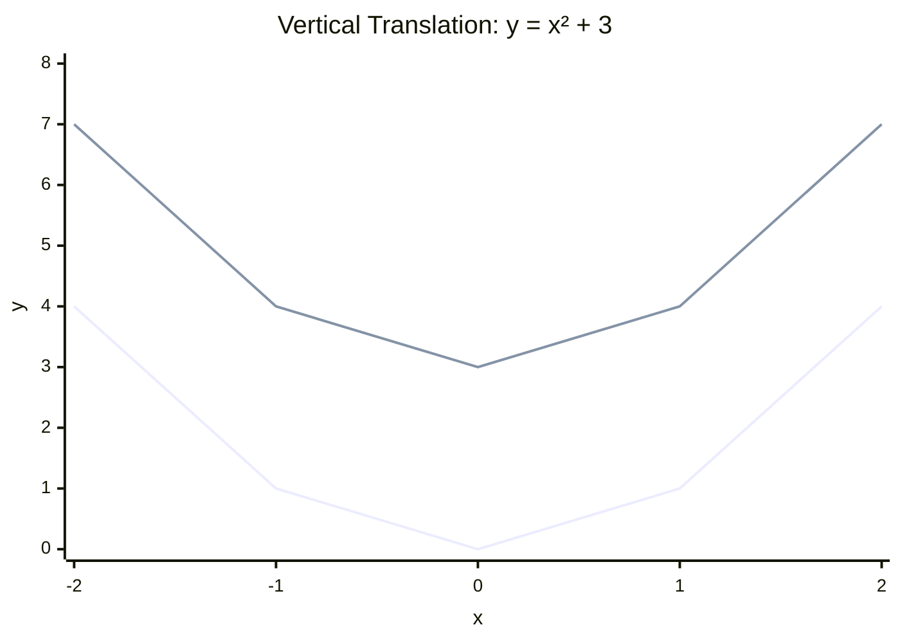
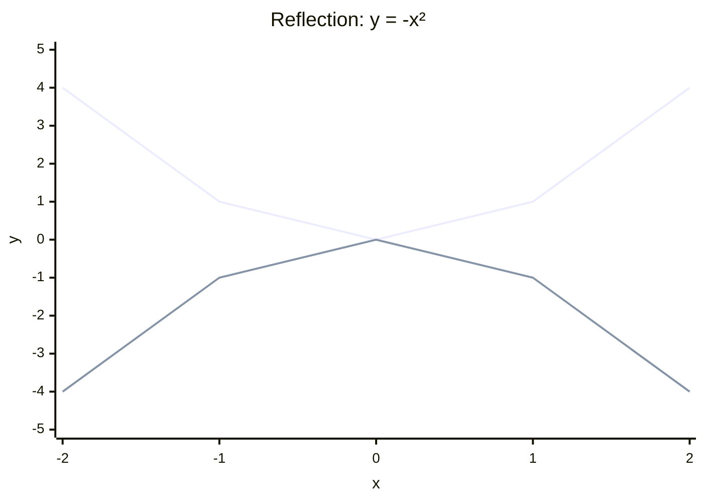
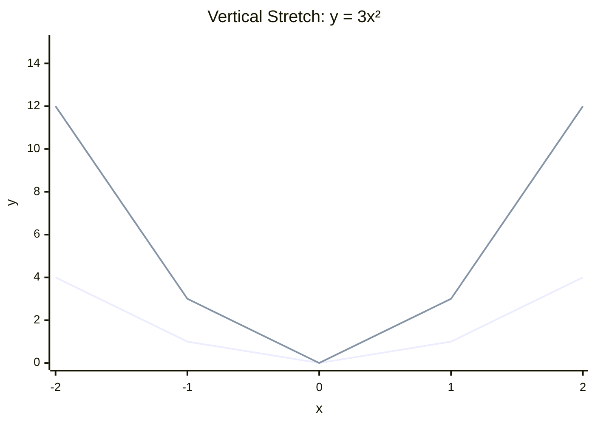

# 3.9 Transformations of Graphs

Tags: #maths/functions #maths/graphs #cs/graphics #cs/data

## Position in the Course
Prerequisites: [[3.1 Coordinates and Axes]], [[3.2 Function Notation and Mapping]], [[3.3 Linear Functions and Gradient]], [[3.4 Quadratic Functions]]

Used later in: [[7.3 Vectors in the Plane]], [[9.9 Gradient Descent and Optimisation]]

Mastery threshold: 85% overall, and 100% on the New Words section.

> [!tip] How to study this note
> Start with one parent graph such as `y = x²`. Apply one transformation at a time. Mark a known point before and after each change. Only combine transformations once each single move feels predictable.

---

## Introduction

A **transformation** changes where a graph sits or how large it looks without changing its basic shape — unless you stretch or compress it. You can **translate** (slide), **reflect** (flip), or **stretch** (scale) a graph using simple rules on the function formula. The **scale factor** is the number multiplying a coordinate during a stretch.

> [!example] Everyday idea
> Moving a sticker on a laptop screen changes its position but not its shape. Flipping it in a mirror reverses left and right. Stretching it in a photo editor makes it taller or wider. Graph transformations work the same way.

## New Words

- [[translation]] — a shift of a graph horizontally or vertically without changing its shape.
- [[reflection]] — a flip of a graph across an axis, turning points into mirror images.
- [[stretch]] — a transformation that multiplies coordinates, making a graph taller, wider, or both.
- [[scale factor]] — the number multiplying a coordinate during a stretch transformation.
- [[transformation]] — any rule that moves, flips, or stretches a graph to a new position or size.

---

## Breadcrumbs

### Breadcrumb 1: The Parent Graph and the Transformed Graph

**Builds on:** [[3.1 Breadcrumb 4|Plotting Points]] (points are coordinate pairs), [[3.2 Breadcrumb 1|What Is a Function]] (f(x) form)

Every [[transformation]] starts from a **parent graph** — a known shape such as `y = x²`, `y = |x|`, or `y = 2ˣ`. The transformed graph is the parent after a rule is applied to every point `(x, y)`.

> [!important] Shape vs position
> Translation and reflection change position or orientation. Stretch changes size. The underlying curve family stays recognisable.

#### Chunked Example
Question: The parent graph is `y = x²` with key point `(2, 4)`. The rule is "add 3 to every y-value." What is the new point?

(2, 4) → y becomes 4 + 3 = 7. x unchanged.

Answer: The transformed point is **(2, 7)**.

---

### Breadcrumb 2: Vertical Translation — f(x) + k

**Builds on:** [[3.9 Breadcrumb 1|The Parent Graph and the Transformed Graph]] (rule applied to y), [[3.2 Breadcrumb 10|Adding Constants Outside the Function]] (outside = vertical)

Adding a constant **outside** the function shifts the graph **vertically**.

```text
y = f(x) + k
```

- `k > 0` moves the graph **up** by k units.
- `k < 0` moves the graph **down** by |k| units.

Every point `(a, b)` moves to `(a, b + k)`.



#### Chunked Example
Question: Describe the transformation from `y = x²` to `y = x² + 5`.

+5 is outside the function → vertical translation up 5. Vertex moves from (0,0) to (0,5).

Answer: **Translation up 5 units**.

---

### Breadcrumb 3: Horizontal Translation — f(x - h)

**Builds on:** [[3.9 Breadcrumb 1|The Parent Graph and the Transformed Graph]] (rule applied to x), [[3.2 Breadcrumb 6|Inputs and Outputs in f(x) Notation]] (inside change affects x)

Adding or subtracting a constant **inside** the function shifts the graph **horizontally**.

```text
y = f(x - h)
```

- `f(x - 3)` shifts the graph **right** 3 units.
- `f(x + 3) = f(x - (-3))` shifts the graph **left** 3 units.

The sign feels backwards because the input x must compensate for the shift.

> [!warning] Inside sign feels reversed
> `f(x - 3)` moves **right**. Read "x minus 3" as "the input is shifted forward by 3."

```mermaid
xychart-beta
    title "Horizontal Translation: y = (x - 2)²"
    x-axis "x" [-2, -1, 0, 1, 2, 3, 4]
    y-axis "y" 0 --> 5
    line "y = x²" [4, 1, 0, 1, 4, ---, ---]
    line "y = (x-2)²" [---, ---, 4, 1, 0, 1, 4]
```

#### Chunked Example
Question: Describe the transformation from `y = x²` to `y = (x - 2)²`.

x → (x - 2) inside the function → shift right 2. Vertex moves from (0,0) to (2,0).

Answer: **Translation right 2 units**.

---

### Breadcrumb 4: Reflection Across the Axes

**Builds on:** [[3.9 Breadcrumb 2|Vertical Translation — f(x) + k]] (outside affects y), [[3.9 Breadcrumb 3|Horizontal Translation — f(x - h)]] (inside affects x), [[3.1 Breadcrumb 2|Axes and Origin]] (axis symmetry)

A [[reflection]] flips a graph like a mirror image.

```text
y = -f(x)     reflect across the x-axis
y = f(-x)     reflect across the y-axis
```

- `-f(x)` multiplies every output by -1 → points flip above/below the x-axis.
- `f(-x)` replaces x with -x → points flip left/right of the y-axis.



#### Chunked Example
Question: Start with `f(x) = x + 1`. Write the formula for a reflection across the x-axis and state the image of `(2, 3)`.

y = -f(x) = -(x + 1) = -x - 1. (2, 3) → (2, -3).

Answer: **y = -x - 1**, and **(2, 3)** maps to **(2, -3)**.

---

### Breadcrumb 5: Vertical Stretch and Compression — a·f(x)

**Builds on:** [[3.9 Breadcrumb 4|Reflection Across the Axes]] (negative a adds reflection), [[3.3 Breadcrumb 2|Slope as Constant Change]] (multiplying output scales it)

Multiplying the **whole function** by a constant stretches or compresses the graph **vertically**.

```text
y = a·f(x)
```

- `|a| > 1` → vertical [[stretch]] (taller).
- `0 < |a| < 1` → vertical compression (flatter).
- `a < 0` → vertical stretch/compression **and** reflection across the x-axis.

The number `a` is the vertical [[scale factor]].



#### Chunked Example
Question: Describe the transformation from `y = x²` to `y = 3x²`.

a = 3 > 1 → vertical stretch with scale factor 3. (1, 1) → (1, 3).

Answer: **Vertical stretch with scale factor 3**.

---

### Breadcrumb 6: Horizontal Stretch and Compression — f(bx)

**Builds on:** [[3.9 Breadcrumb 5|Vertical Stretch and Compression — a·f(x)]] (stretch by multiplying), [[3.2 Breadcrumb 6|Inputs and Outputs in f(x) Notation]] (inside multiplier affects x)

Replacing x with **bx** inside the function stretches or compresses the graph **horizontally**.

```text
y = f(bx)
```

- `|b| > 1` → horizontal compression (narrower).
- `0 < |b| < 1` → horizontal stretch (wider).
- `b < 0` → horizontal scale **and** reflection across the y-axis.

The horizontal [[scale factor]] is `1/|b|`.

> [!warning] Inside multiplier reverses width
> `f(2x)` compresses horizontally by factor 2. The graph looks half as wide.

#### Chunked Example
Question: Describe the transformation from `y = x²` to `y = (2x)²`.

b = 2 → horizontal compression, scale factor 1/2. (2, 4) on parent → (1, 4) on new graph.

Answer: **Horizontal compression with scale factor 1/2**.

---

### Breadcrumb 7: Combining Transformations

**Builds on:** [[3.9 Breadcrumb 5|Vertical Stretch and Compression — a·f(x)]] (vertical order), [[3.9 Breadcrumb 6|Horizontal Stretch and Compression — f(bx)]] (horizontal order)

Real graphs often combine several [[transformation]] steps. Work in a fixed order:

1. Horizontal changes inside the brackets (stretch/reflect, then shift).
2. Vertical changes outside (stretch/reflect, then shift).

For `y = a·f(b(x - h)) + k`, read:

```text
start with f(x)
apply horizontal scale/reflect with b
translate horizontally by h
apply vertical scale/reflect with a
translate vertically by k
```

> [!tip] One change at a time
> Apply transformations step by step to one reference point.

#### Chunked Example
Question: Describe the transformations from `y = x²` to `y = 2(x - 1)² + 3`.

Inside: (x - 1) → right 1. Outside multiplier: 2 → vertical stretch factor 2. Outside addition: +3 → up 3.

Vertex: (0,0) → (1,0) → (1,0) → (1,3).

Answer: **Right 1, vertical stretch factor 2, up 3**.

---

### Breadcrumb 8: Transformations in CS

**Builds on:** [[3.9 Breadcrumb 7|Combining Transformations]] (multi-step transforms), [[3.1 Breadcrumb 8|Coordinates as Pixels in a Grid]] (screen coordinates)

**Graphics transforms** — Every sprite, UI element, and 3D model has a position, scale, and orientation. A point `(x, y)` becomes `(x + dx, y + dy)` for translation, or `(sx·x, sy·y)` for scaling.

**Data normalisation** — Machine learning pipelines transform raw features to a standard range:

```text
normalised = (x - min) / (max - min)
```

Subtracting `min` translates; dividing by the range compresses.

> [!example] CSS transform
> `transform: translate(10px, 20px) scale(2);` moves an element then doubles its size.

#### Chunked Example
Question: A sprite sits at `(4, 6)`. The game applies translate by `(2, -1)` then scale by factor 2 vertically. Where does the sprite draw?

Translate: (6, 5). Scale vertically by 2: (6, 10).

Answer: The sprite draws at **(6, 10)**.

---

## Why This Works

Transformations work because a function graph is a set of input-output pairs. If you change every output by the same rule, the whole graph moves together. If you change every input by the same rule, every x-value shifts or scales together.

[[3.1 Coordinates and Axes]] gives the coordinate plane. [[3.2 Function Notation and Mapping]] gives function notation so you can write `f(x - 2) + 3`. [[3.3 Linear Functions and Gradient]] and [[3.4 Quadratic Functions]] supply common parent graphs.

The counterintuitive horizontal signs come from solving for equivalence: to get the same y-value that `f(0)` used to produce, but the rule is now `f(x - 3)`, you need `x = 3`. The graph moved right.

---

## Worked Examples

For fully worked solutions, use [[3.9 Transformations of Graphs - Worked Examples]].

### Example 1 - Quick Vertical Shift
Question: Describe the move from `y = x²` to `y = x² - 4`.

-4 is outside the function → translate down 4 units.

Answer: **Translation down 4 units**.

---

## Common Mistakes

- Thinking `f(x - 3)` shifts left (it shifts right 3).
- Thinking `f(2x)` stretches horizontally by factor 2 (it compresses, scale factor 1/2).
- Mixing up `-f(x)` (x-axis flip) and `f(-x)` (y-axis flip).
- Applying vertical and horizontal rules to the wrong coordinate (outside = y, inside = x).
- Forgetting a negative scale factor also reflects.
- Combining all transformations at once without tracking a reference point.

> [!failure] Mistake pattern
> If your vertex moved left when you expected right, you reversed the inside sign. Rewrite `f(x + 5)` as `f(x - (-5))` to see the direction.

---

## Where This Shows Up in CS

Graphics pipelines apply translation, scale, and reflection to every drawable object. A 2D game character's world position is a translation; its mirror sprite is a reflection; a zoomed-in icon is a stretch.

Data preprocessing uses the same rules:

```python
# normalise to [0, 1]
x_norm = (x - min_val) / (max_val - min_val)
```

CSS, SVG, Canvas, OpenGL, and Unity all expose transform matrices built from these same primitives.

---

## Checkpoint Questions

1. What is a parent graph?
2. How does `f(x) + 5` move a graph?
3. How does `f(x - 5)` move a graph?
4. What is the difference between `-f(x)` and `f(-x)`?
5. What does `2f(x)` do to a graph?
6. What does `f(2x)` do to a graph?
7. What is a scale factor?
8. Describe the transformations in `y = -3(x + 1)² + 2`.
9. Why does the inside sign for horizontal translation feel backwards?
10. Name one CS use of graph transformations.

---

## Mini-Quiz

1. Define [[translation]].
2. Define [[reflection]].
3. Define [[stretch]].
4. Define [[scale factor]].
5. Define [[transformation]].
6. Describe the move from `y = x²` to `y = (x + 3)²`.
7. Describe the move from `y = x²` to `y = -x²`.
8. Describe the move from `y = x²` to `y = 4x²`.
9. The point `(1, 2)` lies on `y = f(x)`. Where does it go on `y = f(x - 2) + 5`?
10. Explain how data normalisation uses translation and stretch.

---

## Pass Gate

You may move to [[3.10 Piecewise and Step Functions]] only when you can:

- define every term in [[#New Words]]
- identify vertical vs horizontal translations from a formula
- distinguish reflections `-f(x)` and `f(-x)`
- apply vertical and horizontal scale factors correctly
- describe combined transformations from `y = a·f(b(x - h)) + k`
- track a reference point through a sequence of transformations
- connect translation and stretch to graphics and data normalisation
- answer at least 8 out of 10 mini-quiz questions correctly
- complete [[3.9 Transformations of Graphs - Mastery Test]]

---

## Related Notes

Backward links: [[3.1 Coordinates and Axes]], [[3.2 Function Notation and Mapping]], [[3.3 Linear Functions and Gradient]], [[3.4 Quadratic Functions]]

Forward links: [[7.3 Vectors in the Plane]], [[9.9 Gradient Descent and Optimisation]]

Assessment links: [[3.9 Transformations of Graphs - Worked Examples]], [[3.9 Transformations of Graphs - Practice Questions]], [[3.9 Transformations of Graphs - Mastery Test]], [[3.9 Transformations of Graphs - Answers]]
