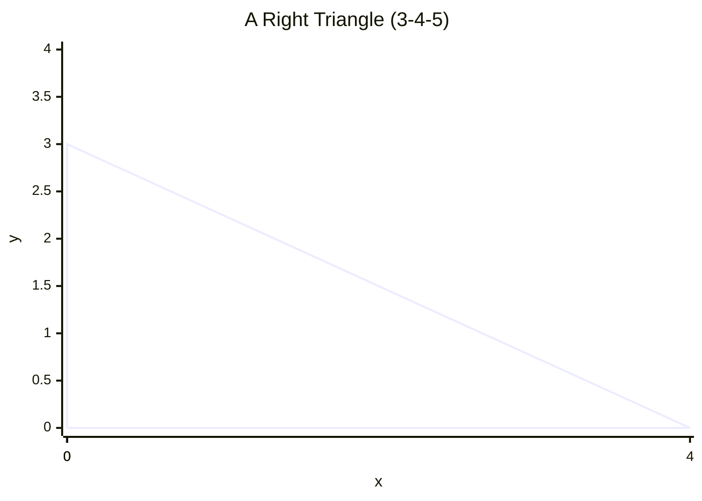

# 4.1 Lines Angles and Triangles

Tags: #maths/geometry #maths/trigonometry #cs/graphics #cs/gamedev

## Position in the Course
Prerequisites: [[1.1 Counting and Number Sense]], [[1.2 Place Value and Number Lines]], [[1.3 Addition and Subtraction]]

Used later in: [[10.4 Computer Graphics and Transformations]]

Mastery threshold: 90% overall, and 100% on the New Words section.

> [!tip] How to study this note
> Draw every shape and angle mentioned. Do not just read — sketch. Geometry is learned through your hands and eyes together.

---

## Introduction

A **line** is a straight one-dimensional figure extending infinitely in both directions. An **angle** measures the rotation from one ray to another around a shared vertex. **Parallel** lines never meet; **perpendicular** lines meet at a right angle (90°). A **triangle** is a three-sided polygon whose interior **angle sum** is always 180°.

Lines, angles, and triangles are the building blocks of every shape. A triangle is the simplest shape that cannot be deformed — three sides, three corners, always flat.

> [!example] Everyday idea
> Where two walls meet is an angle. A table edge is a line segment. A slice of pizza is a triangle. Every shape in computer graphics is built from triangles.

## New Words

- [[line]] — a straight one-dimensional figure extending infinitely in both directions, or a finite segment between two points.
- [[angle]] — the amount of turn between two rays that share a common endpoint (the vertex), measured in degrees (°).
- [[parallel]] — two lines in the same plane that never meet, denoted with the symbol ∥.
- [[triangle]] — a three-sided polygon whose interior [[angle sum]] is always 180°.
- [[angle sum]] — the total of all interior angles in a polygon; for a triangle it is always 180°.

> [!important] You pass this topic only when you can define all five terms without looking.

---

## Breadcrumbs

### Breadcrumb 1: Lines Are Straight Paths

**Builds on:** [[1.2 Breadcrumb 1|The Number Line]] (infinite straight path), [[1.1 Breadcrumb 1|Counting and Whole Numbers]] (infinitely many points)

A [[line]] is a straight one-dimensional figure. Three important variations:

- **Line**: extends infinitely both directions.
- **Line segment**: finite between two endpoints; can be measured.
- **Ray**: one endpoint, extends infinitely in one direction.

Three or more points on the same line are **collinear**. If one point is off the line, the three points define a [[triangle]] — this is the foundation of 3D graphics.

> [!example] Counting points on a line
> From [[1.1 Counting and Number Sense]]: a line contains infinitely many points between any two locations. You can always find another halfway between.

#### Chunked Example
Question: Identify each figure as a line, line segment, or ray: (a) `P---Q` with a bar, (b) `R---S` with arrows both ends, (c) `M---N` with arrow on right.

Step 1: (a) has endpoints P and Q → line segment.
Step 2: (b) extends both ways → line.
Step 3: (c) has endpoint at M, extends past N → ray.

Answer: (a) line segment, (b) line, (c) ray.

---

### Breadcrumb 2: Angles Measure the Turn Between Two Lines

**Builds on:** [[4.1 Breadcrumb 1|Lines Are Straight Paths]] (rays as sides of angle), [[1.2 Breadcrumb 1|The Number Line]] (0°–360° like a circular number line)

An [[angle]] measures rotation from one [[ray]] to another around a shared vertex.

**Angle types by measure:**

```text
Acute (< 90°)    Right (= 90°)    Obtuse (> 90°, < 180°)
Straight (= 180°)    Reflex (> 180°, < 360°)
```

Two angles that share a vertex and a side are **adjacent angles**. Two angles summing to 90° are **complementary**. Two angles summing to 180° are **supplementary** — they form a straight line.

> [!warning] Angle size is about turn, not side length
> A 30° angle drawn with 1 cm rays is the same 30° angle drawn with 1 m rays. The turn is identical.

#### Chunked Example
Question: Classify each angle: 35°, 90°, 120°, 180°, 270°.

35° < 90° → acute. 90° → right. 120° between 90° and 180° → obtuse. 180° → straight. 270° between 180° and 360° → reflex.

Answer: 35° acute, 90° right, 120° obtuse, 180° straight, 270° reflex.

---

### Breadcrumb 3: Parallel and Perpendicular Lines

**Builds on:** [[4.1 Breadcrumb 2|Angles Measure the Turn Between Two Lines]] (right angle = 90°), [[1.2 Breadcrumb 5|Inequalities as Range Comparisons]] (always equal distance)

[[Parallel]] lines never intersect. [[Perpendicular]] lines intersect at a [[right angle]] (90°). The x-axis and y-axis are perpendicular — the foundation of [[3.1 Coordinates and Axes]].

When a third line (a [[transversal]]) cuts across two parallels, three angle rules apply:

- **Corresponding angles** are equal (same relative position).
- **Alternate angles** (Z-pattern) are equal.
- **Co-interior angles** (C-pattern) sum to 180°.

> [!example] Real-world parallel lines
> Train tracks are parallel. Road lanes on a straight highway are parallel. The transversal is like a cross-street.

#### Chunked Example
Question: Two parallel lines are cut by a transversal. One angle is 65°. Find the others.

Using corresponding, alternate, and co-interior rules: the angles cycle through 65°, 115°, 65°, 115°.

Answer: Clockwise: **65°, 115°, 65°, 115°, 65°, 115°, 65°, 115°**.

---

### Breadcrumb 4: Triangles Have Three Sides, Three Angles

**Builds on:** [[4.1 Breadcrumb 1|Lines Are Straight Paths]] (three line segments close), [[1.3 Breadcrumb 2|Adding Larger Numbers]] (sum three angles)

A [[triangle]] is a three-sided polygon. The [[angle sum]] of any triangle is 180°.

**By side length:**

```text
Scalene: all sides different
Isosceles: two sides equal
Equilateral: all sides equal, all angles 60°
```

**By angle:**

```text
Acute: all angles < 90°
Right: one angle = 90°
Obtuse: one angle > 90°
```

Additional properties:
- Triangle inequality: any side < sum of other two.
- Longest side opposite largest angle.
- Exterior angle = sum of two opposite interior angles.

Here is a right triangle plotted on a coordinate grid:



The right angle is at the origin. Legs are length 3 and 4; the diagonal is the hypotenuse of length 5.

> [!important] Triangle angle sum is fixed
> 180° every time. This is like a [[checksum]] in programming — if your angles sum to 181°, one measurement is wrong.

#### Chunked Example
Question: Two angles of a triangle are 50° and 70°. Find the third.

50 + 70 = 120. 180 - 120 = 60.

Answer: The third angle is **60°**.

---

### Breadcrumb 5: Classifying Triangles by Side and Angle

**Builds on:** [[4.1 Breadcrumb 4|Triangles Have Three Sides, Three Angles]] (types), [[1.1 Breadcrumb 3|Comparison Vocabulary]] (equal vs different)

Combine side type first, then angle type:

```text
Scalene acute, isosceles right, equilateral acute, isosceles obtuse, scalene right, ...
```

> [!example] Why triangles in CS?
> Three points always lie in a plane. A quadrilateral can be twisted — one point raised out of the plane. That is why 3D graphics engines break every surface into triangles. A triangle mesh is always flat.

#### Chunked Example
Question: A triangle has sides 5 cm, 5 cm, 8 cm and angles 40°, 40°, 100°. Classify it.

Two equal sides → isosceles. One angle 100° > 90° → obtuse.

Answer: **Isosceles obtuse triangle**.

---

### Breadcrumb 6: Perimeter of Triangles and Quadrilaterals

**Builds on:** [[4.1 Breadcrumb 4|Triangles Have Three Sides, Three Angles]] (side lengths), [[1.3 Breadcrumb 2|Adding Larger Numbers]] (sum sides)

[[Perimeter]] is total distance around a shape's boundary.

```text
Triangle: P = a + b + c
Square: P = 4s
Rectangle: P = 2l + 2w
```

The **triangle inequality** says any side must be shorter than the sum of the other two.

> [!tip] Perimeter is a length
> Measured in cm, m, km. Never use cm² or cm³.

#### Chunked Example
Question: Find the perimeter of a triangle with sides 7 cm, 5 cm, and 6 cm.

7 + 5 + 6 = 18.

Answer: **18 cm**.

---

## Worked Examples

### Example 1 — Classifying Angles and Finding Supplementary Angles

Question: Classify each angle as acute, right, obtuse, straight, or reflex: (a) 72° (b) 180° (c) 240°. Then find the supplementary angle for 72°.

Step 1: 72° < 90° → acute. 180° → straight. 240° between 180° and 360° → reflex.

Step 2: Supplementary angles sum to 180°. For 72°: 180° − 72° = 108°.

Answer: (a) **acute**, (b) **straight**, (c) **reflex**. The supplement of 72° is **108°**.

---

### Example 2 — Parallel Lines and Transversals

Question: Two parallel lines are cut by a transversal. One angle is 110°. Find the corresponding angle, the alternate angle, and the co-interior angle.

Step 1: Corresponding angles are equal → 110°.

Step 2: Alternate angles (Z-pattern) are equal → 110°.

Step 3: Co-interior angles sum to 180° → 180° − 110° = 70°.

Answer: Corresponding = **110°**, alternate = **110°**, co-interior = **70°**.

---

### Example 3 — Triangle Angle Sum and Classification

Question: A triangle has angles 35° and 85°. Find the third angle and classify the triangle by angles.

Step 1: Angle sum = 180°. Third angle = 180° − (35° + 85°) = 180° − 120° = 60°.

Step 2: All three angles (35°, 85°, 60°) are < 90° → acute triangle.

Answer: Third angle = **60°**, triangle is **acute**.

---

### Example 4 — Perimeter of a Triangle and a Rectangle

Question: A triangle has sides 8 cm, 12 cm, and 15 cm. A rectangle has length 10 cm and width 4 cm. Find the perimeter of each shape.

Step 1: Triangle perimeter = 8 + 12 + 15 = 35 cm.

Step 2: Rectangle perimeter = 2 × (10 + 4) = 2 × 14 = 28 cm.

Answer: Triangle perimeter = **35 cm**, rectangle perimeter = **28 cm**.

---

## Why This Works

Every shape starts from counting points and measuring turns between lines. A [[line]] traces the shortest path between two points. An [[angle]] measures rotation — like a circular number line from 0° to 360°. A [[triangle]] is the first stable shape: three sides, three angles, always summing to 180°.

The [[angle sum]] of 180° is a fundamental check — like a [[checksum]] in programming. If you compute a triangle's angles and get 181°, you know to remeasure.

---

## Common Mistakes

1. Mistaking a line segment for an infinite line (segment has two endpoints; line has arrows both ends).
2. Measuring the wrong angle (acute vs reflex — check which arc is marked).
3. Assuming lines look parallel without proof (never trust your eyes).
4. Forgetting triangle sum is always 180°.
5. Confusing corresponding and alternate angles (corresponding = same position; alternate = Z-pattern).
6. Thinking an angle's size depends on side length (the turn is the same regardless of ray length).

> [!failure] Mistake pattern
> "These two lines look parallel so the angles must be equal" — never assume parallel. You need to be told or prove it.

---

## Where This Shows Up in CS

- **Ray casting**: a ray (one endpoint, extends infinitely) is the fundamental tool for visibility queries.
- **Triangle meshes**: 3D models are built from triangles because three points guarantee planarity. OpenGL and DirectX render triangle meshes exclusively.
- **Collision detection**: checking if a point is inside a triangle uses angle calculations.
- **Line drawing**: Bresenham's line algorithm draws a line segment between two pixels on a raster display.
- **Field of view (FOV)**: a typical FOV is 90° (right angle) for consoles and up to 110° (obtuse) for PC shooters.

---

## Checkpoint Questions

1. What is the difference between a line, a ray, and a line segment?
2. What unit do we measure angles in?
3. What is a right angle in degrees?
4. What does parallel mean?
5. What is the angle sum of any triangle?
6. Classify a triangle with sides 3, 4, 5.
7. Two angles of a triangle are 45° and 75°. Find the third.
8. If two parallel lines are cut by a transversal, what can you say about corresponding angles?
9. Why are triangles used in 3D graphics instead of other shapes?
10. What does the triangle inequality tell you?

---

## Mini-Quiz

1. Define [[line]].
2. Define [[angle]] in terms of rays and a vertex.
3. Define [[parallel]].
4. Define [[triangle]].
5. Define [[angle sum]].
6. Classify 47°, 90°, 132°, 180°, 300° by angle type.
7. Find the missing angle: a triangle has angles 38° and 92°.
8. Two parallel lines are cut by a transversal. One angle is 73°. Find the corresponding angle.
9. A triangle has sides 6 cm, 6 cm, 6 cm. Classify it by sides and by angles.
10. Find the perimeter of a triangle with sides 9 cm, 4 cm, 7 cm and a square of side 5 cm.

---

## Pass Gate

You may move to [[4.2 Perimeter Area and Volume]] only when you can:

- define every term in [[#New Words]] without looking
- classify any triangle by sides and angles
- compute the third angle of a triangle given two others
- identify parallel line angle relationships (corresponding, alternate, co-interior)
- answer at least 9 out of 10 mini-quiz questions correctly
- complete [[4.1 Lines Angles and Triangles - Mastery Test]] with at least 90%

---

## Related Notes

Backward links: [[1.1 Counting and Number Sense]], [[1.2 Place Value and Number Lines]], [[1.3 Addition and Subtraction]]

Forward links: [[10.4 Computer Graphics and Transformations]]

Assessment links: [[4.1 Lines Angles and Triangles - Worked Examples]], [[4.1 Lines Angles and Triangles - Practice Questions]], [[4.1 Lines Angles and Triangles - Mastery Test]], [[4.1 Lines Angles and Triangles - Answers]]
