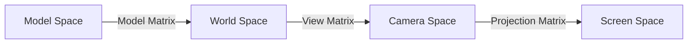

# 4.10 Geometry for Computer Graphics

Tags: #maths/geometry #cs/graphics #cs/gamedev #cs/rendering

## Position in the Course
Prerequisites: [[4.8 Vectors Basics]], [[4.9 Dot Product and Projection]], [[4.4 Pythagoras Theorem]], [[3.1 Coordinates and Axes]]

Used later in: (none within Module 04)

Mastery threshold: 90% overall, and 100% on the New Words section.

> [!tip] How to study this note
> This topic connects everything from Module 04 to real computer graphics. Every concept here is used in rendering pipelines, game engines, and 3D modelling. Draw the transformations as you learn them — visual understanding is key.

---

## Introduction

Computer graphics is about turning 3D scenes into 2D images. Every object in a 3D scene is positioned, rotated, and scaled using **transformations** — operations that move points and vectors around. These transformations are built entirely from the geometry you have learned: vectors for position, dot products for lighting, Pythagoras for distance, and trig for rotation.

> [!example] Everyday idea
> When you move a window on your desktop, you are applying a translation (moving every pixel by some offset). When you zoom in, you apply a scale transformation. When you rotate a 3D model in a game, you apply a rotation matrix — built from sine and cosine.

## New Words

- [[model space]] — the coordinate system local to a 3D object, centred at its origin.
- [[screen space]] — the 2D coordinate system of the display after projection from 3D.
- [[rotation]] — turning an object around an axis; represented by a rotation matrix using sin θ and cos θ.
- [[scaling]] — enlarging or shrinking an object by multiplying its coordinates by a factor.
- [[translation]] — moving an object by adding a constant offset to all its coordinates.

> [!important] You pass this topic only when you can define all five terms without looking.

---

## Breadcrumbs

### Breadcrumb 1: Coordinate Spaces

**Builds on:** [[3.1 Breadcrumb 1|Axes and Coordinates]] (origin and axes), [[4.8 Breadcrumb 1|What Is a Vector?]] (position as vector)

In computer graphics, objects exist in multiple coordinate spaces:

- **Model space**: each 3D model has its own coordinate system, centred at its origin. The model is defined relative to this origin.
- **World space**: all objects are placed in a shared world coordinate system using translations, rotations, and scales.
- **Camera (view) space**: coordinates relative to the camera's position and direction.
- **Screen space**: the final 2D pixel coordinates on your display.

This is like the difference between "my house is at (0, 0) on my street map" (model space) and "my street is at latitude 51.5, longitude −0.13" (world space).

#### Chunked Example
Question: A 3D teapot model has a vertex at (1, 0, 0) in model space. The teapot is placed at world position (10, 5, 3). Where is the vertex in world space?

Step 1: Model space → world space requires a translation: (1+10, 0+5, 0+3) = (11, 5, 3).

Answer: The vertex is at **(11, 5, 3)** in world space.

---

### Breadcrumb 2: Translation

**Builds on:** [[4.8 Breadcrumb 3|Adding Vectors]] (vector addition), [[4.8 Breadcrumb 1|What Is a Vector?]] (offset vector)

**Translation** moves every point by the same vector. If the object position is (t_x, t_y, t_z) and a vertex is at (x, y, z):

$$ (x + t_x,\; y + t_y,\; z + t_z) $$

```text
Before:     After translation by (3, 2):
  ██          ██
  ██     →         ██
                    ██
```

#### Chunked Example
Question: A triangle has vertices A(0, 0), B(2, 0), C(1, 3). Translate by vector (4, 1).

A' = (4, 1). B' = (6, 1). C' = (5, 4).

Answer: Translated vertices: **A'(4, 1), B'(6, 1), C'(5, 4)**.

---

### Breadcrumb 3: Scaling

**Builds on:** [[4.8 Breadcrumb 4|Scalar Multiplication]] (multiply vector by scalar), [[1.4 Breadcrumb 2|Multiplication as Repeated Addition]] (factor scaling)

**Scaling** multiplies each coordinate by a scale factor s:

$$ (sx,\; sy,\; sz) $$

If s > 1, the object grows. If 0 < s < 1, it shrinks. If s < 0, it reflects (mirrors).

```text
Before:      After scaling by 2:
  ██          ██████
  ██     →   ██████
```

#### Chunked Example
Question: A square has corners (0, 0), (2, 0), (2, 2), (0, 2). Scale by 3.

Multiply each coordinate by 3: (0, 0), (6, 0), (6, 6), (0, 6).

Answer: Scaled corners: **(0, 0), (6, 0), (6, 6), (0, 6)**.

---

### Breadcrumb 4: Rotation

**Builds on:** [[4.6 Breadcrumb 2|Coordinates Are Cosine and Sine]] (cos, sin), [[4.5 Breadcrumb 3|Cosine (CAH)]] and [[4.5 Breadcrumb 2|Sine (SOH)]] (trig values)

**Rotation** turns an object around a fixed point (usually the origin). In 2D, rotating by θ:

$$ x' = x\cos\theta - y\sin\theta $$
$$ y' = x\sin\theta + y\cos\theta $$

```text
Before:        After 90° rotation:
  ██             █
  ██     →      ██
                 █
```

> [!important] Rotation preserves distance
> Rotation is a rigid transformation — size and shape are unchanged. The distance between vertices is preserved.

#### Chunked Example
Question: Rotate point (3, 0) by 90° (θ = π/2). cos 90° = 0, sin 90° = 1.

x' = 3×0 − 0×1 = 0. y' = 3×1 + 0×0 = 3.

Answer: The rotated point is **(0, 3)**. (3, 0) rotated 90° CCW. ✓

---

### Breadcrumb 5: Model → World → Screen Pipeline

**Builds on:** [[4.10 Breadcrumb 1|Coordinate Spaces]] (four spaces), [[4.10 Breadcrumb 2|Translation]], [[4.10 Breadcrumb 3|Scaling]], [[4.10 Breadcrumb 4|Rotation]] (transformations)

The full transformation pipeline:



1. **Model → World**: apply translation, rotation, scaling (model matrix)
2. **World → Camera**: transform so camera is at origin, looking along z (view matrix)
3. **Camera → Screen**: project 3D onto 2D using perspective (projection matrix)

#### Chunked Example
Question: A vertex is at model position (1, 0, 0). The model matrix translates by (5, 0, 0) and rotates 90° around z. The view matrix translates by (0, 0, −10). Where is the vertex in camera space?

Step 1: Rotate (1, 0, 0) by 90° → (0, 1, 0). Then translate: (5, 1, 0).
Step 2: World → camera: translate by (0, 0, −10) → (5, 1, 10).

Answer: The vertex is at **(5, 1, 10)** in camera space.

---

### Breadcrumb 6: Lighting with Dot Products

**Builds on:** [[4.9 Breadcrumb 2|The Dot Product — Geometric Definition]] (a·b = |a||b|cos θ), [[4.9 Breadcrumb 1|The Dot Product — Algebraic Definition]] (component-wise)

The Phong reflection model uses dot products for lighting:

**Diffuse**: how much light scatters equally in all directions.

$$ \text{diffuse} = \max(\mathbf{L} \cdot \mathbf{N}, 0) $$

where L is the light direction (unit vector) and N is the surface normal.

**Specular**: how much light reflects like a mirror (highlights).

$$ \text{specular} = \max(\mathbf{R} \cdot \mathbf{V}, 0)^p $$

where R is the reflected light direction, V is the view direction, and p is the shininess.

> [!example] Why dot product for lighting?
> Light hits at 90° (L·N = 1): maximum brightness. Grazing angle (L·N ≈ 0): very dim. Behind surface (L·N < 0): no light.

#### Chunked Example
Question: Surface normal n = (0, 1, 0). Light L = (1, 1, 0), normalised ≈ (0.707, 0.707, 0). Compute diffuse brightness.

L·N = 0.707×0 + 0.707×1 + 0×0 = 0.707. max(0.707, 0) = 0.707.

Answer: The diffuse brightness is **0.707** (≈ 71% of maximum).

---

## Worked Examples

### Example 1 — Translation and Scaling

Question: A triangle has vertices A(1, 1), B(4, 1), C(1, 3). First translate by vector (2, −1), then scale by factor 3. Find the final coordinates of A.

Step 1: Translate A: (1 + 2, 1 − 1) = (3, 0).

Step 2: Scale: multiply each coordinate by 3: (3 × 3, 0 × 3) = (9, 0).

Answer: The final position of A is **(9, 0)**.

---

### Example 2 — 2D Rotation

Question: Rotate the point (5, 0) by 60° counterclockwise. Use cos 60° = 0.5, sin 60° ≈ 0.866.

Step 1: Rotation formula: x' = x cos θ − y sin θ, y' = x sin θ + y cos θ.

Step 2: x' = 5 × 0.5 − 0 × 0.866 = 2.5.

Step 3: y' = 5 × 0.866 + 0 × 0.5 = 4.33.

Answer: The rotated point is approximately **(2.5, 4.33)**.

---

### Example 3 — Model to World Transformation

Question: A model vertex is at (2, 0, 0) in model space. The model matrix scales by 2 then translates by (1, 3, 0). Find the vertex in world space.

Step 1: Scale: (2 × 2, 0 × 2, 0 × 2) = (4, 0, 0).

Step 2: Translate: (4 + 1, 0 + 3, 0 + 0) = (5, 3, 0).

Answer: The vertex in world space is **(5, 3, 0)**.

---

### Example 4 — Diffuse Lighting with Dot Product

Question: A surface has normal vector n = (0, 0, 1). Light comes from direction L = (1, 1, 1). Normalise L and compute the diffuse brightness.

Step 1: |L| = √(1² + 1² + 1²) = √3 ≈ 1.732. L̂ = (1/1.732, 1/1.732, 1/1.732) ≈ (0.577, 0.577, 0.577).

Step 2: Diffuse brightness = max(L̂ · n, 0) = max(0.577×0 + 0.577×0 + 0.577×1, 0) = max(0.577, 0) = 0.577.

Answer: The diffuse brightness is approximately **0.577** (about 58% of maximum).

---

## Why This Works

All of computer graphics geometry rests on three foundations from this module:
1. **Vectors** (4.8) — represent positions, directions, and colours
2. **Dot products** (4.9) — compute angles, lighting, and projections
3. **Trig ratios** (4.5–4.7) — define rotations and circular motion

Every pixel on your screen passes through a pipeline of vector operations. When you move a window, that is a translation. When you zoom, that is a scaling. When you rotate a 3D model, that is a rotation matrix.

This connects back to [[1.1 Counting and Number Sense]] — every transformation is just arithmetic (addition and multiplication) applied to every vertex.

---

## Common Mistakes

1. Applying transformations in the wrong order (translation then rotation ≠ rotation then translation).
2. Forgetting to normalise vectors before dot product for lighting.
3. Using degrees in trig functions that expect radians.
4. Confusing model space with world space.
5. Thinking rotation preserves distance but scaling does not (correct — rotation is rigid, scaling is not).
6. Assuming negative scale factors mirror but do not change area (they preserve area magnitude).

> [!failure] Mistake pattern
> "I rotated the object around its centre by translating, rotating, then translating back." — correct! Rotation always happens around the origin, so to rotate around an object's centre, you must first translate the centre to the origin, rotate, then translate back.

---

## Where This Shows Up in CS

- **OpenGL / DirectX**: the entire rendering pipeline is transformations and dot products.
- **Unity / Unreal**: every GameObject has position, rotation, and scale (Transform component).
- **WebGL**: custom shaders compute lighting using dot products.
- **CAD software**: every operation (move, rotate, scale) is a transformation.
- **Image processing**: scaling and rotation of images uses the same math.
- **Data visualisation**: D3.js and matplotlib apply scaling transformations to map data to pixels.

Example — Unity Transform:
```csharp
transform.position = new Vector3(10, 5, 3);
transform.rotation = Quaternion.Euler(0, 45, 0);
transform.localScale = new Vector3(2, 2, 2);
```

---

## Checkpoint Questions

1. What are the four coordinate spaces in the graphics pipeline?
2. How does translation differ from scaling?
3. Write the 2D rotation formulas for x' and y'.
4. What does the dot product contribute to the Phong lighting model?
5. Why does transformation order matter?
6. What coordinate space is a 3D model defined in before any transformations?
7. What is a rigid transformation? Give one example.
8. Why do we need both model space and world space?
9. What does the projection matrix do?
10. How is the dot product used to compute diffuse lighting?

---

## Mini-Quiz

1. Define model space in one sentence.
2. What does translation add to coordinates?
3. A vertex (2, 3) is translated by (4, 1). Where does it end up?
4. A square of side 2 centred at origin is scaled by 5. What is the new side length?
5. Rotate (0, 4) by 90° counterclockwise. Where does it end up?
6. What is the difference between model space and world space?
7. Why is normalisation important for lighting vectors?
8. N = (0, 0, 1), L = (0, 1, 1) normalised ≈ (0, 0.707, 0.707). Compute diffuse.
9. Explain the full transformation pipeline.
10. How does rotation preserve distance but scaling does not?

---

## Pass Gate

You may move to [[10.4 Computer Graphics and Transformations]] only when you can:
- define every term in [[#New Words]] without looking
- translate, rotate, and scale a 2D or 3D point
- explain the difference between model, world, camera, and screen space
- compute diffuse lighting using the dot product
- describe the transformation pipeline (model → world → camera → screen)
- answer at least 9 out of 10 mini-quiz questions correctly
- complete [[4.10 Geometry for Computer Graphics - Mastery Test]]

---

## Related Notes

Backward links: [[4.8 Vectors Basics]], [[4.9 Dot Product and Projection]], [[4.4 Pythagoras Theorem]], [[3.1 Coordinates and Axes]]

Forward links: (none within Module 04)

Assessment links: [[4.10 Geometry for Computer Graphics - Worked Examples]], [[4.10 Geometry for Computer Graphics - Practice Questions]], [[4.10 Geometry for Computer Graphics - Mastery Test]], [[4.10 Geometry for Computer Graphics - Answers]]
