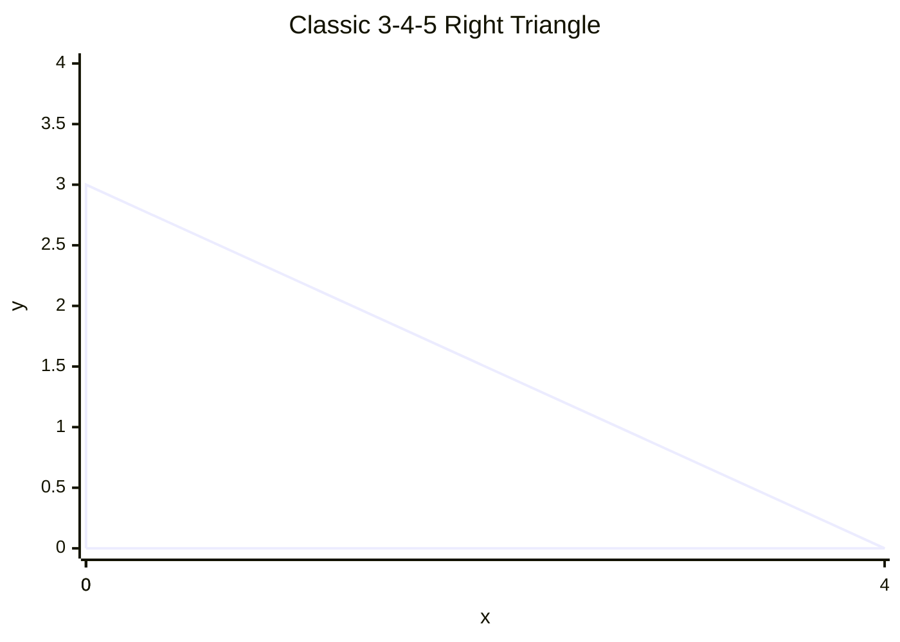

# 4.4 Pythagoras Theorem

Tags: #maths/geometry #maths/trigonometry #cs/algorithms #cs/graphics #cs/machine-learning

## Position in the Course
Prerequisites: [[4.1 Lines Angles and Triangles]], [[2.2 Simplifying Expressions]], [[2.9 Indices and Powers]], [[3.1 Coordinates and Axes]]

Used later in: (none within Module 04)

Mastery threshold: 90% overall, and 100% on the New Words section.

> [!tip] How to study this note
> Draw every triangle. Always mark the right angle with a small square. Identify the hypotenuse (the longest side, opposite the right angle) before writing anything down.

---

## Introduction

**Pythagoras' theorem** relates the three sides of any right-angled triangle. In a right triangle, the square on the longest side (the [[hypotenuse]]) equals the sum of the squares on the other two sides:

$$a^2 + b^2 = c^2$$

where c is the hypotenuse and a, b are the other two sides. This is the single most-used formula in all of geometry, appearing everywhere from GPS to machine learning.

> [!example] Everyday idea
> You walk 3 blocks east, then 4 blocks north. You walked 7 blocks total, but the straight-line distance back to where you started is 5 blocks. Check: 3² + 4² = 9 + 16 = 25 = 5². This works every time.

## New Words

- [[right angle]] — an angle of exactly 90°, marked with a small square in diagrams.
- [[hypotenuse]] — the longest side of a right-angled triangle, always opposite the right angle.
- [[square of a side]] — the value obtained by multiplying a side length by itself; a² means a × a.
- [[distance formula]] — the formula d = √((x₂−x₁)² + (y₂−y₁)²) that calculates the straight-line distance between two points.
- [[checking triangle type]] — using Pythagoras to determine whether a triangle is right-angled by verifying a² + b² = c².

> [!important] You pass this topic only when you can define all five terms without looking.

---

## Breadcrumbs

### Breadcrumb 1: Right-Angled Triangles and the Hypotenuse

**Builds on:** [[4.1 Breadcrumb 2|Angles Measure the Turn Between Two Lines]] (right angle = 90°)

A **right-angled triangle** has one angle of exactly 90°. The side opposite this right angle is the [[hypotenuse]]. It is always the longest side.

```text
         .
        /|
       / |
    c /  | b
     /   |
    /    |
   /_____|
      a

Right angle at the corner between a and b.
c is the hypotenuse.
```

The small square marks the right angle. The two sides a and b are called **legs**.

Here is the classic 3-4-5 right triangle on a coordinate grid:



The right angle is at the origin. The legs are length 3 (vertical) and 4 (horizontal). The diagonal is the hypotenuse of length 5.

> [!important] Spot the hypotenuse
> The hypotenuse is always opposite the right angle. It is never one of the sides that meet at the right angle. Always identify it first — otherwise you will use the formula wrong.

#### Chunked Example
Question: In a right triangle with legs 5 cm and 12 cm, which side is the hypotenuse and how long is it?

Step 1: The hypotenuse is opposite the right angle.
Step 2: It is always the longest side.
Step 3: We do not know the length yet, but we know it is longer than 5 and 12.

Answer: The hypotenuse is the side we will find — it is opposite the right angle and will be longer than 12 cm.

---

### Breadcrumb 2: The Theorem — a² + b² = c²

**Builds on:** [[4.4 Breadcrumb 1|Right-Angled Triangles and the Hypotenuse]] (hypotenuse identification), [[2.9 Breadcrumb 1|Repeated Multiplication as a Power]] (squaring numbers), [[2.6 Breadcrumb 1|Balancing an Equation]] (solving for unknown)

Pythagoras' theorem states:

$$c^2 = a^2 + b^2$$

where c is the hypotenuse and a, b are the legs. The word "square" means multiplying a number by itself: 3² = 3 × 3 = 9.

> [!example] Visual proof
> Imagine three squares attached to the three sides of a right triangle:
> - Square on side a: area = a²
> - Square on side b: area = b²
> - Square on side c: area = c²
>
> If you cut up the two smaller squares and arrange the pieces, they exactly fill the big square. This always works — try it with paper.

#### Chunked Example
Question: A right triangle has legs 6 cm and 8 cm. Find the hypotenuse.

Step 1: Identify the hypotenuse c (unknown). Legs: a = 6, b = 8.
Step 2: Apply: c² = a² + b² = 6² + 8².
Step 3: Compute: 6² = 36, 8² = 64.
Step 4: Add: 36 + 64 = 100.
Step 5: Take square root: c = √100 = 10.

Answer: The hypotenuse is **10 cm**.

Check: 6² + 8² = 36 + 64 = 100 = 10². ✓

---

### Breadcrumb 3: Finding a Shorter Side

**Builds on:** [[4.4 Breadcrumb 2|The Theorem — a² + b² = c²]] (original equation), [[2.6 Breadcrumb 1|Balancing an Equation]] (rearranging)

If you know the hypotenuse and one leg, you can find the other leg by rearranging:

$$a^2 = c^2 - b^2 \quad \text{or} \quad b^2 = c^2 - a^2$$

> [!warning] Subtract, do not add
> When finding a leg, the formula uses subtraction, not addition. a² = c² − b². This is because c is the largest side, so c² must be larger than a² or b² alone.

#### Chunked Example
Question: A right triangle has hypotenuse 13 cm and one leg 5 cm. Find the other leg.

Step 1: c = 13, b = 5. Find a.
Step 2: a² = c² − b² = 13² − 5².
Step 3: Compute: 13² = 169, 5² = 25.
Step 4: Subtract: 169 − 25 = 144.
Step 5: Take square root: a = √144 = 12.

Answer: The other leg is **12 cm**.

Check: 5² + 12² = 25 + 144 = 169 = 13². ✓

---

### Breadcrumb 4: The Distance Formula (2D)

**Builds on:** [[4.4 Breadcrumb 2|The Theorem — a² + b² = c²]] (right triangle on axes), [[3.1 Breadcrumb 1|Axes and Coordinates]] (point positions)

Pythagoras gives us the distance between any two points. Given (x₁, y₁) and (x₂, y₂):

$$d = \sqrt{(x_2 - x_1)^2 + (y_2 - y_1)^2}$$

The horizontal difference Δx = x₂ − x₁ is one leg, the vertical difference Δy = y₂ − y₁ is the other leg, and d is the hypotenuse.

```text
(x₁, y₁) ----------- (x₂, y₁)
    |                   |
    |     distance      |
    |       d           |
    |                   |
(x₁, y₂) ----------- (x₂, y₂)

The horizontal leg is |x₂ − x₁|
The vertical leg is |y₂ − y₁|
The diagonal d is the hypotenuse.
```

> [!tip] You already know this
> The distance formula IS Pythagoras' theorem. Every time you compute the distance between two coordinates, you are using a² + b² = c².

#### Chunked Example
Question: Find the distance between (1, 2) and (4, 6).

Step 1: Δx = 4 − 1 = 3.
Step 2: Δy = 6 − 2 = 4.
Step 3: d² = 3² + 4² = 9 + 16 = 25.
Step 4: d = √25 = 5.

Answer: The distance is **5 units**.

---

### Breadcrumb 5: Converse of Pythagoras

**Builds on:** [[4.4 Breadcrumb 2|The Theorem — a² + b² = c²]] (verifying the equation), [[4.4 Breadcrumb 1|Right-Angled Triangles and the Hypotenuse]] (identifying candidate hypotenuse)

The **converse** says: if a triangle has sides a, b, c and a² + b² = c², then the triangle is right-angled. This lets us check without measuring the angle.

> [!important] Always check the longest side first
> The candidate for c must be the longest side. If you check the wrong side, the converse will give a wrong answer.

#### Chunked Example
Question: A triangle has sides 5 cm, 12 cm, 13 cm. Is it right-angled?

Step 1: Find the longest side (candidate for hypotenuse): 13 cm.
Step 2: Check: 13² = 5² + 12².
Step 3: Left: 13² = 169.
Step 4: Right: 5² + 12² = 25 + 144 = 169.
Step 5: They are equal → the triangle is right-angled.

Answer: Yes, it is a right-angled triangle.

> [!failure] Mistake pattern
> "The triangle has sides 8, 15, 17. Is it right-angled?" — always check the largest side first. 17² = 289. 8² + 15² = 64 + 225 = 289. Yes. If you had checked 8² + 17² = 64 + 289 = 353 ≠ 15², you'd wrongly say no.

---

### Breadcrumb 6: 3D Distance

**Builds on:** [[4.4 Breadcrumb 4|The Distance Formula (2D)]] (2D distance), [[3.1 Breadcrumb 10|Plotting Points in 3D]] (three coordinates)

The same idea extends to three dimensions:

$$d = \sqrt{(x_2 - x_1)^2 + (y_2 - y_1)^2 + (z_2 - z_1)^2}$$

Apply Pythagoras twice: first in the xy-plane to find the horizontal distance, then combine with the vertical difference.

> [!example] Room diagonal
> A room is 3 m × 4 m × 12 m. The diagonal from one corner to the opposite corner is √(3² + 4² + 12²) = √169 = 13 m.

#### Chunked Example
Question: Find the distance between (1, 2, 3) and (4, 6, 15).

Step 1: Δx = 4 − 1 = 3.
Step 2: Δy = 6 − 2 = 4.
Step 3: Δz = 15 − 3 = 12.
Step 4: d² = 3² + 4² + 12² = 9 + 16 + 144 = 169.
Step 5: d = √169 = 13.

Answer: The distance is **13 units**.

---

## Worked Examples

### Example 1 — Finding the Hypotenuse

Question: A right triangle has legs 9 cm and 12 cm. Find the length of the hypotenuse.

Step 1: Let a = 9, b = 12. The hypotenuse c is unknown: c² = a² + b².

Step 2: c² = 9² + 12² = 81 + 144 = 225.

Step 3: c = √225 = 15.

Answer: The hypotenuse is **15 cm**.

Check: 9² + 12² = 81 + 144 = 225 = 15². ✓

---

### Example 2 — Finding a Leg

Question: A right triangle has hypotenuse 26 cm and one leg 24 cm. Find the other leg.

Step 1: c = 26, a = 24. Find b: b² = c² − a².

Step 2: b² = 26² − 24² = 676 − 576 = 100.

Step 3: b = √100 = 10.

Answer: The other leg is **10 cm**.

Check: 24² + 10² = 576 + 100 = 676 = 26². ✓

---

### Example 3 — Distance Between Two Points

Question: Find the distance between A(−1, 3) and B(5, 11).

Step 1: Δx = 5 − (−1) = 6. Δy = 11 − 3 = 8.

Step 2: d² = 6² + 8² = 36 + 64 = 100.

Step 3: d = √100 = 10.

Answer: The distance is **10 units**.

---

### Example 4 — Checking if a Triangle is Right-Angled

Question: A triangle has sides 9 cm, 40 cm, and 41 cm. Determine whether it is right-angled.

Step 1: The longest side is 41 cm — the candidate for the hypotenuse (c).

Step 2: Test a² + b² = c² using the two shorter sides: 9² + 40² = 81 + 1600 = 1681.

Step 3: 41² = 1681. The values match.

Answer: Yes, the triangle **is right-angled** because 9² + 40² = 41².

---

## Why This Works

Pythagoras' theorem is a consequence of the Euclidean plane being "flat." If you move 3 units east and 4 units north, the straight-line distance back is 5 units — the same as the hypotenuse of a 3‑4‑5 triangle.

The theorem works because the squares of the legs measure area, and these areas must equal the square on the hypotenuse due to the way distance works in flat space. This connects to [[1.4 Multiplication and Division]] — a² is multiplication (a × a), and the theorem says these multiplications are additive.

Every time you compute a distance in 2D or 3D space — in games, GPS, graphics, or machine learning — you are using Pythagoras' theorem.

---

## Common Mistakes

1. Using a² + b² = c² when the unknown is a leg (should subtract: a² = c² − b²).
2. Forgetting to identify the hypotenuse first (the longest side opposite the right angle).
3. Not taking the square root at the end (c² = 25 → c = 5, not c = 25).
4. Using the theorem on non-right triangles (it does not apply).
5. Mixing up which side is c (c must always be the hypotenuse).
6. Making sign errors in the distance formula (differences are squared, so sign does not matter).

> [!failure] Mistake pattern
> "A triangle has sides 10, 24, 26. The hypotenuse is 26, so 10² + 24² = 100 + 576 = 676 = 26². Yes, right-angled." ✓
>
> "A triangle has sides 9, 12, 14. Longest is 14. 9² + 12² = 81 + 144 = 225. 14² = 196. 225 ≠ 196. NOT right-angled." ✓

---

## Where This Shows Up in CS

- **A\* pathfinding**: the Euclidean distance heuristic estimates remaining distance: h(n) = √((goal.x − n.x)² + (goal.y − n.y)²).
- **Collision detection**: distance between objects in 2D or 3D game worlds.
- **Computer graphics**: lighting falloff, level-of-detail selection, and camera culling.
- **Machine learning**: k‑nearest neighbours (kNN) uses Euclidean distance between feature vectors: d = √(Σ(xᵢ − yᵢ)²).
- **GPS navigation**: the Haversine formula (Pythagoras on a sphere) computes distances between coordinates.
- **Sound processing**: RMS amplitude = √(average of squared samples) — Pythagoras in signal space.

Example — kNN classification:
```text
new_point = (5, 3)
training_data = [(2, 3, 'A'), (4, 3, 'A'), (6, 5, 'B')]

distances:
  to (2, 3): √((5−2)² + (3−3)²) = √(9 + 0) = 3
  to (4, 3): √((5−4)² + (3−3)²) = √(1 + 0) = 1
  to (6, 5): √((5−6)² + (3−5)²) = √(1 + 4) ≈ 2.236

k=1 nearest neighbour: (4, 3) → class A
k=3 nearest neighbours: (4,3) [A], (6,5) [B], (2,3) [A] → majority class A
```

---

## Checkpoint Questions

1. In a right-angled triangle, which side is the hypotenuse?
2. Write Pythagoras' theorem in symbols.
3. If a = 3 and b = 4, what is c?
4. If c = 10 and a = 6, what is b?
5. Write the distance formula for points (x₁, y₁) and (x₂, y₂).
6. A triangle has sides 7, 24, 25. Is it right-angled? How do you know?
7. What is the distance between (0, 0) and (3, 4)?
8. When finding a leg, should you add or subtract?
9. Why does the distance formula work for any two points?
10. How is Pythagoras used in machine learning?

---

## Mini-Quiz

1. Define hypotenuse in one sentence.
2. A right triangle has legs 9 cm and 12 cm. Find the hypotenuse.
3. A right triangle has hypotenuse 17 cm and one leg 15 cm. Find the other leg.
4. Find the distance between (0, 0) and (8, 6).
5. Find the distance between (2, 1, 3) and (5, 5, 15).
6. A triangle has sides 8, 15, 17. Is it right-angled? Explain.
7. What is the distance formula and why does it work?
8. In a right triangle, the hypotenuse is 10 and one leg is 6. The other leg is:
9. Explain how Pythagoras is used in A\* pathfinding.
10. Why must you take the square root at the end of a Pythagoras calculation?

---

## Pass Gate

You may move to [[4.5 Trig Ratios SOHCAHTOA]] only when you can:
- define every term in [[#New Words]] without looking
- compute the hypotenuse given two legs
- compute a leg given the hypotenuse and one leg
- apply the distance formula in 2D and 3D
- check whether a triangle is right-angled using the converse
- explain how kNN uses the distance formula
- answer at least 9 out of 10 mini-quiz questions correctly
- complete [[4.4 Pythagoras Theorem - Mastery Test]]

---

## Related Notes

Backward links: [[4.1 Lines Angles and Triangles]], [[2.2 Simplifying Expressions]], [[2.9 Indices and Powers]], [[3.1 Coordinates and Axes]]

Forward links: (none within Module 04)

Assessment links: [[4.4 Pythagoras Theorem - Worked Examples]], [[4.4 Pythagoras Theorem - Practice Questions]], [[4.4 Pythagoras Theorem - Mastery Test]], [[4.4 Pythagoras Theorem - Answers]]
