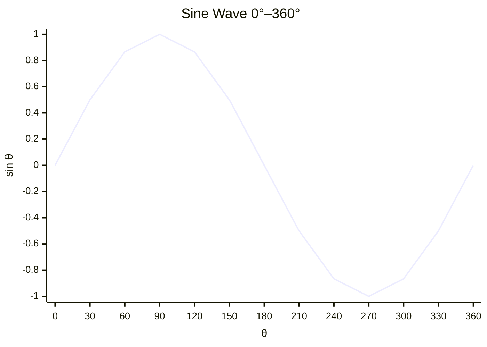
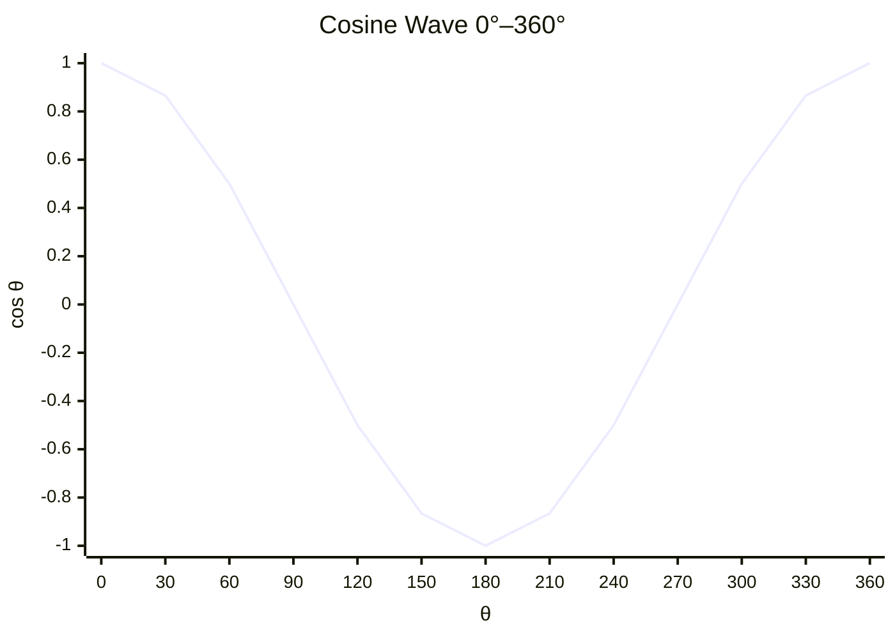

# 4.5 Trig Ratios SOHCAHTOA

Tags: #maths/trigonometry #maths/geometry #cs/graphics #cs/gamedev

## Position in the Course
Prerequisites: [[4.1 Lines Angles and Triangles]], [[4.4 Pythagoras Theorem]], [[2.2 Simplifying Expressions]], [[2.9 Indices and Powers]]

Used later in: (none within Module 04)

Mastery threshold: 90% overall, and 100% on the New Words section.

> [!tip] How to study this note
> SOHCAHTOA is a memory aid — write it on every page. Draw every triangle before applying the ratios. Always label the opposite, adjacent, and hypotenuse relative to the angle you are working with.

---

## Introduction

Trigonometry connects the angles of a triangle to the ratios of its sides. In any right-angled triangle, the ratio of two specific sides depends only on the angle, not on the size of the triangle. Three key ratios — [[sine]] (sin), [[cosine]] (cos), and [[tangent]] (tan) — are defined by the acronym SOHCAHTOA:

- **SOH**: Sin = Opposite / Hypotenuse
- **CAH**: Cos = Adjacent / Hypotenuse
- **TOA**: Tan = Opposite / Adjacent

> [!info] Why "ratio"?
> A ratio is a comparison of two quantities by division. When we say sin θ = Opposite / Hypotenuse, we are comparing the length of the opposite side to the length of the hypotenuse. For a 30° angle, this ratio is always 0.5, whether the triangle is tiny or enormous. That consistency is what makes trig powerful.

## New Words

- [[sine]] — In a right triangle, the ratio of the opposite side to the hypotenuse. Abbreviated sin. sin θ = Opposite / Hypotenuse.
- [[cosine]] — In a right triangle, the ratio of the adjacent side to the hypotenuse. Abbreviated cos. cos θ = Adjacent / Hypotenuse.
- [[tangent]] — In a right triangle, the ratio of the opposite side to the adjacent side. Abbreviated tan. tan θ = Opposite / Adjacent. Also equal to sin θ / cos θ.
- [[opposite]] — The side of a right triangle that is across from a given angle. It does not touch the vertex of that angle.
- [[adjacent]] — The side of a right triangle that is next to a given angle, forming one side of that angle. It is not the hypotenuse.
- [[hypotenuse]] — The longest side of a right triangle, always opposite the right angle.
- [[inverse sine]] (arcsin, sin⁻¹) — The function that answers "what angle has this sine value?" If sin θ = 0.5, then sin⁻¹(0.5) = 30°.
- [[inverse cosine]] (arccos, cos⁻¹) — The function that answers "what angle has this cosine value?"
- [[inverse tangent]] (arctan, tan⁻¹) — The function that answers "what angle has this tangent value?"
- [[SOHCAHTOA]] — A mnemonic: Sine = Opposite / Hypotenuse, Cosine = Adjacent / Hypotenuse, Tangent = Opposite / Adjacent.
- [[similar triangles]] — Triangles that have the same angles but different side lengths. Their corresponding sides are in the same proportion. This is why trig ratios are constant for a given angle.

> [!important] You pass this topic only when you can define all eleven terms without looking.

---

## Breadcrumbs

### Breadcrumb 1: Labelling a Right Triangle for Trig

**Builds on:** [[4.1 Breadcrumb 4|Triangles Have Three Sides, Three Angles]] (right triangle), [[4.4 Breadcrumb 1|Right-Angled Triangles and the Hypotenuse]] (hypotenuse identification)

Before using any trig ratio, label the three sides relative to your reference angle θ (theta):

```text
         /|
        / |
       /  |  opposite
      /   |    (to θ)
     /    |
    /θ    |
   /──────┘
   adjacent
```

- **Hypotenuse**: The longest side, opposite the right angle.
- **Opposite**: The side directly across from θ. Does **not** touch θ's vertex.
- **Adjacent**: The side next to θ that is **not** the hypotenuse. Touches θ's vertex.

> [!warning] Critical
> The labelling changes depending on which angle you pick! If you switch to the other acute angle, opposite and adjacent swap. Always decide which angle is θ first.

#### Chunked Example
Question: A right triangle has a 40° angle (θ = 40°). The side across from θ is 5 cm long. The side next to θ (not the hypotenuse) is 6 cm. The longest side is approximately 7.81 cm. Label all three sides relative to θ.

Step 1: θ = 40°. The side across from θ (the opposite) is 5 cm.
Step 2: The side next to θ that is not the hypotenuse is 6 cm — the adjacent.
Step 3: The longest side (7.81 cm) is opposite the right angle — the hypotenuse.

Answer: Opposite = 5 cm, Adjacent = 6 cm, Hypotenuse ≈ 7.81 cm.

Verify: 5² + 6² = 25 + 36 = 61, and 7.81² ≈ 61. ✓

---

### Breadcrumb 2: Sine (SOH)

**Builds on:** [[4.5 Breadcrumb 1|Labelling a Right Triangle for Trig]] (opposite and hypotenuse), [[1.6 Fractions and Mixed Numbers]] (division as fraction)

**SOH** stands for **S**in = **O**pposite / **H**ypotenuse. Sine measures how much of the hypotenuse the opposite side occupies.

$$ \sin\theta = \frac{\text{opposite}}{\text{hypotenuse}} $$

```text
         /|
        / |
     h /  | o
      /   |
     /θ   |
    /─────┘
```

Since the opposite ≤ the hypotenuse, sin θ is between 0 and 1 for angles 0°–90°.

Here is the sine wave from 0° to 360°:



#### Chunked Example
Question: In a right triangle, the side opposite a 30° angle is 4 cm. The hypotenuse is 8 cm. Find sin 30°.

Step 1: Opposite = 4 cm, Hypotenuse = 8 cm.
Step 2: SOH: sin 30° = 4 / 8 = 0.5.

Answer: sin 30° = 0.5.

#### Chunked Example
Question: sin 60° ≈ 0.8660. If the hypotenuse is 10 m, how long is the opposite side?

Step 1: sin 60° = Opposite / Hypotenuse.
Step 2: 0.8660 = Opposite / 10.
Step 3: Opposite = 0.8660 × 10 = 8.66.

Answer: The opposite side is approximately **8.66 m**.

---

### Breadcrumb 3: Cosine (CAH)

**Builds on:** [[4.5 Breadcrumb 1|Labelling a Right Triangle for Trig]] (adjacent and hypotenuse), [[1.6 Fractions and Mixed Numbers]] (division as fraction)

**CAH** stands for **C**os = **A**djacent / **H**ypotenuse. Cosine measures how much of the hypotenuse the adjacent side occupies.

$$ \cos\theta = \frac{\text{adjacent}}{\text{hypotenuse}} $$

```text
         /|
        / |
     h /  |
      /   | o
     /    |
    /θ    |
   /──────┘
      a
```

cos θ is between 0 and 1 for angles 0°–90°. cos 0° = 1, cos 90° = 0.



#### Chunked Example
Question: In a right triangle, the side adjacent to a 45° angle is 7 cm. The hypotenuse is approximately 9.899 cm. Find cos 45°.

Step 1: Adjacent = 7 cm, Hypotenuse ≈ 9.899 cm.
Step 2: CAH: cos 45° = 7 / 9.899 ≈ 0.7071.

Answer: cos 45° ≈ 0.7071 (= √2 / 2 exactly).

#### Chunked Example
Question: cos 25° ≈ 0.9063. If the hypotenuse is 12 cm, how long is the adjacent side?

Step 1: cos 25° = Adjacent / Hypotenuse.
Step 2: 0.9063 = Adjacent / 12.
Step 3: Adjacent = 0.9063 × 12 = 10.8756.

Answer: The adjacent side is approximately **10.88 cm**.

---

### Breadcrumb 4: Tangent (TOA)

**Builds on:** [[4.5 Breadcrumb 1|Labelling a Right Triangle for Trig]] (opposite and adjacent), [[1.6 Fractions and Mixed Numbers]] (division as fraction)

**TOA** stands for **T**an = **O**pposite / **A**djacent. Tangent compares the opposite to the adjacent.

$$ \tan\theta = \frac{\text{opposite}}{\text{adjacent}} = \frac{\sin\theta}{\cos\theta} $$

```text
         /|
        / |
       /  |
      /   | o
     /    |
    /θ    |
   /──────┘
      a
```

> [!important] Tangent can be > 1
> Unlike sine and cosine, tangent is not bounded between 0 and 1. As θ → 90°, tan θ → ∞. tan 45° = 1.

#### Chunked Example
Question: In a right triangle, the side opposite a 60° angle is 8.66 cm. The adjacent side is 5 cm. Find tan 60°.

Step 1: Opposite ≈ 8.66 cm, Adjacent = 5 cm.
Step 2: TOA: tan 60° = 8.66 / 5 = 1.732.

Answer: tan 60° ≈ 1.732 (= √3 exactly).

Check: sin 60° / cos 60° = 0.8660 / 0.5 = 1.732. ✓

#### Chunked Example
Question: tan 35° ≈ 0.7002. If the adjacent side is 15 cm, how long is the opposite?

Step 1: tan 35° = Opposite / Adjacent.
Step 2: 0.7002 = Opposite / 15.
Step 3: Opposite = 0.7002 × 15 = 10.503.

Answer: The opposite side is approximately **10.50 cm**.

---

### Breadcrumb 5: Finding a Side Using Trig

**Builds on:** [[4.5 Breadcrumb 2|Sine (SOH)]], [[4.5 Breadcrumb 3|Cosine (CAH)]], [[4.5 Breadcrumb 4|Tangent (TOA)]] (all three ratios), [[2.2 Breadcrumb 4|Solving Word Problems]] (rearranging)

Practical strategy:
1. **Label** the triangle: mark θ, opposite, adjacent, hypotenuse.
2. **Identify** which sides are known and unknown.
3. **Choose** SOH, CAH, or TOA based on which sides are involved.
4. **Write** the formula: sin θ = O/H, cos θ = A/H, or tan θ = O/A.
5. **Substitute** known values.
6. **Rearrange** to isolate the unknown.
7. **Solve** and include units.

#### Chunked Example
Question: A right triangle has a 32° angle. The hypotenuse is 15 cm. Find the side opposite the 32° angle.

Step 1: θ = 32°. Hypotenuse = 15 cm (known). Opposite = ? (unknown).
Step 2: Opposite and hypotenuse → **SOH**.
Step 3: sin 32° = Opposite / 15.
Step 4: sin 32° ≈ 0.5299. Opposite = 15 × 0.5299 = 7.9485.

Answer: The opposite side is approximately **7.95 cm**.

#### Chunked Example
Question: A right triangle has a 50° angle. The adjacent side is 8.2 m. Find the hypotenuse.

Step 1: θ = 50°. Adjacent = 8.2 m (known). Hypotenuse = ? (unknown).
Step 2: Adjacent and hypotenuse → **CAH**.
Step 3: cos 50° = 8.2 / Hypotenuse.
Step 4: cos 50° ≈ 0.6428. Hypotenuse = 8.2 / 0.6428 ≈ 12.756.

Answer: The hypotenuse is approximately **12.76 m**.

#### Chunked Example
Question: A right triangle has a 28° angle. The opposite side is 3.5 km. Find the adjacent side.

Step 1: θ = 28°. Opposite = 3.5 km (known). Adjacent = ? (unknown).
Step 2: Opposite and adjacent → **TOA**.
Step 3: tan 28° = 3.5 / Adjacent. tan 28° ≈ 0.5317.
Step 4: Adjacent = 3.5 / 0.5317 ≈ 6.583.

Answer: The adjacent side is approximately **6.58 km**.

---

### Breadcrumb 6: Finding an Angle Using Inverse Trig

**Builds on:** [[4.5 Breadcrumb 5|Finding a Side Using Trig]] (setting up ratio), [[3.2 Breadcrumb 3|Inverse Functions]] (function that undoes another)

If you know two sides, find the acute angles using inverse trigonometric functions:

- **Inverse sine** (sin⁻¹ or arcsin): "What angle has this sine?"
- **Inverse cosine** (cos⁻¹ or arccos): "What angle has this cosine?"
- **Inverse tangent** (tan⁻¹ or arctan): "What angle has this tangent?"

> [!warning] Notation
> sin⁻¹ θ does **not** mean 1 / sin θ. The −1 denotes the inverse function. The reciprocal of sine is cosecant (csc = 1/sin), which is different.

#### Strategy
1. Identify the two known sides.
2. Choose the ratio (SOH, CAH, TOA) that uses those sides.
3. Write: sin θ = O/H (or cos θ = A/H, or tan θ = O/A).
4. Apply the inverse: θ = sin⁻¹(O/H) (or cos⁻¹(A/H), or tan⁻¹(O/A)).
5. Use a calculator.

#### Chunked Example
Question: A right triangle has opposite = 5 cm and hypotenuse = 13 cm. Find θ.

Step 1: Opposite and hypotenuse → **SOH**.
Step 2: sin θ = 5 / 13 ≈ 0.3846.
Step 3: θ = sin⁻¹(0.3846) ≈ 22.62°.

Answer: The angle θ is approximately **22.62°**.

#### Chunked Example
Question: A right triangle has legs 9 cm and 12 cm. Find the acute angle opposite the 9 cm side.

Step 1: Opposite = 9 cm, Adjacent = 12 cm → **TOA**.
Step 2: tan θ = 9 / 12 = 0.75.
Step 3: θ = tan⁻¹(0.75) ≈ 36.87°.

Answer: The angle θ is approximately **36.87°**.

Check: The other acute angle = 90° − 36.87° = 53.13°. Verify: tan 53.13° = 12/9 ≈ 1.333. ✓

---

## Worked Examples

### Example 1 — Finding a Side Using Sine (SOH)

Question: A right triangle has a 35° angle. The hypotenuse is 20 cm. Find the side opposite the 35° angle. Use sin 35° ≈ 0.574.

Step 1: Opposite and hypotenuse → use SOH: sin θ = Opposite / Hypotenuse.

Step 2: sin 35° = Opposite / 20. Opposite = 20 × 0.574 = 11.48.

Answer: The opposite side is approximately **11.48 cm**.

---

### Example 2 — Finding a Side Using Tangent (TOA)

Question: A right triangle has a 42° angle. The side adjacent to this angle is 9 m. Find the side opposite the 42° angle. Use tan 42° ≈ 0.900.

Step 1: Opposite and adjacent → use TOA: tan θ = Opposite / Adjacent.

Step 2: tan 42° = Opposite / 9. Opposite = 9 × 0.900 = 8.10.

Answer: The opposite side is approximately **8.10 m**.

---

### Example 3 — Finding an Angle Using Inverse Sine

Question: A right triangle has opposite side 7 cm and hypotenuse 25 cm. Find the angle θ (to 1 decimal place).

Step 1: Opposite and hypotenuse → use SOH: sin θ = 7 / 25 = 0.28.

Step 2: θ = sin⁻¹(0.28) ≈ 16.3°.

Answer: The angle θ is approximately **16.3°**.

---

### Example 4 — Finding an Angle Using Inverse Cosine

Question: A right triangle has adjacent side 8 cm and hypotenuse 17 cm. Find the angle θ (to 1 decimal place).

Step 1: Adjacent and hypotenuse → use CAH: cos θ = 8 / 17 ≈ 0.4706.

Step 2: θ = cos⁻¹(0.4706) ≈ 61.9°.

Answer: The angle θ is approximately **61.9°**.

---

## Why This Works

### Similar Triangles
Triangles with the same three angles are similar. Two right triangles both with a 30° angle have angles 30°, 60°, 90° — they are scaled copies. Their side ratios are identical:

```text
Triangle A:       Triangle B (scaled ×2):
   /|                /|
  / |               / |
 /  | 1            /  | 2
/30°|             /30°|
──────            ──────
 √3                2√3
```

- sin 30° = 1/2 = 2/4 = 0.5 ✓
- cos 30° = √3/2 = 2√3/4 ✓
- tan 30° = 1/√3 = 2/(2√3) ✓

> [!important] The key insight
> Trig ratios depend **only on the angle**, not on the triangle size.

### Connection to Pythagoras
The identity sin²θ + cos²θ = 1 comes from [[4.4 Pythagoras Theorem]]:
- sin²θ + cos²θ = O²/H² + A²/H² = (O² + A²) / H² = H²/H² = 1

This is the **Pythagorean identity** — a powerful check.

---

## Common Mistakes

> [!failure] Mistake 1: Using the wrong reference angle
> Swapping opposite and adjacent because θ is in the wrong position. **Fix**: Always mark θ clearly before labelling.

> [!failure] Mistake 2: Mixing up sin⁻¹ and 1/sin
> Treating sin⁻¹ as the reciprocal. **Fix**: sin⁻¹ is the inverse function (arcsin), not the reciprocal.

> [!failure] Mistake 3: Using the wrong ratio
> Applying SOH when the problem needs CAH. **Fix**: Write SOHCAHTOA at the top of every problem.

> [!failure] Mistake 4: Calculator in wrong mode
> Getting a wrong answer because the calculator is in radians instead of degrees. **Fix**: Always check calculator mode.

> [!failure] Mistake 5: Forgetting to rearrange
> Writing sin θ = O/H but multiplying H × sin θ when the unknown is in the denominator. **Fix**: If the unknown is the denominator, cross-multiply: H = O / sin θ.

> [!failure] Mistake 6: Using the hypotenuse as adjacent
> The adjacent is never the hypotenuse. It is always one of the two legs.

---

## Where This Shows Up in CS

- **Game development**: Aiming (atan2(dy, dx)), third-person camera offset (sin/cos of pitch/yaw).
- **Computer graphics**: Rotation matrices (x' = x cos θ − y sin θ, y' = x sin θ + y cos θ); lighting dot product; perspective projection.
- **Robotics**: Inverse kinematics (arctan to find joint angles); odometry (sin/cos for position changes); LIDAR (polar to Cartesian).
- **Signal processing**: Sine wave synthesis sin(2πft); FFT decomposition into sine/cosine components.
- **Physics engines**: Projectile motion (v cos θ, v sin θ); collision response (normal reflection).
- **Machine learning**: Periodic feature encoding (time of day as sin/cos).

---

## Checkpoint Questions

1. A right triangle has θ = 40°, opposite = 6.43 cm, adjacent = 7.66 cm. Find the hypotenuse.
2. If sin θ = 0.6 and the hypotenuse is 20, find the opposite.
3. If cos θ = 0.8 and the adjacent is 12, find the hypotenuse.
4. If tan θ = 1.5 and the adjacent is 10, find the opposite.
5. A 5-12-13 right triangle has its smallest angle opposite the side of length 5. Find sin of that angle.
6. A right triangle has opposite = 7 and hypotenuse = 25. Find θ (to 1 d.p.).
7. A right triangle has adjacent = 9 and opposite = 12. Find tan θ.
8. True or false: In a right triangle, the adjacent is always shorter than the hypotenuse.
9. True or false: tan 45° = sin 45° / cos 45°.
10. A 5 m ladder leans at 65° to the ground. How high up the wall does it reach?

---

## Mini-Quiz

1. Write SOHCAHTOA in full.
2. Label opposite, adjacent, hypotenuse for θ:
   ```
      /|
     / |
    /  |
   /θ  |
   ────
   ```
3. sin 30° = 0.5, hypotenuse = 14. Find the opposite.
4. cos 45° ≈ 0.7071, adjacent = 8. Find the hypotenuse.
5. tan 20° ≈ 0.3640, opposite = 3. Find the adjacent.
6. opposite = 8, hypotenuse = 17. Find θ (nearest degree).
7. adjacent = 5, opposite = 5. Find θ.
8. What is the relationship between sin θ, cos θ, and tan θ?
9. Circle the correct statement:
   a) sin⁻¹(0.5) = 30° means "the angle whose sine is 0.5 is 30°"
   b) sin⁻¹(0.5) = 30° means "1 / sin(0.5) = 30°"
10. Why do trig ratios depend only on the angle and not on triangle size?

---

## Pass Gate

You may move to [[4.6 Unit Circle]] only when you can:
- define every term in [[#New Words]] without looking
- correctly label opposite, adjacent, hypotenuse for any angle
- compute any side given an angle and one side (SOH/CAH/TOA)
- compute any angle given two sides (inverse trig)
- explain why trig ratios depend only on the angle (similar triangles)
- answer at least 9 out of 10 mini-quiz questions correctly
- complete [[4.5 Trig Ratios SOHCAHTOA - Mastery Test]] with at least 90%

---

## Related Notes

Backward links: [[4.1 Lines Angles and Triangles]], [[4.4 Pythagoras Theorem]], [[2.2 Simplifying Expressions]], [[2.9 Indices and Powers]], [[1.6 Fractions and Mixed Numbers]]

Forward links: (none within Module 04)

Assessment links: [[4.5 Trig Ratios SOHCAHTOA - Worked Examples]], [[4.5 Trig Ratios SOHCAHTOA - Practice Questions]], [[4.5 Trig Ratios SOHCAHTOA - Mastery Test]], [[4.5 Trig Ratios SOHCAHTOA - Answers]]
