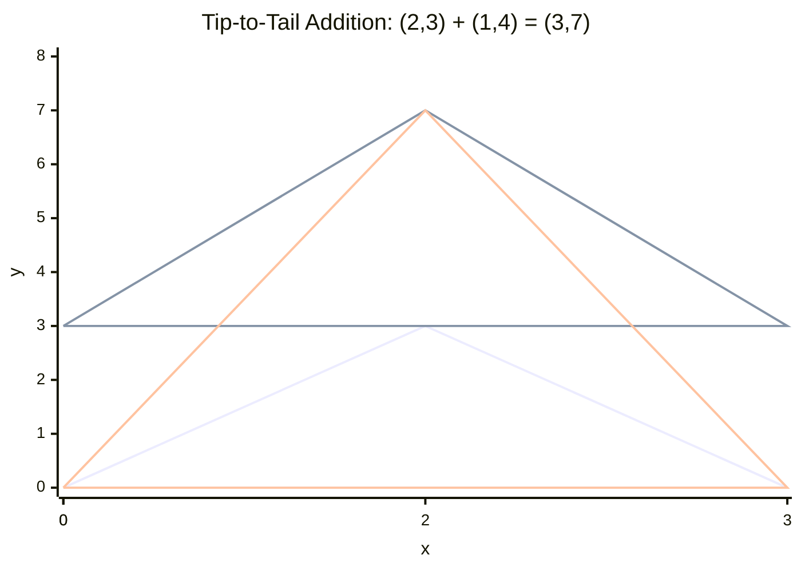

# 4.8 Vectors Basics

Tags: #maths/vectors #maths/geometry #cs/graphics #cs/gamedev #cs/physics

## Position in the Course
Prerequisites: [[4.4 Pythagoras Theorem]], [[4.5 Trig Ratios SOHCAHTOA]], [[3.1 Coordinates and Axes]]

Used later in: (none within Module 04)

Mastery threshold: 90% overall, and 100% on the New Words section.

> [!tip] How to study this note
> A vector is a quantity with both size and direction. Think of it as an arrow. The length of the arrow is the magnitude. The way it points is the direction. Vectors are the language of movement in games, graphics, and physics.

---

## Introduction

A **vector** is a quantity that has both **magnitude** (size) and **direction**. Vectors differ from scalars, which have only magnitude (like temperature, mass, or speed). In 2D, a vector is often written as (x, y), meaning "move x units right and y units up." Vectors represent positions, velocities, forces, and directions in computer graphics, games, and machine learning.

> [!example] Everyday idea
> "5 km north" is a vector — it tells you both how far (magnitude = 5) and which way (direction = north). "5 km" without a direction is just a scalar. In a game, a character's velocity is a vector: (3, 4) means moving 3 pixels right and 4 pixels up each frame.

## New Words

- [[vector]] — a quantity with both magnitude (size) and direction, often written as (x, y) or (x, y, z).
- [[magnitude]] — the length or size of a vector; for (x, y), magnitude = √(x² + y²).
- [[direction]] — the way a vector points, often given as an angle or a unit vector.
- [[component]] — one of the coordinate values (x, y, or z) that make up a vector.
- [[resultant]] — the sum of two or more vectors; the single vector with the same combined effect.

> [!important] You pass this topic only when you can define all five terms without looking.

---

## Breadcrumbs

### Breadcrumb 1: What Is a Vector?

**Builds on:** [[3.1 Breadcrumb 1|Axes and Coordinates]] (coordinate differences), [[4.1 Breadcrumb 1|Lines Are Straight Paths]] (directed line segment)

A vector is an **arrow** with:
- A starting point (tail)
- An ending point (head)
- A length (magnitude)
- A direction

We write vectors as (3, 4) or $$\begin{pmatrix}3\\4\end{pmatrix}$$. The components tell you how far to move along each axis.

```text
     ^
     |        / (3, 4)
   4 |      /
     |    /
   3 |  /
     |/ θ
   0 +--+--+--+-->
       1  2  3
```

#### Chunked Example
Question: What are the components of the vector from (1, 2) to (4, 6)?

Δx = 4 − 1 = 3. Δy = 6 − 2 = 4. Vector = (3, 4).

Answer: The vector is **(3, 4)**, meaning 3 units right and 4 units up.

---

### Breadcrumb 2: Magnitude (Length) of a Vector

**Builds on:** [[4.4 Breadcrumb 2|The Theorem — a² + b² = c²]] (Pythagoras), [[4.4 Breadcrumb 4|The Distance Formula (2D)]] (distance between points)

The magnitude (length) of a vector uses Pythagoras:

$$ |\mathbf{v}| = \sqrt{x^2 + y^2} $$

For a 3D vector (x, y, z): $$ |\mathbf{v}| = \sqrt{x^2 + y^2 + z^2} $$

> [!important] Magnitude is distance
> The magnitude of a vector is the distance from its tail to its head — same formula as the distance between two points.

#### Chunked Example
Question: Find the magnitude of v = (3, 4).

|v| = √(3² + 4²) = √(9 + 16) = √25 = 5.

Answer: The magnitude is **5 units**.

---

### Breadcrumb 3: Adding Vectors

**Builds on:** [[4.8 Breadcrumb 1|What Is a Vector?]] (vector components), [[1.3 Breadcrumb 1|Adding Numbers on the Number Line]] (adding x and y parts separately)

Add corresponding components:

$$ \mathbf{a} + \mathbf{b} = (a_x + b_x,\; a_y + b_y) $$

Geometrically, place the tail of the second at the head of the first (tip-to-tail). The resultant goes from the first tail to the last head.



#### Chunked Example
Question: a = (2, 3), b = (1, 4). Find a + b.

Add x: 2 + 1 = 3. Add y: 3 + 4 = 7. Result: (3, 7).

Answer: **a + b = (3, 7)**.

---

### Breadcrumb 4: Scalar Multiplication

**Builds on:** [[4.8 Breadcrumb 1|What Is a Vector?]] (vector components), [[1.4 Breadcrumb 2|Multiplication as Repeated Addition]] (scaling each component)

Multiplying a vector by a scalar (plain number) scales each component:

$$ k \times (x, y) = (kx, ky) $$

- k > 1: longer, same direction
- 0 < k < 1: shorter, same direction
- k < 0: flips to opposite direction

> [!warning] Negative scalars reverse direction
> Multiplying by −1 flips the vector 180°. (3, 4) becomes (−3, −4) — same magnitude, opposite direction.

#### Chunked Example
Question: v = (2, 3). Compute 3v and −2v.

3v = (6, 9). −2v = (−4, −6).

Answer: **3v = (6, 9)**, **−2v = (−4, −6)**.

---

### Breadcrumb 5: Unit Vectors

**Builds on:** [[4.8 Breadcrumb 2|Magnitude (Length) of a Vector]] (divide by magnitude), [[4.5 Breadcrumb 4|Tangent (TOA)]] (direction from components)

A **unit vector** has magnitude 1. It points in the same direction as the original but with length 1.

$$ \hat{\mathbf{v}} = \frac{\mathbf{v}}{|\mathbf{v}|} $$

The hat (^) means "unit vector." Unit vectors represent **direction only**.

> [!example] CS use
> In games, unit vectors represent facing direction. For direction (3, 4), normalising gives (0.6, 0.8). Multiply by speed to get velocity.

#### Chunked Example
Question: Find the unit vector in the direction of v = (3, 4).

|v| = √(3² + 4²) = 5. Divide: (3/5, 4/5) = (0.6, 0.8).

Answer: The unit vector is **(0.6, 0.8)**.

Check: √(0.36 + 0.64) = √1 = 1. ✓

---

### Breadcrumb 6: Vectors in 3D

**Builds on:** [[4.8 Breadcrumb 1|What Is a Vector?]] (2D components), [[4.8 Breadcrumb 2|Magnitude (Length) of a Vector]] (2D magnitude), [[3.1 Breadcrumb 10|Plotting Points in 3D]] (three axes)

Vectors extend to 3D: (x, y, z). Same rules:

$$ |\mathbf{v}| = \sqrt{x^2 + y^2 + z^2} \quad \mathbf{a} + \mathbf{b} = (a_x+b_x,\; a_y+b_y,\; a_z+b_z) \quad k\mathbf{v} = (kx, ky, kz) $$

3D vectors are the foundation of all 3D graphics, game engines, and physics.

#### Chunked Example
Question: a = (1, 2, 3), b = (4, 5, 6). Find a + b and |a|.

a + b = (5, 7, 9). |a| = √(1+4+9) = √14 ≈ 3.74.

Answer: **a + b = (5, 7, 9)**. |a| = **√14 ≈ 3.74**.

---

## Worked Examples

### Example 1 — Finding Components and Magnitude

Question: Find the vector from P(1, 2) to Q(7, 10). Then find its magnitude.

Step 1: Vector v = Q − P = (7 − 1, 10 − 2) = (6, 8).

Step 2: Magnitude |v| = √(6² + 8²) = √(36 + 64) = √100 = 10.

Answer: The vector is **(6, 8)** with magnitude **10 units**.

---

### Example 2 — Adding Vectors

Question: a = (3, 7) and b = (5, −2). Find a + b and compute |a + b|.

Step 1: a + b = (3 + 5, 7 + (−2)) = (8, 5).

Step 2: |a + b| = √(8² + 5²) = √(64 + 25) = √89 ≈ 9.43.

Answer: a + b = **(8, 5)**. |a + b| = **√89 ≈ 9.43**.

---

### Example 3 — Scalar Multiplication and Unit Vectors

Question: v = (7, 24). Compute 2v and find the unit vector in the direction of v.

Step 1: 2v = (14, 48).

Step 2: |v| = √(7² + 24²) = √(49 + 576) = √625 = 25.

Step 3: Unit vector v̂ = v / |v| = (7/25, 24/25) = (0.28, 0.96).

Answer: 2v = **(14, 48)**. Unit vector = **(0.28, 0.96)**.

Check: √(0.28² + 0.96²) = √(0.0784 + 0.9216) = √1 = 1. ✓

---

### Example 4 — 3D Vector Operations

Question: a = (2, 3, 6) and b = (0, 4, 8). Find a + b and |a|.

Step 1: a + b = (2 + 0, 3 + 4, 6 + 8) = (2, 7, 14).

Step 2: |a| = √(2² + 3² + 6²) = √(4 + 9 + 36) = √49 = 7.

Answer: a + b = **(2, 7, 14)**. |a| = **7 units**.

---

## Why This Works

Vectors work component-by-component because each axis is independent. Moving 3 right and 4 up is the same as moving 3 right, then 4 up — order does not matter. Adding component-wise is just combining movements on each axis. This connects back to [[1.3 Addition and Subtraction]] — vector addition is addition of x-parts and y-parts separately.

---

## Common Mistakes

1. Adding vectors by adding magnitudes (|a| + |b| — this ignores direction).
2. Forgetting to include the negative sign when subtracting vectors.
3. Computing magnitude as x + y instead of √(x² + y²).
4. Confusing scalars (plain numbers) with vectors (have direction).
5. Thinking a zero vector (0, 0) has no meaning — it means "no displacement."
6. Normalising by dividing by the wrong magnitude.

> [!failure] Mistake pattern
> "|v| = 3 + 4 = 7 for v = (3, 4)" — wrong! Magnitude is √(x² + y²), not x + y. The correct answer is 5.

---

## Where This Shows Up in CS

- **Game development**: player position, velocity, acceleration — all vectors.
- **Computer graphics**: vertex positions, normals, texture coordinates.
- **Physics engines**: forces, momentum, collision normals.
- **Machine learning**: feature vectors, weight vectors, embeddings.
- **Robotics**: joint positions in 3D space, end-effector poses.

Example — character movement:
```python
position = (100, 200)
velocity = (3, -4)
new_position = (position[0] + velocity[0], position[1] + velocity[1])
speed = math.sqrt(velocity[0]**2 + velocity[1]**2)  # = 5
direction = (velocity[0]/speed, velocity[1]/speed)  # (0.6, -0.8)
```

---

## Checkpoint Questions

1. What two properties does every vector have?
2. How do you find the magnitude of (x, y)?
3. Write the rule for adding two vectors.
4. What happens when you multiply a vector by −1?
5. What is a unit vector, and how do you find one?
6. How does vector addition differ from scalar addition?
7. Find the vector from (2, 5) to (7, 17).
8. Find |v| for v = (6, 8).
9. Normalise v = (3, 4).
10. Why are vectors important in machine learning?

---

## Mini-Quiz

1. Define vector in one sentence.
2. Find the vector from (1, 1) to (4, 5).
3. |v| for v = (5, 12).
4. a = (2, 3), b = (4, 1). Find a + b.
5. v = (3, 2). Find 4v and −v.
6. Find the unit vector of (6, 8).
7. a = (1, 0, 2), b = (3, 4, 5). Find a + b.
8. What is the difference between a vector and a scalar? Give an example of each.
9. Explain why |a + b| is not necessarily equal to |a| + |b|.
10. In a game, a character's velocity is (4, 3). What is their speed?

---

## Pass Gate

You may move to [[4.9 Dot Product and Projection]] only when you can:
- define every term in [[#New Words]] without looking
- compute the vector between two points
- find the magnitude of any 2D or 3D vector
- add and subtract vectors component-wise
- multiply a vector by a scalar
- normalise a vector to a unit vector
- answer at least 9 out of 10 mini-quiz questions correctly
- complete [[4.8 Vectors Basics - Mastery Test]]

---

## Related Notes

Backward links: [[4.4 Pythagoras Theorem]], [[4.5 Trig Ratios SOHCAHTOA]], [[3.1 Coordinates and Axes]]

Forward links: (none within Module 04)

Assessment links: [[4.8 Vectors Basics - Worked Examples]], [[4.8 Vectors Basics - Practice Questions]], [[4.8 Vectors Basics - Mastery Test]], [[4.8 Vectors Basics - Answers]]
