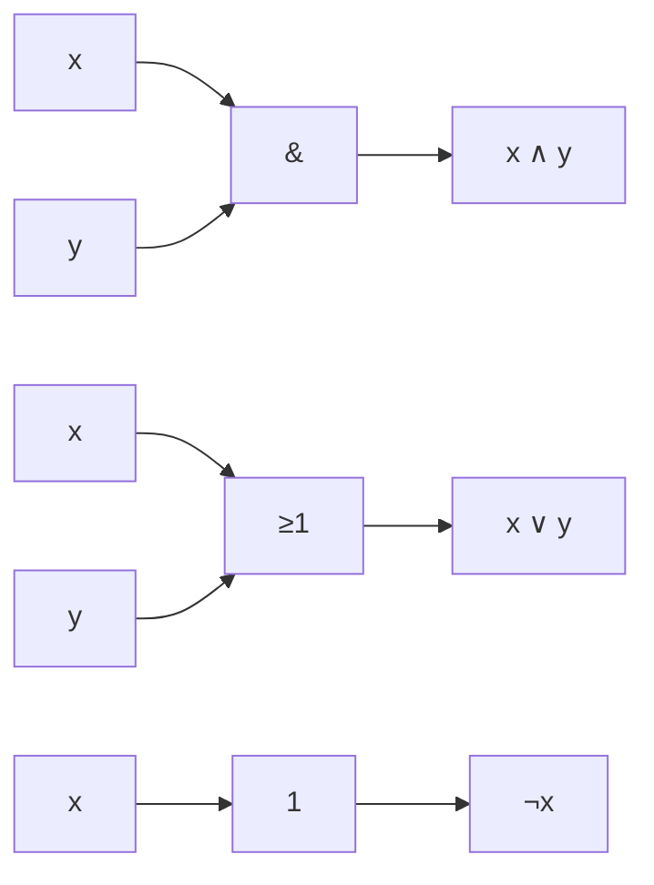

# 5.8 Boolean Algebra and De Morgan Laws

Tags: #maths/logic #maths/algebra #cs/hardware #cs/programming #cs/algorithms

## Position in the Course
Prerequisites: [[5.5 Propositional Logic]], [[5.6 Truth Tables]], [[5.7 Implication and Equivalence]]

Used later in: (none within Module 05)

Mastery threshold: 90% overall, 100% on New Words.

> [!tip] How to study this note
> Boolean algebra is the algebra of true/false. Work through every law with a truth table at least once. The algebraic laws reduce complex expressions just like arithmetic laws do for numbers — practice simplification until it becomes automatic.

---

## Introduction

Boolean algebra is an algebraic structure over the set {0, 1} with operations ∧, ∨, ¬. It was introduced by George Boole in 1847 to formalise logical reasoning. Today it is the mathematical foundation of digital circuit design, programming language semantics, and database queries.

Just as arithmetic has laws (commutative, associative, distributive), Boolean algebra has its own laws — many identical to arithmetic, some different (like De Morgan's).

Boolean algebra lets you **simplify** logical expressions: fewer gates = cheaper, faster, cooler-running chips.

## New Words

- [[Boolean algebra]] — an algebraic structure on {0, 1} with operations ∧, ∨, ¬.
- [[Boolean variable]] — a variable that takes only values 0 (false) or 1 (true).
- [[Boolean expression]] — an expression built from Boolean variables, constants 0/1, and operators ∧, ∨, ¬.
- [[duality principle]] — every Boolean identity remains valid after swapping ∧↔∨ and 0↔1.
- [[De Morgan's laws]] — ¬(x ∧ y) = ¬x ∨ ¬y, ¬(x ∨ y) = ¬x ∧ ¬y.
- [[idempotent law]] — x ∧ x = x, x ∨ x = x.
- [[absorption law]] — x ∧ (x ∨ y) = x, x ∨ (x ∧ y) = x.
- [[complement law]] — x ∧ ¬x = 0, x ∨ ¬x = 1.
- [[identity law]] — x ∧ 1 = x, x ∨ 0 = x.
- [[domination law]] — x ∧ 0 = 0, x ∨ 1 = 1.
- [[involution law (double negation)]] — ¬(¬x) = x.

> [!important] You pass this topic only when you can define all eleven terms without looking.

---

## Breadcrumbs

### Breadcrumb 1: Boolean Algebra as an Algebraic Structure

**Builds on:** [[5.5 Breadcrumb 2|Logical Connectives — NOT, AND, OR]] (operators), [[2.1 Breadcrumb 3|Commutative, Associative, and Distributive Properties]] (algebraic laws in ordinary algebra)

Boolean algebra has:
- **Carrier set**: {0, 1} (false, true)
- **Operations**: ∧, ∨, ¬ (binary, binary, unary)
- **Constants**: 0, 1
- **Axioms**: commutative, associative, distributive, identity, complement

Every Boolean expression computes a function f: {0, 1}ⁿ → {0, 1}. Each such function is a **Boolean function**.

> [!example] Why this matters
> Ordinary algebra over ℝ: `(x + y)² = x² + 2xy + y²`. Boolean algebra over {0, 1}: `(x ∧ y) ∨ (¬x ∧ z)` is a multiplexer expression. Both are algebraic objects with laws.

#### Chunked Example
Show that Boolean algebra has closure: if x, y ∈ {0, 1}, then x ∧ y ∈ {0, 1}. 0∧0=0, 0∧1=0, 1∧0=0, 1∧1=1. All outputs are 0 or 1. ✅

---

### Breadcrumb 2: The Laws of Boolean Algebra

**Builds on:** [[5.8 Breadcrumb 1|Boolean Algebra as an Algebraic Structure]] (what Boolean algebra is), [[5.5 Breadcrumb 6|Logical Equivalence]] (equivalence reasoning)

| Law | ∧ form | ∨ form |
|-----|--------|--------|
| Identity | x ∧ 1 = x | x ∨ 0 = x |
| Domination | x ∧ 0 = 0 | x ∨ 1 = 1 |
| Idempotent | x ∧ x = x | x ∨ x = x |
| Complement | x ∧ ¬x = 0 | x ∨ ¬x = 1 |
| Double negation | ¬(¬x) = x | — |
| Commutative | x ∧ y = y ∧ x | x ∨ y = y ∨ x |
| Associative | (x∧y)∧z = x∧(y∧z) | (x∨y)∨z = x∨(y∨z) |
| Distributive | x ∧ (y ∨ z) = (x∧y) ∨ (x∧z) | x ∨ (y ∧ z) = (x∨y) ∧ (x∨z) |
| Absorption | x ∧ (x ∨ y) = x | x ∨ (x ∧ y) = x |
| De Morgan | ¬(x ∧ y) = ¬x ∨ ¬y | ¬(x ∨ y) = ¬x ∧ ¬y |

> [!tip] Duality
> Notice the symmetry: every law in the ∧ column becomes the ∨ column by swapping ∧↔∨ and 0↔1. This is the **duality principle**.

#### Chunked Example
Prove the absorption law `x ∨ (x ∧ y) = x` using other laws:
1. x ∨ (x ∧ y) ≡ (x ∧ 1) ∨ (x ∧ y)  [identity]
2. ≡ x ∧ (1 ∨ y)                    [distributive]
3. ≡ x ∧ 1                          [domination: 1 ∨ y = 1]
4. ≡ x                              [identity]

---

### Breadcrumb 3: De Morgan's Laws — Truth Table Verification

**Builds on:** [[5.8 Breadcrumb 2|The Laws of Boolean Algebra]] (De Morgan listed), [[5.6 Breadcrumb 1|Building a Truth Table]] (verification method)

```
x    y    ¬(x ∧ y)    ¬x ∨ ¬y    ¬(x ∨ y)    ¬x ∧ ¬y
────────────────────────────────────────────────────────
0    0       1          1           1           1
0    1       1          1           0           0
1    0       1          1           0           0
1    1       0          0           0           0
```

Columns ¬(x∧y) and ¬x∨¬y match → first De Morgan law verified.
Columns ¬(x∨y) and ¬x∧¬y match → second De Morgan law verified.

> [!warning] Common trap
> De Morgan distributes the negation across the operator AND flips the operator. NOT (A AND B) = (NOT A) OR (NOT B). The AND becomes OR and vice versa.

---

### Breadcrumb 4: Duality Principle

**Builds on:** [[5.8 Breadcrumb 2|The Laws of Boolean Algebra]] (paired laws)

The **dual** of a Boolean expression is obtained by swapping:
- ∧ ↔ ∨
- 0 ↔ 1 (if constants appear)

**Duality principle**: if two Boolean expressions are equivalent, their duals are also equivalent.

Example: The dual of `x ∧ (y ∨ z)` is `x ∨ (y ∧ z)`. The dual of `x ∧ ¬x = 0` is `x ∨ ¬x = 1`.

> [!tip] Why duality exists
> The Boolean axioms are symmetric: every axiom appears in pairs. This structural symmetry means every theorem has a dual theorem, proved by applying the dual steps of the original proof.

#### Chunked Example
Find the dual of `(x ∧ 0) ∨ (¬y ∧ 1)`. Swap ∧↔∨ and 0↔1 → `(x ∨ 1) ∧ (¬y ∨ 0)`.

---

### Breadcrumb 5: Simplification

**Builds on:** [[5.8 Breadcrumb 2|The Laws of Boolean Algebra]] (all laws as rewrite rules)

Simplification applies the laws as rewrite rules to reduce complexity.

**Example:** Simplify `(A ∧ B) ∨ (A ∧ ¬B)`
1. Factor: `A ∧ (B ∨ ¬B)`  [distributive]
2. Complement: `B ∨ ¬B = 1`
3. Identity: `A ∧ 1 = A`

Result: `(A ∧ B) ∨ (A ∧ ¬B) ≡ A`

**Example:** `¬(P ∨ (Q ∧ R))`
1. De Morgan: `¬P ∧ ¬(Q ∧ R)`
2. De Morgan: `¬P ∧ (¬Q ∨ ¬R)`

Result: `¬(P ∨ (Q ∧ R)) ≡ ¬P ∧ (¬Q ∨ ¬R)`

> [!tip] Minimisation
> Karnaugh maps (K-maps) are a graphical method for minimising Boolean expressions with ≤6 variables. For more variables, computer algorithms (Quine-McCluskey, Espresso) are used.

#### Chunked Example
Simplify `(x ∧ y) ∨ (x ∧ ¬y) ∨ (¬x ∧ y)`:
- Apply absorption: `(x ∧ y) ∨ (x ∧ ¬y) = x ∨ (x ∧ ¬y)`... Actually: `(x∧y) ∨ (x∧¬y) = x ∧ (y∨¬y) = x ∧ 1 = x`.
- So expression becomes `x ∨ (¬x ∧ y)`.
- Distributive (or Shannon expansion): `(x ∨ ¬x) ∧ (x ∨ y) = 1 ∧ (x ∨ y) = x ∨ y`.

---

### Breadcrumb 6: Digital Logic Gates

**Builds on:** [[5.8 Breadcrumb 1|Boolean Algebra as an Algebraic Structure]] (operations), [[5.8 Breadcrumb 5|Simplification]] (reducing expressions)

Every Boolean operation maps to a digital logic gate:

| Gate | Expression | Symbol (US ANSI) |
|------|-----------|------------------|
| AND | x ∧ y | D-shaped |
| OR | x ∨ y | Shield-shaped |
| NOT | ¬x | Triangle with circle |
| NAND | ¬(x ∧ y) | AND + circle |
| NOR | ¬(x ∨ y) | OR + circle |
| XOR | x ⊕ y | OR with extra curve |
| XNOR | ¬(x ⊕ y) | XOR + circle |

**NAND universality**: every Boolean function can be implemented using only NAND gates (or only NOR gates). This is why real chips use a single gate type.



> [!tip] De Morgan's in hardware
> A NAND gate is equivalent to an OR gate with inverted inputs: `¬(x ∧ y) = ¬x ∨ ¬y`. This means you can swap gate types by pushing bubbles through.

---

## Worked Examples

### Example 1 — Simplifying a Boolean Expression

Question: Simplify the Boolean expression (x ∧ y) ∨ (x ∧ ¬y) ∨ (¬x ∧ y) using the laws of Boolean algebra.

Step 1: Group first two terms: (x ∧ y) ∨ (x ∧ ¬y) = x ∧ (y ∨ ¬y) [distributive law].

Step 2: y ∨ ¬y = 1 [complement law]. So x ∧ 1 = x [identity law].

Step 3: The expression becomes x ∨ (¬x ∧ y).

Step 4: By the distributive law: x ∨ (¬x ∧ y) = (x ∨ ¬x) ∧ (x ∨ y).

Step 5: x ∨ ¬x = 1 [complement law]. So 1 ∧ (x ∨ y) = x ∨ y [identity law].

Answer: The simplified expression is **x ∨ y**.

### Example 2 — Applying De Morgan's Laws

Question: Apply De Morgan's laws step by step to fully negate and simplify ¬( (A ∨ B) ∧ ¬C ).

Step 1: First De Morgan (break the outer ∧): ¬( (A ∨ B) ∧ ¬C ) ≡ ¬(A ∨ B) ∨ ¬(¬C).

Step 2: Apply De Morgan to ¬(A ∨ B): (¬A ∧ ¬B) ∨ ¬(¬C).

Step 3: Double negation on ¬(¬C): (¬A ∧ ¬B) ∨ C.

Answer: ¬( (A ∨ B) ∧ ¬C ) ≡ **(¬A ∧ ¬B) ∨ C**.

### Example 3 — Finding the Dual

Question: Find the dual of the Boolean expression (x ∧ 1) ∨ (¬x ∧ y).

Step 1: Swap ∧ ↔ ∨: (x ∨ 1) ∧ (¬x ∨ y).

Step 2: Swap constants 0 ↔ 1: (x ∨ 0) ∧ (¬x ∨ y).

Step 3: Simplify: x ∨ 0 = x [identity law]. So the dual is x ∧ (¬x ∨ y).

But wait — let's check: original dual before simplification: (x ∨ 0) ∧ (¬x ∨ y) = x ∧ (¬x ∨ y). This is the dual expression.

Answer: The dual is **(x ∨ 0) ∧ (¬x ∨ y)** which simplifies to **x ∧ (¬x ∨ y)**.

### Example 4 — Truth Table Verification of a Boolean Law

Question: Use a truth table to verify the absorption law: x ∨ (x ∧ y) = x.

Step 1: Two variables → 4 rows. Compute x∧y, then x ∨ (x∧y), and compare to x.

```
x  y  x∧y  x ∨ (x∧y)  x
──────────────────────────
0  0   0       0       0
0  1   0       0       0
1  0   0       1       1
1  1   1       1       1
```

Step 2: The columns x ∨ (x∧y) and x are identical on every row.

Answer: The absorption law **x ∨ (x ∧ y) = x** is verified.

## Why This Works

Boolean algebra is a **free Boolean algebra** generated by the variables: every element is a finite combination of generators under ∧, ∨, ¬ modulo the equivalence laws. This makes it a **model of classical propositional logic** where algebraic equality ≡ logical equivalence.

The satisfaction of all laws can be verified by exhaustive enumeration (truth tables, 2ⁿ cases). Because the carrier set is finite (size 2), all proofs about Boolean algebra reduce to case analysis — unlike ℝ where infinite cases are needed.

---

## Common Mistakes

1. Thinking De Morgan's breaks one connective only — it breaks and flips both: `¬(x∧y) = ¬x ∨ ¬y`.
2. Forgetting that `x ∨ y` already includes the case where both are true — no need to add a separate case.
3. Confusing Boolean algebra (∧, ∨, ¬) with arithmetic (+, ×, −) — in Boolean, `x ∨ x = x` (not 2x).
4. Double negation: `¬(¬x) = x`, not `¬x`.
5. De Morgan's on nested expressions: `¬(x ∧ (y ∨ z)) = ¬x ∨ ¬(y ∨ z) = ¬x ∨ (¬y ∧ ¬z)` — apply stepwise.
6. Distributive law for ∨ over ∧: many forget the second distributive law.

---

## Where This Shows Up in CS

- **Digital logic design**: every processor is a large Boolean expression. Simplifying Boolean expressions reduces gate count, power, and cost.
- **Compiler optimisation**: constant folding evaluates `true && x → x` at compile time. Dead-code elimination proves `if (false) { ... }` is unreachable.
- **Database queries**: SQL WHERE clause optimisation applies De Morgan's: `NOT (x > 5 OR y < 3)` → `x <= 5 AND y >= 3`.
- **Cryptography**: Boolean functions are used in S-boxes (AES, DES). Algebraic properties affect security.
- **Type systems**: type checking reduces to Boolean satisfiability in some type systems.
- **Formal verification**: SAT solvers convert hardware/software to Boolean formulas and check satisfiability.

---

## Checkpoint Questions

1. State De Morgan's laws in Boolean algebraic form.
2. Simplify: `(A ∧ B) ∨ (A ∧ ¬B)`.
3. Simplify: `¬(P ∨ ¬Q)`.
4. What is the dual of `x ∧ (y ∨ ¬z)`?
5. Prove the absorption law using other laws.
6. Verify `x ∧ (y ∨ z) = (x∧y) ∨ (x∧z)` with a truth table.
7. Explain NAND universality.
8. How many Boolean functions of 2 variables exist? (Hint: 2^(2ⁿ) for n variables.)
9. Simplify `(x ∨ y) ∧ (x ∨ ¬y)`.
10. Give a programming example where De Morgan's improves readability.

---

## Mini-Quiz

1. De Morgan's first law: ¬(x∧y) = ? (a) ¬x∧¬y (b) ¬x∨¬y (c) ¬(x∨y)
2. Idempotent law: x ∧ x = ? (a) 0 (b) x (c) 1
3. Absorption: x ∨ (x ∧ y) = ? (a) x (b) y (c) x∧y
4. Complement: x ∧ ¬x = ? (a) 0 (b) 1 (c) x
5. Duality swaps? (a) 0↔1, ∧↔∨ (b) x↔¬x (c) nothing
6. Domination law: x ∨ 1 = ? (a) 0 (b) 1 (c) x
7. Number of Boolean functions of 3 variables? (a) 8 (b) 64 (c) 256
8. NAND = ? (a) ¬(x∧y) (b) ¬x∧¬y (c) x∨y
9. `¬(x ∨ ¬y)` simplifies to? (a) ¬x ∧ y (b) ¬x ∨ y (c) x ∧ ¬y
10. The dual of x ∧ 0 is? (a) x ∨ 1 (b) ¬x ∨ 0 (c) x ∨ y

Answers: 1-b, 2-b, 3-a, 4-a, 5-a, 6-b, 7-c (2^(2³) = 2⁸ = 256), 8-a, 9-a, 10-a.

---

## Pass Gate

You may move to [[5.9 Direct Proof and Counterexample]] only when you can:
- define every term in [[#New Words]] without looking
- state and apply De Morgan's laws
- verify any Boolean law using a truth table
- simplify Boolean expressions using the laws
- apply the duality principle
- explain NAND universality
- simplify a compound Boolean expression step by step
- answer at least 9 out of 10 mini-quiz questions correctly
- complete [[5.8 Boolean Algebra and De Morgan Laws - Mastery Test]]

---

## Related Notes

Backward links: [[5.5 Propositional Logic]], [[5.6 Truth Tables]], [[5.7 Implication and Equivalence]]

Forward links: (none within Module 05)

Assessment links: [[5.8 Boolean Algebra and De Morgan Laws - Worked Examples]], [[5.8 Boolean Algebra and De Morgan Laws - Practice Questions]], [[5.8 Boolean Algebra and De Morgan Laws - Mastery Test]], [[5.8 Boolean Algebra and De Morgan Laws - Answers]]
