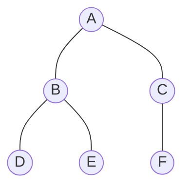
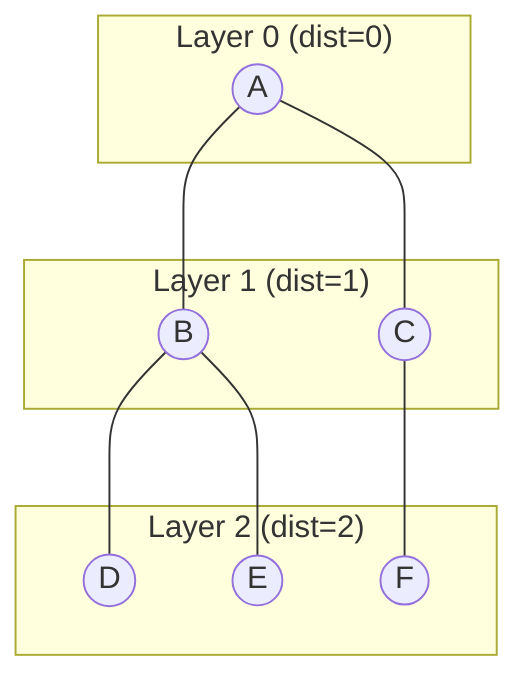
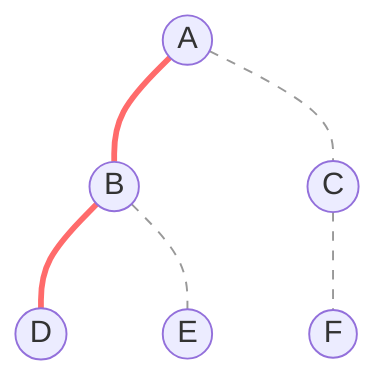
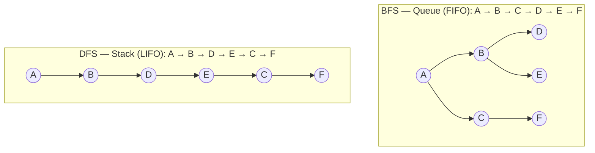
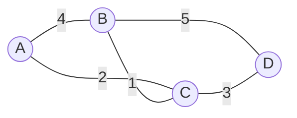
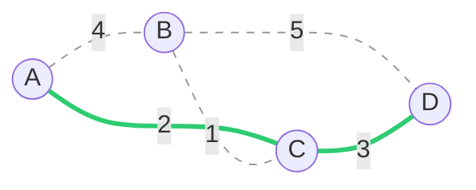
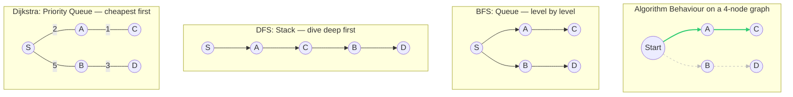
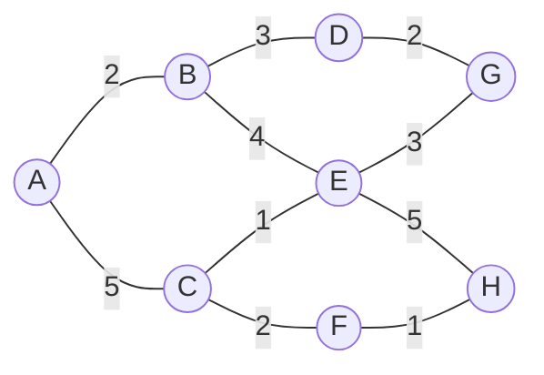
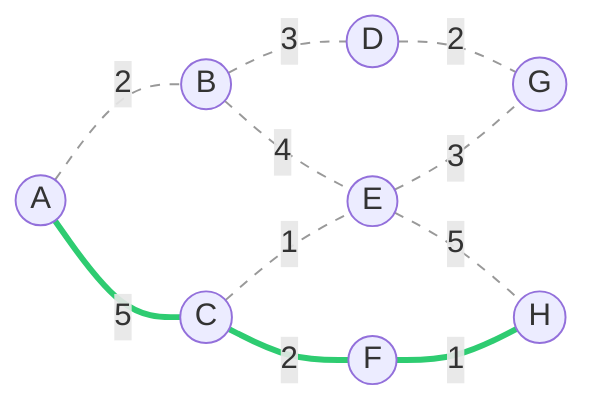

# 6.9 Graph Algorithms: BFS, DFS, Dijkstra

Tags: #cs/algorithms #cs/graphs #maths/discrete #cs/complexity

## Position in the Course
Prerequisites: [[6.7 Graph Theory Basics]], [[6.8 Trees and Traversal]]

Used later in: (none within Module 06)

Mastery threshold: 85% overall, 100% on New Words.

> [!tip] How to study this note
> Act out each algorithm. For BFS, use a queue (write nodes on slips of paper, process front, add neighbours to back). For DFS, use a stack. Run each algorithm manually on small graphs before looking at code.

## Plain-English Idea

Graph algorithms find paths through networks:

- **BFS** (Breadth-First Search): explores level by level. Like ripples from a stone dropped in water. Finds the shortest path in unweighted graphs.
- **DFS** (Depth-First Search): explores as deep as possible before backtracking. Like solving a maze by going down one path until you hit a dead end.
- **Dijkstra's algorithm**: finds shortest paths in weighted graphs. Used by GPS navigation to find the fastest route.

> [!example] Everyday idea
> BFS is like finding the shortest chain of friends connecting you to a celebrity on social media. DFS is like exploring a cave network, marking tunnels you have visited. Dijkstra is like a GPS finding the fastest route, considering road distances and traffic.

## New Words

- **[[breadth-first search (BFS)]]** - graph traversal that visits neighbours level by level using a queue.
- **[[depth-first search (DFS)]]** - graph traversal that goes as deep as possible using a stack or recursion.
- **[[shortest path]]** - the path with the minimum number of edges (unweighted) or minimum total weight (weighted).
- **[[Dijkstra's algorithm]]** - algorithm for finding shortest paths from a single source in a weighted graph with non-negative edge weights.
- **[[priority queue]]** - data structure where the smallest element is always removed first, used by Dijkstra.

You pass this topic only when you can define all five terms without looking.

## Concept 1 - Breadth-First Search (BFS)

BFS explores the graph in layers. Starting from a source node, it visits all nodes at distance 1, then distance 2, then distance 3, and so on.

**Data structure**: Queue (First-In-First-Out).

Here is the sample graph we will use for BFS and DFS:



**Algorithm**:
```text
1. Mark source as visited, enqueue it.
2. While queue is not empty:
   a. Dequeue node v.
   b. For each unvisited neighbour u of v:
      - Mark u as visited, set distance[u] = distance[v]+1.
      - Enqueue u.
```

### Chunked Example

Question: Graph above. BFS from A. Visit order and distances.

Step 1: Start A. Queue=[A], dist[A]=0.

```text
Dequeue A. Neighbours: B, C. Both unvisited.
dist[B]=1, dist[C]=1. Queue=[B, C]
```

Step 2: Dequeue B. Neighbours: A(visited), D, E.

```text
dist[D]=2, dist[E]=2. Queue=[C, D, E]
```

Step 3: Dequeue C. Neighbours: A(visited), F.

```text
dist[F]=2. Queue=[D, E, F]
```

Step 4: Dequeue D, E, F (no new unvisited neighbours).

Answer:
```text
Visit order: A, B, C, D, E, F
Distances: A=0, B=1, C=1, D=2, E=2, F=2
```

Visually, BFS explores in expanding rings from the source:



> [!tip] BFS finds shortest paths in UNWEIGHTED graphs
> Because BFS explores by increasing distance, the first time it visits a node, the distance is the minimum number of edges from the source.

## Concept 2 - Depth-First Search (DFS)

DFS goes as deep as possible, then backtracks.

**Data structure**: Stack (Last-In-First-Out) or recursion.

Same sample graph (A-B, A-C, B-D, B-E, C-F). DFS follows one branch as deep as it can go before backtracking:



*Thick red edges: DFS path A→B→D (backtrack) →E (backtrack) →C→F. Dashed edges: not followed in this traversal order.*

**Algorithm (iterative with stack)**:
```text
1. Push source onto stack, mark visited.
2. While stack is not empty:
   a. Pop node v.
   b. For each unvisited neighbour u of v:
      - Mark u as visited.
      - Push u onto stack.
```

### Chunked Example

Question: Same graph: A-B, A-C, B-D, B-E, C-F. DFS from A.

Step 1: Stack=[A]. Pop A. Push B, C (order depends on neighbour order, assume alphabetical: B then C). Stack=[B,C].

```text
Pop B (top). Push D, E. Stack=[D,E,C]
```

Step 2: Pop D. No unvisited neighbours. Stack=[E,C].

```text
Pop E. No unvisited neighbours. Stack=[C].
```

Step 3: Pop C. Push F. Stack=[F].

```text
Pop F. Stack=[].
```

Answer: **Visit order: A, B, D, E, C, F** (different from BFS's A, B, C, D, E, F).

Here is the visual comparison of both traversals on the same graph:



BFS spreads like a wave — all nodes at distance 1, then all at distance 2. DFS dives straight down one branch, then backtracks.

> [!example] CS connection
> DFS is used by garbage collectors to trace reachable objects. BFS is used by web crawlers to discover pages level by level.

## Concept 3 - Shortest Path in Unweighted Graphs (using BFS)

BFS gives shortest paths automatically. We just track the parent of each discovered node, then reconstruct the path at the end.

### Chunked Example

Question: Find the shortest path from A to F in the same graph.

Step 1: Run BFS from A, tracking parents.

```text
A: parent = None
B: parent = A
C: parent = A
D: parent = B
E: parent = B
F: parent = C
```

Step 2: Backtrack from F: F→C→A.

Answer: **A → C → F (2 edges)**.

## Concept 4 - Dijkstra's Algorithm (Weighted Graphs)

Dijkstra finds the shortest path from a source to all other nodes in a graph with non-negative edge weights.

**Data structure**: Priority queue (min-heap) of (distance, node).

**Algorithm**:
```text
1. dist[source]=0, dist[others]=∞.
2. Insert all nodes into priority queue with their dist.
3. While queue is not empty:
   a. Extract node u with smallest dist.
   b. For each neighbour v of u:
      - If dist[u] + w(u,v) < dist[v]:
          Update dist[v] = dist[u] + w(u,v).
          Update priority queue (decrease key).
```

### Chunked Example

Question: Find shortest path from A to D.



Step 1: Initialise:
```text
dist[A]=0, dist[B]=∞, dist[C]=∞, dist[D]=∞
PQ: [(0,A)]
```

Step 2: Extract A (0). Update neighbours:
```text
B: 0+4=4 < ∞ → dist[B]=4, PQ: [(2,C), (4,B)]
C: 0+2=2 < ∞ → dist[C]=2, PQ: [(2,C), (4,B)]
```

Step 3: Extract C (2). Update neighbours:
```text
B: 2+1=3 < 4 → dist[B]=3, PQ: [(3,B), (4,B), (∞,D)]  (old entry 4 still there)
D: 2+3=5 < ∞ → dist[D]=5, PQ: [(3,B), (4,B), (5,D)]
```

Step 4: Extract B (3). Update neighbours:
```text
D: 3+5=8 > 5 → no update
```

Step 5: Extract D (5). No updates.

Answer: **Shortest path A→C→D = 5**.

Visually, Dijkstra builds a shortest-path tree from the source. The thick edges show the shortest paths found:



*Thick green: shortest-path tree edges (A→C, C→D). Dashed: edges not on any shortest path from A.*

> [!warning] Dijkstra's algorithm requires non-negative edge weights
> If there are negative edge weights, Dijkstra may fail. Use Bellman-Ford instead.

## Why This Works

BFS works layer by layer because the queue ensures nodes discovered earlier are processed first. Since all edges have weight 1 in an unweighted graph, the first time you reach a node is necessarily the shortest path.

DFS works depth-first because the stack ensures the most recently discovered node is explored next. This uses less memory for deep graphs but may find much longer paths.

Dijkstra works because it always expands the node with the **minimum tentative distance**. By the time a node is removed from the priority queue, its distance is guaranteed to be correct (the "greedy" property). This only holds for non-negative weights.

Here is how the three algorithms compare on the same graph — each picks a different next node based on its data structure:



*BFS (blue) visits neighbours before their children. DFS (red) follows a single branch to the end. Dijkstra (green) always expands the cheapest known node first.*

## Worked Examples

### Example 1 - BFS Application: Social Network

Question: In a social network, A is friends with B and C. B is friends with D and E. C is friends with F. D is friends with G. Find the shortest friendship chain from A to G.

Step 1: Run BFS from A.

```text
Layer 0: A
Layer 1: B, C
Layer 2: D, E, F
Layer 3: G
```

Step 2: Backtrack: G→D→B→A.

Answer: **A → B → D → G (3 degrees of separation)**.

### Example 2 - DFS Application: Maze

Question: Find a path through a maze. Represent dead ends as nodes with no exits.

Step 1: Start at entrance (source), apply DFS pushing each corridor (neighbour).

Step 2: When hitting a dead end (leaf), backtrack to the last node with unexplored paths.

Step 3: Continue until exit found or all paths exhausted.

Answer: **DFS guarantees finding a path if one exists (though not necessarily the shortest)**.

### Example 3 - Dijkstra on a Larger Graph

Question: Find shortest path from A to H.



Step 1: dist[A]=0. PQ=[(0,A)].

```text
Extract A: dist[B]=2, dist[C]=5. PQ=[(2,B),(5,C)]
```

Step 2: Extract B: dist[D]=5, dist[E]=6. PQ=[(5,C),(5,D),(6,E)]

```text
C has dist 5, D has dist 5. Extract C first (alphabetical).
```

Step 3: Extract C: dist[E]=min(6,5+1=6)=6, dist[F]=7. PQ=[(5,D),(6,E),(7,F)]

Step 4: Extract D: dist[G]=7. PQ=[(6,E),(7,F),(7,G)]

Step 5: Extract E: dist[G]=min(7,6+3=9)=7, dist[H]=11. PQ=[(7,F),(7,G),(11,H)]

Step 6: Extract F: dist[H]=min(11,7+1=8)=8. PQ=[(7,G),(8,H)]

Step 7: Extract G: no improvements. PQ=[(8,H)]

Answer: **A→C→F→H = 8, not A→B→E→H = 11**.

The green path shows the shortest route Dijkstra discovers:



*Green: shortest path A→C→F→H (total weight 8). Grey dashed: other edges not on the shortest path.*

### Example 4 - Dijkstra vs BFS

Question: In the example above, would BFS find the right path?

Step 1: BFS treats all edges as length 1. It would find A→B→D→E→H (4 hops, actual weight 2+3+3+5=13) or A→C→F→H (3 hops, actual weight 5+2+1=8).

Step 2: BFS says the 3-hop path is shortest (fewest edges). Dijkstra correctly says the 8-weight path is shortest.

Answer: **BFS works for number of edges. Dijkstra works for weighted paths. Use Dijkstra when edges have weights**.

## Common Mistakes

> [!failure] Mistake pattern: Confusing BFS and DFS data structures
> BFS = Queue (FIFO). DFS = Stack (LIFO). If you use a stack for BFS, you get DFS behaviour and vice versa.

> [!failure] Mistake pattern: Forgetting to mark nodes as visited
> Without marking visited nodes, both BFS and DFS can loop infinitely (especially DFS). Always mark when you first discover a node.

> [!failure] Mistake pattern: Dijkstra on negative weights
> Dijkstra assumes once a node is visited, its distance is final. Negative weights can break this, creating shorter paths through already-processed nodes.

> [!failure] Mistake pattern: Mixing Dijkstra heuristic with A* search
> Dijkstra is uninformed (no heuristic). A* adds a heuristic for direction. Dijkstra always finds the shortest path but may explore more nodes than A*.

## Where This Shows Up in CS

### GPS Navigation
GPS systems use Dijkstra (or A*) on road networks with weights = travel time or distance.

### Web Crawling
Search engines use BFS to discover web pages: start from known pages, follow links level by level.

### Network Routing
OSPF (Open Shortest Path First) uses Dijkstra to compute routing tables.

### Other applications
- **Social network**: friend recommendations (BFS for degrees of separation)
- **Garbage collection**: DFS to mark reachable objects
- **Maze solving**: DFS for simple path, BFS for shortest path
- **Puzzle solving**: BFS for minimum moves (e.g., Rubik's cube)
- **AI search**: DFS for game tree search (chess, Go)

## Checkpoint Questions

1. What data structure does BFS use? What about DFS?
2. Why does BFS find shortest paths in unweighted graphs?
3. Why can Dijkstra fail with negative edge weights?
4. What does it mean to "mark a node as visited"?
5. How does Dijkstra decide which node to process next?
6. What is the time complexity of BFS for a graph with V vertices and E edges?
7. In the priority queue of Dijkstra, what is the key (priority)?
8. When would you choose DFS over BFS?

## Mini-Quiz

1. BFS uses a ___ (queue/stack).
2. DFS uses a ___ (queue/stack).
3. Dijkstra requires edge weights to be ___ (positive/negative).
4. BFS on an unweighted graph finds the ___ (shortest/longest) path.
5. True or false: DFS always finds the shortest path.
6. In Dijkstra, the first node extracted from the priority queue is the ___.
7. What is the complexity of Dijkstra with a binary heap priority queue?
8. True or false: Marking visited prevents infinite loops in BFS/DFS.
9. If Dijkstra extracts node X with dist=5, can there be a shorter path to X?
10. A graph has 10 vertices and 15 edges, all weights = 1. Which finds shortest paths faster: BFS or Dijkstra?

## Pass Gate

You may move to [[6.10 Relations and Functions on Sets]] only when you can:

- define every term in [[#New Words]]
- simulate BFS on a small graph, tracking distances
- simulate DFS on a small graph, tracking visit order
- simulate Dijkstra on a small weighted graph
- explain why BFS and Dijkstra find shortest paths (and their limits)
- answer at least 9 out of 10 mini-quiz questions correctly
- complete [[6.9 Graph Algorithms BFS DFS Dijkstra - Mastery Test]]

## Related Notes

Backward links: [[6.7 Graph Theory Basics]], [[6.8 Trees and Traversal]]

Assessment links: [[6.9 Graph Algorithms BFS DFS Dijkstra - Worked Examples]], [[6.9 Graph Algorithms BFS DFS Dijkstra - Practice Questions]], [[6.9 Graph Algorithms BFS DFS Dijkstra - Mastery Test]], [[6.9 Graph Algorithms BFS DFS Dijkstra - Answers]]
