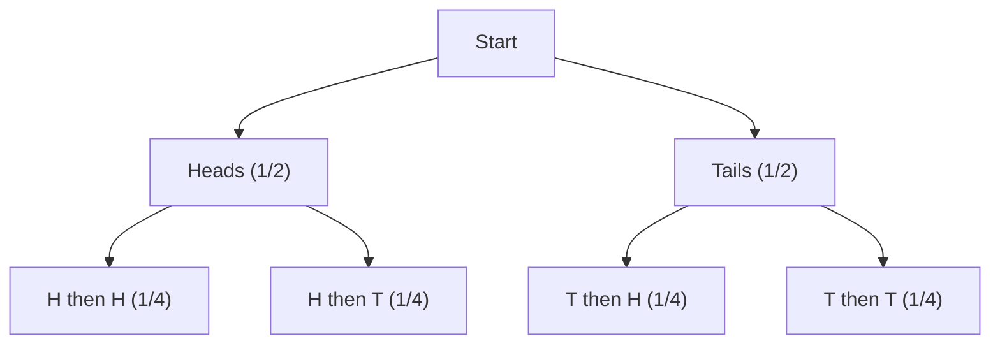

# 8.1 Probability Basics

Tags: #maths/probability #cs/ml #cs/datascience #maths/statistics

## Position in the Course
Prerequisites: [[5.1 Set Theory Basics]], [[1.6 Fractions and Mixed Numbers]], [[6.4 Counting Rules]]

Mastery threshold: 90% overall, 100% on New Words.

> [!tip] How to study this note
> Probability answers "how likely?" All probabilities are between 0 (impossible) and 1 (certain). Practise by listing all possible outcomes for simple experiments (coin flips, dice rolls) and counting favourable outcomes. The rules build on each other — do not skip Breadcrumb 1.

## Introduction

**Probability** measures how likely something is to happen. A fair coin flip:

```
P(Heads) = 1/2 = 0.5
```

From [[5.1 Set Theory Basics]], you already know about sets, elements, and subsets. Probability applies set theory to uncertainty: the **sample space** is the universal set of all possible outcomes, and an **event** is a subset (a collection of outcomes we care about).

Why does probability matter in CS? Every time a program makes a decision under uncertainty — whether a spam filter guesses that an email is junk, a recommendation system predicts what you will like, or a network router estimates congestion — it uses probability. Machine learning classifiers output probability distributions over classes. Search engines rank results by relevance probabilities. Cryptography relies on randomness and the probability of guessing a key. Without probability, none of these systems would work reliably.

The fundamental rules are simple:
- Probability is always between 0 and 1.
- The sum of probabilities of all possible outcomes equals 1.
- P(not A) = 1 - P(A).

These three rules alone, combined with set theory, give you enough to solve most basic probability problems.

## New Words

- **[[probability]]** — a number P(A) between 0 and 1 measuring how likely event A is.
- **[[event]]** — a set of outcomes we care about (e.g., rolling an even number).
- **[[sample space]]** — the set of ALL possible outcomes (e.g., {1, 2, 3, 4, 5, 6} for a die).
- **[[complement]]** — the event that A does NOT happen: P(Aᶜ) = 1 - P(A).
- **[[mutually exclusive]]** — events that cannot happen at the same time (no overlap).

> [!important] You pass this topic only when you can define all five terms without looking.

## Breadcrumbs

### Breadcrumb 1: Sample Spaces and Events

**Builds on:** [[5.1 Set Theory Basics]] (sets, subsets, universal set), [[1.1 Counting and Number Sense]] (counting outcomes)

The **sample space** S is the set of all possible outcomes. An **event** A is a subset of S.

A coin flip: S = {H, T}. Event A = "heads" = {H}. P(A) = 1/2.

A die roll: S = {1, 2, 3, 4, 5, 6}. Event "even number" = {2, 4, 6}. P(even) = 3/6 = 1/2.

When all outcomes are equally likely (a fair coin, a fair die), the probability of an event is:

```
P(A) = (number of outcomes in A) / (total number of outcomes in S)
```

This is the **classical definition** of probability, and it works whenever you can count equally likely outcomes.

#### Chunked Example 1 — Marbles

Question: A bag has 3 red marbles and 2 blue marbles. You pick one at random. What is the sample space? What is P(red)?

Step 1: S = {R₁, R₂, R₃, B₁, B₂}. Total = 5 equally likely outcomes.

Step 2: Event "red" = {R₁, R₂, R₃}. Count = 3.

Step 3: P(red) = 3/5.

Answer: **P(red) = 0.6**.

#### Chunked Example 2 — Deck of Cards

Question: A standard deck has 52 cards: 4 suits (hearts, diamonds, clubs, spades), 13 ranks per suit. You draw one card at random. What is P(heart)? What is P(ace)?

Step 1: Total outcomes = 52.

Step 2: Hearts = 13 cards. P(heart) = 13/52 = 1/4.

Step 3: Aces = 4 cards (one per suit). P(ace) = 4/52 = 1/13.

Answer: **P(heart) = 1/4. P(ace) = 1/13**.

### Breadcrumb 2: The Complement Rule

**Builds on:** Breadcrumb 1, [[5.1 Set Theory Basics]] (complement of a set)

The complement Aᶜ is the set of outcomes NOT in A. Since either A or Aᶜ must happen:

```
P(A) + P(Aᶜ) = 1    so    P(Aᶜ) = 1 - P(A)
```

The complement rule is surprisingly powerful: sometimes computing P(A) directly is hard, but computing P(not A) is easy. In that case, find P(not A) and subtract from 1.

#### Chunked Example 1 — Weather

Question: P(rain tomorrow) = 0.3. What is P(no rain)?

Step 1: "No rain" is the complement of "rain".

Step 2: P(no rain) = 1 - 0.3 = 0.7.

Answer: **P(no rain) = 0.7**.

#### Chunked Example 2 — At Least One

Question: You flip a fair coin 3 times. What is P(at least one head)?

Step 1: "At least one head" is the complement of "no heads" (i.e., all tails).

Step 2: S = {HHH, HHT, HTH, HTT, THH, THT, TTH, TTT}. P(all tails) = 1/8.

Step 3: P(at least one head) = 1 - 1/8 = 7/8.

Answer: **P(at least one head) = 7/8**.

Note: This is much faster than counting all outcomes that have at least one head (7 of them) directly.

### Breadcrumb 3: The Addition Rule

**Builds on:** Breadcrumb 1, [[5.1 Set Theory Basics]] (disjoint sets, union)

Two events are **mutually exclusive** if they cannot happen at the same time (their intersection is empty).

For mutually exclusive events: P(A or B) = P(A) + P(B)

For any two events (general addition rule): P(A or B) = P(A) + P(B) - P(A and B)

Why subtract P(A and B)? Because when A and B overlap, the overlapping outcomes are counted twice (once in P(A), once in P(B)). Subtracting P(A∩B) corrects this double-count.

#### Chunked Example 1 — Mutually Exclusive

Question: Rolling a die. P(roll 3) = 1/6. P(roll 5) = 1/6. These are mutually exclusive (cannot roll both). What is P(3 or 5)?

Step 1: P(3 or 5) = P(3) + P(5) = 1/6 + 1/6 = 2/6 = 1/3.

Answer: **P(3 or 5) = 1/3**.

#### Chunked Example 2 — Not Mutually Exclusive

Question: P(sunny) = 0.6, P(windy) = 0.3, P(sunny AND windy) = 0.1. What is P(sunny or windy)?

Step 1: Not mutually exclusive (it can be both sunny and windy). Use general rule.

Step 2: P(sunny or windy) = 0.6 + 0.3 - 0.1 = 0.8.

Answer: **P(sunny or windy) = 0.8**.

#### Chunked Example 3 — Cards

Question: Draw one card from a deck of 52. What is P(heart or ace)?

Step 1: P(heart) = 13/52. P(ace) = 4/52. P(heart AND ace) = 1/52 (the ace of hearts).

Step 2: P(heart or ace) = 13/52 + 4/52 - 1/52 = 16/52 = 4/13.

Answer: **P(heart or ace) = 4/13**.

### Breadcrumb 4: Probability Trees

**Builds on:** Breadcrumb 1, [[6.4 Counting Rules]] (multiplication principle)

A probability tree shows sequential events as branches, with probabilities on each branch.



The probability of a path = product of branch probabilities.

#### Chunked Example 1 — Without Replacement

Question: A bag has 4 red and 2 blue marbles. Draw two WITHOUT replacement. What is P(R then B)?

Step 1: First draw: P(R) = 4/6 = 2/3.

Step 2: Second draw (given first was R): 1 red removed. Left: 3 red, 2 blue. P(B|R) = 2/5.

Step 3: P(R then B) = (2/3) × (2/5) = 4/15.

Answer: **P(R then B) = 4/15**.

#### Chunked Example 2 — With Replacement vs Without Replacement

Question: A bag has 5 red and 3 blue marbles. Draw two marbles. Compare P(R then B) with replacement vs without replacement.

Case A — With replacement:
Step 1: First draw: P(R) = 5/8. Second draw: replace the marble. Bag is unchanged. P(B) = 3/8.
Step 2: P(R then B) = (5/8) × (3/8) = 15/64 ≈ 0.234.

Case B — Without replacement:
Step 1: First draw: P(R) = 5/8. Second draw: marble not replaced. Left: 4 red, 3 blue. P(B|R) = 3/7.
Step 2: P(R then B) = (5/8) × (3/7) = 15/56 ≈ 0.268.

Answer: **With replacement: 15/64. Without replacement: 15/56**. The probabilities differ because removing the first marble changes the composition of the bag.

### Breadcrumb 5: The Law of Total Probability

**Builds on:** Breadcrumb 3 (addition rule), Breadcrumb 4 (tree multiplication)

If events B₁, B₂, ..., Bₖ partition the sample space (mutually exclusive and cover everything), then for any event A:

```
P(A) = P(A|B₁)P(B₁) + P(A|B₂)P(B₂) + ... + P(A|Bₖ)P(Bₖ)
```

This is just summing the paths through a probability tree.

#### Chunked Example 1 — Phone Factories

Question: Two factories make phones. Factory 1 produces 60% of phones (3% defective). Factory 2 produces 40% (5% defective). What is P(defective)?

Step 1: P(def) = P(def|F₁)P(F₁) + P(def|F₂)P(F₂)
         = 0.03 × 0.6 + 0.05 × 0.4
         = 0.018 + 0.020 = 0.038

Answer: **P(defective) = 0.038 (3.8%)**.

#### Chunked Example 2 — Spam Filter

Question: 20% of emails are spam. The filter correctly flags 95% of spam as spam, but also falsely flags 2% of legitimate emails as spam. What is the overall probability an email is flagged as spam?

Step 1: Let A = "flagged as spam". Partition = {spam, not spam}.

Step 2: P(flagged) = P(flagged|spam)P(spam) + P(flagged|not spam)P(not spam)
                  = 0.95 × 0.20 + 0.02 × 0.80
                  = 0.19 + 0.016 = 0.206

Answer: **P(flagged as spam) = 0.206 (20.6%)**.

## Worked Examples

### Example 1 — Multi-step Probability with a Tree

Question: A box contains 6 white and 4 black balls. Draw two balls without replacement. What is the probability that the two balls are the same colour?

Step 1: "Same colour" means (white then white) OR (black then black). These two paths are mutually exclusive.

Step 2: Draw the tree mentally:
- First draw: P(W) = 6/10 = 3/5, P(B) = 4/10 = 2/5.
- Second draw given first was W: 5 white, 4 black left. P(W|W) = 5/9.
- Second draw given first was B: 6 white, 3 black left. P(B|B) = 3/9 = 1/3.

Step 3: P(W then W) = (3/5) × (5/9) = 15/45 = 1/3.
P(B then B) = (2/5) × (1/3) = 2/15.

Step 4: P(same colour) = P(W then W) + P(B then B) = 1/3 + 2/15 = 5/15 + 2/15 = 7/15.

Answer: **P(same colour) = 7/15 ≈ 0.467**.

### Example 2 — Using the Complement Rule Strategically

Question: You roll a fair die 4 times. What is the probability that you get at least one 6?

Step 1: "At least one 6" is the complement of "no 6s in 4 rolls".

Step 2: P(no 6 on one roll) = 5/6.

Step 3: Since rolls are independent, P(no 6 in 4 rolls) = (5/6)⁴ = 625/1296 ≈ 0.482.

Step 4: P(at least one 6) = 1 - 625/1296 = 671/1296 ≈ 0.518.

Answer: **P(at least one 6) = 671/1296 ≈ 0.518**.

Key insight: Computing "at least one" directly would require summing probabilities of exactly one 6, exactly two 6s, exactly three 6s, and exactly four 6s. The complement approach is vastly simpler.

### Example 3 — Law of Total Probability in a Medical Test

Question: A disease affects 1% of the population. A test for the disease is 99% accurate (99% sensitivity: if you have the disease, the test is positive 99% of the time; 99% specificity: if you are healthy, the test is negative 99% of the time). What is P(positive test)?

Step 1: Partition = {disease, no disease}. P(disease) = 0.01, P(no disease) = 0.99.

Step 2: P(positive|disease) = 0.99. P(positive|no disease) = 0.01 (false positive).

Step 3: P(positive) = 0.99 × 0.01 + 0.01 × 0.99 = 0.0099 + 0.0099 = 0.0198.

Answer: **P(positive test) ≈ 0.0198 (≈ 2%)**.

Surprising result: even though the test seems very accurate, positive tests are rare (~2%) because the disease itself is rare. This is a classic example of how ignoring the base rate (1% prevalence) leads to misinterpretation.

## Why This Works

Probability is set theory applied to uncertainty. The sample space is the universal set, events are subsets, complements and unions work the same way. The only new element is the probability measure — a number assigned to each event that satisfies P(S) = 1 and additivity for disjoint events.

Probability trees visualise sequential processes: each path represents one sequence of outcomes, and the product rule along branches comes from the multiplication principle for counting. The law of total probability is just summing over all paths in a tree.

The complement rule is particularly powerful because it often turns a hard problem (computing P(A) directly) into an easy one (computing P(not A) and subtracting from 1). Look for "at least one" or "none" phrases — they are strong signals the complement rule will help.

## Common Mistakes

> [!failure] Mistake pattern: Probability > 1 or < 0
> Always check: 0 ≤ P(A) ≤ 1. If your calculation gives 1.3 or -0.2, something is wrong.

> [!failure] Mistake pattern: Forgetting the subtraction in the addition rule
> P(A or B) = P(A) + P(B) only when A and B are mutually exclusive. Otherwise subtract P(A and B).

> [!failure] Mistake pattern: Confusing "and" with "or"
> P(A and B) is the overlap (intersection). P(A or B) is the union. They are different.

> [!failure] Mistake pattern: Assuming independence without justification
> Drawing without replacement changes probabilities on subsequent draws. Only use the simple product rule P(A∩B) = P(A)P(B) when events are truly independent.

## Where This Shows Up in CS

### Machine Learning — Classification
```python
# A classifier outputs probabilities for each class
# P(cat) = 0.85, P(dog) = 0.10, P(rabbit) = 0.05
# The complement rule applies: P(not cat) = 1 - 0.85 = 0.15
```

### Spam Detection
```python
# P(spam | contains "free") computed via probability tree
# Law of total probability combines evidence from multiple words
```

### Error Handling — System Reliability
```python
# P(system failure) = P(fail | component A fails) P(A) + P(fail | B fails) P(B)
# Used in fault tree analysis for safety-critical systems
```

### Randomised Algorithms
```python
# Quicksort's worst case is O(n²) but its average case is O(n log n)
# The probability of hitting the worst case with random pivot selection is tiny
# P(worst case) ≈ 2/n! for a randomly chosen pivot
```

## Checkpoint Questions

1. What is the range of possible probability values?
2. What is the complement rule and when is it strategically useful?
3. When can you add probabilities: P(A or B) = P(A) + P(B)?
4. What is the general addition rule for any two events?
5. How do you compute the probability of a path in a probability tree?
6. What is the law of total probability?
7. What does it mean for events to be mutually exclusive?
8. A fair die: P(even) = ?
9. P(A) = 0.7, P(B) = 0.4, mutually exclusive. P(A or B) = ?
10. Why is P(at least one) often easier to compute via the complement?

## Mini-Quiz

1. P(A) = 0.3. P(Aᶜ) = ?
2. Rolling a 6-sided die. P(4) = ?
3. P(sun) = 0.7, P(rain) = 0.2. Mutually exclusive? P(sun or rain)?
4. A coin flipped 3 times. How many outcomes in the sample space?
5. P(A) = 0.4, P(B) = 0.5, P(A∩B) = 0.1. P(A∪B) = ?
6. True or false: P(A) can be 1.2.
7. Draw 2 cards from a deck of 52. P(both aces, no replacement)?
8. P(A) = 0.6, P(B|A) = 0.3. P(A∩B) = ?
9. Law of total probability sums over a ___ of the sample space.
10. A bag has 5 red, 3 blue. P(red then blue, without replacement)?
11. P(at least one head in 2 coin flips) = ?
12. A test is 95% accurate; disease prevalence is 2%. P(positive test) ≈ ?

## Pass Gate

You may move to [[8.2 Conditional Probability]] only when you can:

- define every term in [[#New Words]]
- compute probabilities by counting outcomes
- use the complement rule strategically
- apply the addition rule correctly (with and without mutual exclusivity)
- draw and use a probability tree
- apply the law of total probability
- answer at least 10 out of 12 mini-quiz questions correctly
- complete [[8.1 Probability Basics - Mastery Test]]

## Related Notes

Backward links: [[5.1 Set Theory Basics]], [[1.6 Fractions and Mixed Numbers]], [[6.4 Counting Rules]]

Assessment links: [[8.1 Probability Basics - Worked Examples]], [[8.1 Probability Basics - Practice Questions]], [[8.1 Probability Basics - Mastery Test]], [[8.1 Probability Basics - Answers]]
