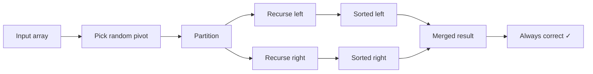

# 11.2 Randomised Algorithms

Tags: #cs/algorithms #maths/probability #cs/advanced

## Position in the Course
Prerequisites: [[11.1 Advanced Complexity Theory]], [[8.5 Discrete Distributions]], [[8.6 Continuous Distributions]]

Mastery threshold: 90% overall, 100% on New Words.

> [!tip] How to study this note
> Randomised algorithms use randomness to achieve better worst-case guarantees or simpler implementation. Two key types: Las Vegas (always correct, random running time) and Monte Carlo (bounded time, correct with high probability). Concentration inequalities (Chernoff, Hoeffding) bound deviation probabilities. Practise applying amplification: run k independent trials to push error exponentially small.

## Introduction

**Randomised algorithms** flip coins (use random bits) during execution. They often outperform deterministic algorithms in practice and sometimes solve problems with no known efficient deterministic solution (e.g., primality testing before 2002).

From [[11.1 Advanced Complexity Theory]], you understand problem hardness classes and the significance of polynomial time. From [[8.5 Discrete Distributions]], you know about Bernoulli, Binomial, and Poisson distributions. From [[8.6 Continuous Distributions]], you understand the Normal distribution and the Central Limit Theorem.

The two main families:

- **Las Vegas algorithms**: always produce the correct answer; only the running time is random. Quick sort with a random pivot is the classic example — O(n log n) expected time, never wrong.
- **Monte Carlo algorithms**: run in deterministic time but may produce incorrect answers with bounded probability. Miller-Rabin primality testing and Freivalds' matrix verification are examples. Error probability can be reduced by repeated trials (amplification).

Most randomised algorithms rely on **concentration inequalities** — mathematical tools that bound the probability that a random variable deviates far from its expected value. The Chernoff bound is the workhorse: it shows that sums of independent random variables concentrate tightly around their mean.

## New Words

- **[[Las Vegas algorithm]]** — always correct, randomised running time (e.g., quick sort with random pivot).
- **[[Monte Carlo algorithm]]** — fixed running time, correct with probability ≥ 1−δ (e.g., Miller-Rabin).
- **[[concentration inequality]]** — a bound on the probability that a random variable deviates from its mean.
- **[[Chernoff bound]]** — P(|X−μ| ≥ δμ) ≤ 2exp(−δ²μ/3) for a sum of independent [0,1] random variables.
- **[[randomised rounding]]** — converting a fractional LP solution to an integer solution by random assignment.
- **[[amplification]]** — running a Monte Carlo algorithm multiple times and taking the majority to reduce error.

> [!important] You pass this topic only when you can define all six terms without looking.

## Breadcrumbs

### Breadcrumb 1: Las Vegas Algorithms — Always Correct, Usually Fast

**Builds on:** [[11.1 Advanced Complexity Theory]] (P vs NP, polynomial time), [[8.5 Discrete Distributions]] (expected value, Binomial distribution)

A **Las Vegas algorithm** always returns the correct answer. The randomness only affects the running time, not the output. The analysis focuses on **expected** running time.

The prototypical example: **quick sort with a random pivot**. Without randomness, quick sort runs in O(n²) on sorted input (adversarial worst case). With a random pivot, every input has the same expected O(n log n) running time — the adversary cannot force the worst case.



#### Chunked Example — Expected Comparisons in Randomised Quick Sort

Question: Show that randomised quick sort performs 2n ln n comparisons in expectation.

Step 1: Let C(n) be the expected number of comparisons. When the pivot has rank i (i=1..n, each equally likely with probability 1/n), the subproblem sizes are i−1 and n−i.

Step 2: C(n) = n−1 + (1/n)∑_{i=1}^{n}[C(i−1) + C(n−i)].

Step 3: By symmetry, ∑_{i=1}^{n} C(i−1) = ∑_{i=1}^{n} C(n−i) = ∑_{k=0}^{n−1} C(k).

Step 4: So C(n) = n−1 + (2/n)∑_{k=0}^{n−1} C(k). Solving: C(n) ≈ 2n ln n ≈ 1.39n log₂ n.

Answer: **Expected 2n ln n comparisons, regardless of input order.**

### Breadcrumb 2: Monte Carlo Algorithms — Fast but Fallible

**Builds on:** Breadcrumb 1, [[8.6 Continuous Distributions]] (error bounds, confidence intervals)

A **Monte Carlo algorithm** runs in deterministic time and produces an answer that is correct with probability at least 1−δ (one-sided or two-sided error). The key advantage: these algorithms can be much faster than any known deterministic alternative.

The paradigmatic example: **Freivalds' algorithm** for checking matrix multiplication A × B = C.

```mermaid
flowchart LR
    A[Matrices A, B, C] --> B[Pick random r ∈ {0,1}^n]
    B --> C[Compute x = Br]
    C --> D[Compute y = A × x]
    D --> E[y == Cr?]
    E -->|Yes| F[Return 'correct']
    E -->|No| G[Return 'incorrect'] 
    F --> H[Amplify: repeat k times]
    G --> H
    H --> I[Error ≤ 2^{−k}]
```

#### Chunked Example — Verifying Matrix Multiplication

Question: Use Freivalds' algorithm to verify A×B = C in O(n²) time.

Step 1: Pick a random vector r ∈ {0,1}ⁿ. Compute x = Br (O(n²)), then y = Ax (O(n²)).

Step 2: Check if y = Cr (O(n²)). If A×B ≠ C, the probability that y = Cr by chance is ≤ 1/2.

Step 3: Repeat k times with independent random vectors. If any trial reports mismatch, A×B ≠ C. If all k trials say equal, P(error) ≤ (1/2)ᵏ.

Step 4: For k = 30, error probability ≤ 2⁻³⁰ ≈ 10⁻⁹.

Answer: **Freivalds: O(n²) verification with exponentially small error**, compared to O(n³) for deterministic verification.

#### Chunked Example — Miller-Rabin Primality Test

Question: Test whether 221 is prime using Miller-Rabin.

Step 1: Write 221−1 = 220 = 2² × 55. So s = 2, d = 55.

Step 2: Pick random base a ∈ {2, ..., 220}. Compute aᵈ mod 221.

Step 3: If aᵈ ≡ ±1 (mod 221), declare "probably prime" (pass). Otherwise, repeatedly square: if we get −1 before reaching a^{n−1}, declare "probably prime."

Step 4: With a = 174: 174⁵⁵ mod 221 = 47. Square: 47² mod 221 = 2209 mod 221 = −1. Pass — inconclusive.

Step 5: Repeat with a = 137: 137⁵⁵ mod 221 = 202. Square: 202² mod 221 = 40804 mod 221 = 152. Square again: 152² mod 221 = 23104 mod 221 = 114 ≠ −1. Composite detected!

Answer: **221 = 13 × 17 (composite). Miller-Rabin detects compositeness with probability ≥ 1 − 4⁻ᵏ for k random bases.**

### Breadcrumb 3: Concentration Inequalities — Why Averages Converge

**Builds on:** [[8.5 Discrete Distributions]] (expectation, variance), [[8.6 Continuous Distributions]] (CLT, Normal distribution)

Concentration inequalities answer: how far can a random variable deviate from its mean, and with what probability?

The **Chernoff bound** is the most powerful tool for sums of independent [0,1]-valued random variables. Let X = ∑_{i=1}^{n} Xᵢ with each Xᵢ ∈ [0,1] and μ = E[X]. Then for any δ > 0:

P(X ≥ (1+δ)μ) ≤ (e^δ / (1+δ)^{1+δ})^{μ}
P(X ≤ (1−δ)μ) ≤ exp(−μδ²/2)

The simplified form: P(|X−μ| ≥ δμ) ≤ 2exp(−δ²μ/3) for 0 < δ ≤ 1.

#### Chunked Example — Load Balancing with Chernoff

Question: n jobs, m machines, each assigned uniformly at random. What is the maximum load?

Step 1: Let Lⱼ = number of jobs on machine j. Lⱼ ~ Binomial(n, 1/m). E[Lⱼ] = n/m.

Step 2: By Chernoff: P(Lⱼ > 2n/m) ≤ exp(−n/(3m)).

Step 3: Union bound: P(any machine overloaded) ≤ m·exp(−n/(3m)). If n = m log m, this is ≤ m·exp(−(log m)/3) → 0.

Step 4: More precise: maximum load = O(log m / log log m) w.h.p. when n = m.

Answer: **Random assignment gives O(log m / log log m) max load with high probability** — much better than deterministic worst-case O(n).

## Why This Works

Randomness breaks adversarial inputs. Without randomness, an adversary can construct the worst-case input for any deterministic algorithm. With randomness, the algorithm's behaviour is unpredictable — the adversary cannot tailor the input.

Amplification is the reason Monte Carlo algorithms are practical. A single trial with 51% success probability is useless, but 1000 independent trials with majority voting give success probability ≈ 1 − 2⁻¹⁰⁰⁰ — effectively certain.

```
P(error after k trials) ≤ (4ε(1−ε))^{k/2}   [Chernoff bound on majority]
                     ≤ exp(−k(1−2ε)²/2)     [for ε < 1/2]
```

This exponential decay means even weak Monte Carlo algorithms become trustworthy with a modest number of repetitions.

## Worked Examples

### Example 1 — Expected Comparisons in Randomised Quicksort

Question: Compute the expected number of comparisons C(n) for randomised quicksort on n = 5 distinct elements. Use the recurrence C(n) = n − 1 + (2/n)∑_{k=0}^{n−1} C(k) with C(0) = C(1) = 0.

Step 1: Compute base cases: C(0) = 0, C(1) = 0.

Step 2: C(2) = 1 + (2/2)[C(0) + C(1)] = 1 + 0 = 1.

Step 3: C(3) = 2 + (2/3)[C(0) + C(1) + C(2)] = 2 + (2/3)(0 + 0 + 1) = 2 + 2/3 = 8/3.

Step 4: C(4) = 3 + (2/4)[C(0) + C(1) + C(2) + C(3)] = 3 + (1/2)(0 + 0 + 1 + 8/3) = 3 + (1/2)(11/3) = 3 + 11/6 = 29/6.

Step 5: C(5) = 4 + (2/5)[C(0) + C(1) + C(2) + C(3) + C(4)] = 4 + (2/5)(0 + 0 + 1 + 8/3 + 29/6) = 4 + (2/5)(51/6) = 4 + 17/5 = 37/5 = 7.4.

Answer: **Expected 7.4 comparisons for n = 5 (asymptotically ≈ 2n ln n ≈ 16.09, but exact for small n).**

### Example 2 — Freivalds' Matrix Verification

Question: Given A = [[1,2],[3,4]], B = [[0,1],[1,0]], and claimed product C = [[2,1],[4,3]]. Use Freivalds' algorithm with random vector r = [1,0]ᵀ to verify whether A × B = C. What is the error probability of this single trial?

Step 1: Compute x = B·r = [[0,1],[1,0]]·[1,0]ᵀ = [0, 1]ᵀ. This is O(n²) = O(4).

Step 2: Compute y = A·x = [[1,2],[3,4]]·[0,1]ᵀ = [2, 4]ᵀ. This is O(n²).

Step 3: Compute C·r = [[2,1],[4,3]]·[1,0]ᵀ = [2, 4]ᵀ. This is O(n²).

Step 4: y = [2,4]ᵀ = C·r, so the test passes. A×B = [[2,1],[4,3]] = C, so the product is correct. If it were incorrect, P(pass | error) ≤ 1/2 per trial. Repeat k = 30 trials to push error ≤ 2⁻³⁰ ≈ 10⁻⁹.

Answer: **A×B = C verified. Single-trial error probability ≤ 1/2. After 30 trials, error ≤ 2⁻³⁰.**

### Example 3 — Amplification for Majority Voting

Question: A Monte Carlo algorithm is correct with probability p = 0.6 (one-sided error). How many independent trials k are needed so that majority voting yields error probability ≤ 10⁻⁶?

Step 1: Each trial is correct with p = 0.6, so the error probability per trial is ε = 0.4. The majority of k trials is correct if more than k/2 trials are correct.

Step 2: Chernoff bound on majority: P(error after k trials) ≤ exp(−k(1 − 2ε)² / 2). Here 1 − 2ε = 1 − 0.8 = 0.2.

Step 3: Set exp(−k(0.2)² / 2) ≤ 10⁻⁶ → exp(−0.02k) ≤ 10⁻⁶ → −0.02k ≤ −13.82 → k ≥ 691.

Step 4: With k = 691 independent trials and majority voting, the overall error probability is at most 10⁻⁶.

Answer: **k = 691 trials needed for error ≤ 10⁻⁶ via majority voting amplification.**

### Example 4 — Chernoff Bound for Load Balancing

Question: n = 100 jobs are assigned uniformly at random to m = 10 machines. Use the Chernoff bound to bound P(L₁ > 20), where L₁ is the number of jobs on machine 1.

Step 1: L₁ ~ Binomial(100, 1/10). Expected load E[L₁] = n/m = 100/10 = 10.

Step 2: We want P(L₁ ≥ (1 + δ)μ) with μ = 10 and target 20. So (1 + δ) × 10 = 20 → δ = 1.

Step 3: Chernoff bound: P(L₁ ≥ (1 + δ)μ) ≤ (e^δ / (1 + δ)^{1 + δ})^{μ} = (e¹ / 2²)^{10} = (e/4)^{10}.

Step 4: e/4 ≈ 0.679. Compute: 0.679¹⁰ = exp(10 ln 0.679) = exp(10 × (−0.387)) = exp(−3.87) ≈ 0.021.

Answer: **P(L₁ > 20) ≤ (e/4)¹⁰ ≈ 0.021. The union bound over all 10 machines gives P(any machine > 20) ≤ 0.21.**

## Common Mistakes

> [!failure] Mistake pattern: Confusing Las Vegas and Monte Carlo
> Las Vegas guarantees correctness but has random running time. Monte Carlo guarantees running time but may be wrong. Quick sort (random pivot) is Las Vegas; Miller-Rabin is Monte Carlo.

> [!failure] Mistake pattern: Forgetting to amplify
> A single Monte Carlo run with P = 0.51 is worthless. Always amplify: run k independent trials and take the majority. Use Chernoff to bound the error after amplification.

> [!failure] Mistake pattern: Misapplying the union bound
> The union bound P(∪Aᵢ) ≤ ∑P(Aᵢ) can be very loose when events overlap. When bounding maximum load, check whether the union bound or a more refined method (e.g., Lovász Local Lemma) is appropriate.

## Where This Shows Up in CS

### Streaming and Big Data
```text
- Count-Min Sketch: frequency estimation with O(1/ε) space
- Bloom filter: probabilistic set membership
- HyperLogLog: cardinality estimation in O(log log n) space
- All use randomised hashing + Chernoff-style bounds
```

### Machine Learning
```text
- Stochastic Gradient Descent (SGD): random sample per step
- Dropout: random neuron masking for regularisation
- Random forests: random feature subsets
- Monte Carlo gradient estimators for variational inference
```

### Cryptography
```text
- Random key generation
- Random nonces in TLS
- Zero-knowledge proofs (random challenges)
- Secure multi-party computation (randomised protocols)
```

### Distributed Systems
```text
- Randomised consensus (Paxos leader election via random timers)
- Ethernet backoff (random wait times)
- Consistent hashing (random assignment to servers)
```

## Checkpoint Questions

1. What distinguishes a Las Vegas algorithm from a Monte Carlo algorithm?
2. How does amplification reduce error probability?
3. What is the Chernoff bound and when is it used?
4. What is randomised rounding and what problem is it applied to?
5. Why does random pivot make quick sort run in expected O(n log n)?
6. How does Freivalds' algorithm verify matrix multiplication in O(n²)?
7. What error probability does Miller-Rabin achieve after k bases?
8. What is the expected maximum load with m machines and n = m jobs?
9. What is Karger's algorithm and what probability of success does each trial have?
10. What approximation ratio does the Goemans-Williamson algorithm achieve?

## Mini-Quiz

1. Las Vegas: always correct, random \_\_\_.
2. Monte Carlo: bounded \_\_\_, sometimes wrong.
3. Chernoff bound: P(|X−μ| ≥ δμ) ≤ \_\_\_ (simplified form).
4. Miller-Rabin error probability per trial ≤ \_\_\_.
5. Quick sort with random pivot is (Las Vegas / Monte Carlo).
6. True or false: Randomised algorithms always run faster than deterministic ones.
7. Amplification reduces error probability to \_\_\_ in k.
8. Karger's min-cut success prob per trial ≥ \_\_\_.
9. Goemans-Williamson MAX-CUT approx ratio = \_\_\_.
10. SGD is a (deterministic / randomised) algorithm.
11. Random pivot ensures (correctness / performance) regardless of input.
12. True or false: Every Monte Carlo algorithm can be converted to a Las Vegas algorithm.

## Pass Gate

You may move to [[11.3 Approximation Algorithms]] only when you can:

- define every term in [[#New Words]]
- distinguish Las Vegas vs Monte Carlo with examples
- apply amplification to reduce error exponentially
- use Chernoff bounds to analyse load balancing
- answer at least 11 out of 12 mini-quiz questions correctly
- complete [[11.2 Randomised Algorithms - Mastery Test]]

## Related Notes

Backward links: [[11.1 Advanced Complexity Theory]], [[8.5 Discrete Distributions]], [[8.6 Continuous Distributions]]

Assessment links: [[11.2 Randomised Algorithms - Worked Examples]], [[11.2 Randomised Algorithms - Practice Questions]], [[11.2 Randomised Algorithms - Mastery Test]], [[11.2 Randomised Algorithms - Answers]]
