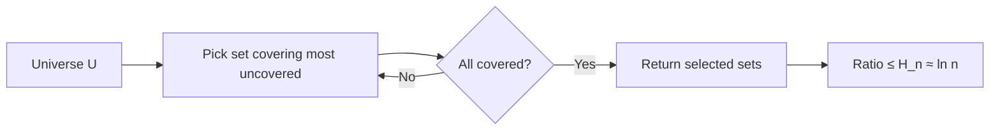

# 11.3 Approximation Algorithms

Tags: #cs/algorithms #maths/optimisation #cs/advanced

## Position in the Course
Prerequisites: [[11.1 Advanced Complexity Theory]], [[11.2 Randomised Algorithms]], [[9.10 Convex Optimisation Basics]]

Mastery threshold: 90% overall, 100% on New Words.

> [!tip] How to study this note
> When a problem is NP-hard, we cannot solve it optimally in polynomial time. Approximation algorithms provide provably good solutions quickly. The approximation ratio α: for minimisation, ALG ≤ α·OPT (α ≥ 1). For maximisation, ALG ≥ OPT/α. PTAS (polynomial-time approximation scheme) gives (1+ε)-approximation for any ε > 0. Practise constructing and analysing greedy, LP-rounding, and primal-dual algorithms.

## Introduction

**Approximation algorithms** are the pragmatic response to NP-hardness. Since we cannot solve problems like TSP, Set Cover, or Vertex Cover optimally in polynomial time (unless P = NP), we ask: can we find a solution that is provably close to optimal in polynomial time?

From [[11.1 Advanced Complexity Theory]], you understand NP-completeness and why we cannot expect polynomial-time exact algorithms. From [[11.2 Randomised Algorithms]], you know how randomness can help design efficient algorithms. From [[9.10 Convex Optimisation Basics]], you understand LP relaxations and convex optimisation.

The key metric is the **approximation ratio**: a minimisation algorithm has ratio α if ALG ≤ α·OPT for all instances. A maximisation algorithm has ratio α if ALG ≥ OPT/α. In both cases α ≥ 1, and α = 1 means optimal.

Problems differ dramatically in approximability:
- **Vertex Cover**: 2-approximation (easy), no (√2−ε)-approximation unless P = NP.
- **Set Cover**: (ln n)-approximation (best possible), no (1−ε)ln n unless P = NP.
- **TSP (metric)**: 1.5-approximation (Christofides), no better than 1.0045 unless P = NP.
- **Knapsack**: FPTAS — (1−ε)-approximation in O(n³/ε).

## New Words

- **[[approximation ratio]]** — α = max(ALG/OPT, OPT/ALG); always ≥ 1; closer to 1 means better.
- **[[PTAS]]** — polynomial-time approximation scheme: (1+ε)-approximation for any ε > 0 (running time may depend exponentially on 1/ε).
- **[[FPTAS]]** — fully polynomial-time approximation scheme: PTAS with running time polynomial in n and 1/ε.
- **[[greedy algorithm]]** — makes locally optimal choice at each step; often has provable approximation ratio.
- **[[LP rounding]]** — solve linear programming relaxation, then round fractional solution to integer.
- **[[hardness of approximation]]** — lower bound: no α-approximation exists for a problem unless P = NP.
- **[[PCP theorem]]** — Probabilistically Checkable Proofs → characterisation of NP that implies hardness of approximation results.

> [!important] You pass this topic only when you can define all seven terms without looking.

## Breadcrumbs

### Breadcrumb 1: Greedy Algorithms and Set Cover

**Builds on:** [[11.1 Advanced Complexity Theory]] (NP-hardness, reductions), [[5.9 Direct Proof and Counterexample]] (invariant-based reasoning)

The **greedy algorithm for Set Cover**: repeatedly pick the set that covers the most uncovered elements.

Question: Universe U = {1, 2, 3, 4, 5}, sets S₁ = {1, 2, 3}, S₂ = {2, 4, 5}, S₃ = {4}, S₄ = {3, 5}. Run greedy.

Step 1: S₁ covers 3 elements (most). Pick S₁. Uncovered = {4, 5}.

Step 2: S₂ covers 2 of the remaining (most). Pick S₂. All covered.

Step 3: Solution = {S₁, S₂}. Optimal = {S₂, S₄} = 2 sets. Ratio = 1.

But greedy can be worse. In the worst case, greedy achieves ratio Hₙ ≈ ln n, where Hₙ = 1 + 1/2 + ... + 1/n. This is tight — and optimal unless P = NP.



#### Chunked Example — Worst Case for Greedy Set Cover

Question: Construct an instance where greedy achieves ratio ≈ ln n.

Step 1: Create universe of n elements. Create a singleton set for each element plus one large set covering all but one element.

Step 2: Greedy picks the large set first, then all n−1 singletons — total n sets.

Step 3: Optimal solution: pick the large set + the one singleton for the missing element = 2 sets.

Step 4: Ratio = n/2. For carefully constructed instances, ratio approaches Hₙ.

Answer: **Greedy Set Cover ratio = Hₙ ≈ ln n in the worst case, which is optimal unless P = NP.**

### Breadcrumb 2: LP Rounding and Vertex Cover

**Builds on:** [[9.10 Convex Optimisation Basics]] (LP fundamentals), Breadcrumb 1

**LP rounding** solves an NP-hard integer program by: (1) relaxing integrality constraints to get a linear program, (2) solving the LP optimally in polynomial time, (3) rounding the fractional solution to an integer solution.

**Vertex Cover LP Relaxation:**

```
Minimise:  ∑ x_v
Subject to: x_u + x_v ≥ 1  for every edge (u,v)
             0 ≤ x_v ≤ 1   for every vertex v
```

The LP solution x_v ∈ [0,1] is fractional. **Simple rounding**: round x_v ≥ 0.5 to 1, else to 0. This gives a 2-approximation.

#### Chunked Example — 2-Approximation via Maximal Matching

Question: Find a 2-approximation for Vertex Cover without LP.

Step 1: Find a maximal matching M (set of edges sharing no vertices). Greedy: pick any edge, remove its endpoints, repeat.

Step 2: Let C = all endpoints of edges in M. C is a vertex cover (any unselected edge would contradict maximality).

Step 3: |C| = 2|M|. Optimal VC must include at least |M| vertices (one per matched edge, since edges are disjoint).

Step 4: So |C| = 2|M| ≤ 2·OPT.

Answer: **Maximal matching gives a 2-approximation for Vertex Cover — O(V+E) time.**

### Breadcrumb 3: TSP and Christofides Algorithm (1.5-Approximation)

**Builds on:** [[6.9 Graph Algorithms BFS DFS Dijkstra]] (MST, shortest paths), Breadcrumb 2

For **metric TSP** (triangle inequality holds: d(a,c) ≤ d(a,b) + d(b,c)), Christofides gives a 1.5-approximation:

```
1. Compute MST T of the complete graph.
2. Find minimum-weight perfect matching M on odd-degree vertices of T.
3. Combine T ∪ M → multigraph where every vertex has even degree.
4. Find Eulerian tour.
5. Take shortcuts to get Hamiltonian tour.
```


#### Chunked Example — MST Doubling (Simpler 2-Approximation)

Question: Show MST doubling gives 2-approximation for metric TSP.

Step 1: Cost of optimal TSP tour ≥ cost of MST (removing an edge from tour gives a spanning tree).

Step 2: Double each edge of MST → Eulerian multigraph. Find Eulerian tour. Cost = 2×MST ≤ 2×OPT.

Step 3: Take shortcuts (skip already-visited vertices). Triangle inequality ensures shortcuts don't increase cost.

Answer: **MST doubling: 2-approximation. Christofides improves to 1.5-approximation via perfect matching.**

## Why This Works

Approximation algorithms occupy the sweet spot between exact exponential algorithms and heuristics with no guarantees:

```
Exact (2ⁿ)  ←Too slow→  Approximation (nᶜ)  ←Too weak→  Heuristics (no bound)
```

The PCP Theorem (1992) revolutionised the field by proving that for many problems, the best approximation ratio is a specific constant — and achieving anything better would imply P = NP. For example:

- MAX-3SAT: no 7/8+ε approximation unless P = NP.
- Vertex Cover: no (√2−ε) approximation unless P = NP (current best: 2−Θ(1/√log n)).
- Set Cover: no (1−ε)ln n unless P = NP.

## Worked Examples

### Example 1 — Greedy 2-Approximation for 0/1 Knapsack

Question: Given knapsack capacity W = 50 and items: A(value=60, weight=10), B(100, 20), C(120, 30). Apply the 2-approximation algorithm: (a) sort by value/weight and pack greedily; (b) take max of greedy solution and the best single item. What does the algorithm return, and what is the optimal solution?

Step 1: Value/weight ratios: A = 60/10 = 6, B = 100/20 = 5, C = 120/30 = 4. Greedy order: A, B, C.

Step 2: Greedy packing: take A (weight 10, value 60, remaining 40). Take B (weight 20, value 100, remaining 20). C does not fit (30 > 20). Greedy value = 60 + 100 = 160.

Step 3: Best single item: max(60, 100, 120) = 120 (item C).

Step 4: Algorithm returns max(160, 120) = 160. Optimal is C + B = 220 (weight 50). Ratio = 220/160 = 1.375 ≤ 2.

Answer: **Algorithm returns 160. Optimal = 220 (C+B). 2-approximation guarantee holds.**

### Example 2 — Vertex Cover 2-Approximation via Maximal Matching

Question: Given G = (V,E) with V = {a,b,c,d} and E = {(a,b), (a,c), (b,c), (c,d)}. Apply the maximal-matching 2-approximation to find a vertex cover. What is the cover size and the optimal size?

Step 1: Find a maximal matching greedily. Pick edge (a,b) — matched vertices {a,b}. Remaining edges not incident to a or b: (c,d).

Step 2: Pick edge (c,d). Maximal matching M = {(a,b), (c,d)}, |M| = 2.

Step 3: Vertex cover C = endpoints of M = {a, b, c, d}, |C| = 4.

Step 4: Optimal vertex cover: {a, c} covers all edges — (a,b) via a, (a,c) via a or c, (b,c) via c, (c,d) via c. |OPT| = 2. Ratio = |C|/|OPT| = 4/2 = 2, and |C| = 2|M| ≤ 2·OPT.

Answer: **C = {a,b,c,d}, size 4. Optimal = {a,c}, size 2. Ratio = 2 (tight).**

### Example 3 — MAX-3SAT: Expected Satisfied Clauses

Question: Given φ = (x₁∨¬x₂∨x₃) ∧ (x₁∨x₂∨¬x₃) ∧ (¬x₁∨¬x₂∨x₃) ∧ (¬x₁∨x₂∨¬x₃) with 4 clauses. If each variable is set T/F with probability 1/2, what is the expected number of satisfied clauses? Derandomise by fixing x₁ = T.

Step 1: Each clause has 3 literals. P(clause satisfied) = 1 − (1/2)³ = 7/8.

Step 2: By linearity of expectation: E[#satisfied] = 4 × 7/8 = 3.5.

Step 3: Fix x₁ = T. Clauses 1 and 2 are immediately satisfied (contain x₁). Clause 3 = (F∨¬x₂∨x₃) and clause 4 = (F∨x₂∨¬x₃) each have 2 unresolved literals, so P(satisfied) = 1 − (1/2)² = 3/4.

Step 4: Conditional expectation = 2 + 2 × 3/4 = 3.5. Setting x₁ = F would make clauses 3 and 4 satisfied, with clauses 1 and 2 having 2 unresolved literals each — also 3.5. Either choice maintains the expectation. Continue fixing remaining variables to preserve or exceed the bound.

Answer: **E[#satisfied] = 3.5. Derandomisation yields an assignment satisfying ≥ 3 clauses (7/8-approximation).**

### Example 4 — MST Doubling 2-Approximation for Metric TSP

Question: Given cities with coordinates A(0,0), B(1,0), C(1,1), D(0,1) and Euclidean distances. Compute an MST, then construct a TSP tour via MST doubling (double edges, Eulerian tour, shortcut). What is the tour length and the optimal TSP length?

Step 1: Edge lengths: AB=1, AC=√2≈1.414, AD=1, BC=1, BD=√2≈1.414, CD=1.

Step 2: MST via Kruskal: add AB(1), add AD(1), add BC(1). Total MST weight = 3.

Step 3: Double each MST edge. Walk: A→B→C→B→A→D→A. Length = 1+1+1+1+1+1 = 6.

Step 4: Shortcut repeated vertices: A→B→C→D→A. Length = AB+BC+CD+DA = 1+1+1+1 = 4. Optimal TSP tour = same (around the square). Ratio = 4/4 = 1 ≤ 2.

Answer: **MST doubling tour length = 4. Optimal TSP = 4. Guarantee: cost ≤ 2·OPT holds.**

## Common Mistakes

> [!failure] Mistake pattern: Confusing approximation ratio direction
> For minimisation: ALG ≤ α·OPT with α ≥ 1 (e.g., 2-approx means ALG ≤ 2·OPT). For maximisation: ALG ≥ OPT/α. Always decode which type the problem is.

> [!failure] Mistake pattern: Assuming greedy always has a guarantee
> Many greedy algorithms (e.g., greedy TSP) have NO provable bound. Always analyse the ratio formally before claiming a guarantee.

> [!failure] Mistake pattern: Ignoring PTAS running time dependence on ε
> PTAS: O(n^{f(1/ε)}) where f may be exponential. If f(1/ε) = (1/ε)!, the algorithm is impractical for small ε. FPTAS (O((n/ε)ᶜ)) is practically meaningful.

> [!failure] Mistake pattern: LP rounding without checking feasibility
> Rounding a fractional LP solution may violate constraints. Always verify that the rounded solution is feasible (e.g., for matching, rounded fractional solution may over-cover constraints).

## Where This Shows Up in CS

### Network Design
```text
- Facility location: LP rounding gives constant-factor approximation
- Steiner tree: 1.39-approximation via LP + randomised rounding
- Survivable network design: primal-dual 2-approximation
```

### Scheduling
```text
- Job scheduling on identical machines: list scheduling is 2-approximation
- Makespan minimisation: PTAS exists
- Online scheduling: competitive ratio analysis
```

### Data Mining and ML
```text
- k-means clustering: k-means++ achieves O(log k) approximation
- Feature selection: submodular optimisation via greedy (1−1/e) approx
- Recommendation systems: matrix completion via nuclear norm relaxation
```

### VLSI Design
```text
- Circuit layout: graph partitioning approximations
- Wire routing: Steiner tree approximations
- FPGA mapping: set cover formulations
```

## Checkpoint Questions

1. What is an approximation ratio and how is it defined for minimisation vs maximisation?
2. What distinguishes PTAS from FPTAS?
3. How does greedy set cover achieve an Hₙ approximation ratio?
4. What is the 2-approximation for Vertex Cover via maximal matching?
5. Why does MST doubling give a 2-approximation for metric TSP?
6. What improvement does Christofides algorithm provide over MST doubling?
7. What does the PCP theorem imply for hardness of approximation?
8. What is LP rounding and how does it relate to NP-hard problems?
9. How does randomisation give a 7/8-approximation for MAX-3SAT?
10. What is the best possible approximation ratio for MAX-3SAT?

## Mini-Quiz

1. Minimisation: ALG ≤ α·OPT with α (≥ / ≤) 1.
2. Vertex cover 2-approx uses maximal \_\_\_.
3. Greedy set cover achieves ratio = Hₙ ≈ \_\_\_.
4. True or false: Every NP-hard problem has a PTAS.
5. TSP 2-approx: double MST then take \_\_\_.
6. MAX-3SAT best possible ratio = \_\_\_.
7. Knapsack has (PTAS / FPTAS / both).
8. PCP theorem is used to prove hardness of \_\_\_.
9. True or false: Greedy algorithms always have provable approximation ratios.
10. LP rounding: solve LP relaxation, then \_\_\_ to get integer solution.
11. Christofides TSP approximation ratio = \_\_\_.
12. Metric TSP requires (triangle inequality / symmetry / both).

## Pass Gate

You may move to [[11.4 Advanced Graph Theory]] only when you can:

- define every term in [[#New Words]]
- state the definition of approximation ratio correctly for both minimisation and maximisation
- explain the Vertex Cover 2-approximation via maximal matching
- describe the difference between PTAS and FPTAS
- answer at least 11 out of 12 mini-quiz questions correctly
- complete [[11.3 Approximation Algorithms - Mastery Test]]

## Related Notes

Backward links: [[11.1 Advanced Complexity Theory]], [[11.2 Randomised Algorithms]], [[9.10 Convex Optimisation Basics]]

Assessment links: [[11.3 Approximation Algorithms - Worked Examples]], [[11.3 Approximation Algorithms - Practice Questions]], [[11.3 Approximation Algorithms - Mastery Test]], [[11.3 Approximation Algorithms - Answers]]
