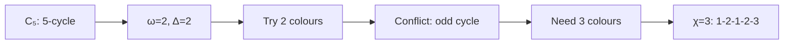
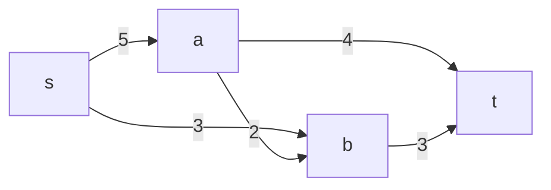

# 11.4 Advanced Graph Theory

Tags: #cs/graphs #maths/combinatorics #cs/networks #cs/advanced

## Position in the Course
Prerequisites: [[6.7 Graph Theory Basics]], [[10.10 Graphs in Networks and AI Search]], [[8.1 Probability Basics]]

Mastery threshold: 90% overall, 100% on New Words.

> [!tip] How to study this note
> Advanced graph theory covers graph colouring, network flows, matchings, planar graphs, spectral graph theory, and the probabilistic method. Key results: Hall's marriage theorem, Menger's theorem, max-flow min-cut theorem, Kuratowski's theorem, Four Colour Theorem. Practise applying these theorems to concrete graph instances — the probabilistic method is especially subtle because it proves existence without explicit construction.

## Introduction

**Advanced graph theory** moves beyond basic paths, cycles, and trees into structural properties that reveal deep connections between combinatorics, optimisation, and algorithm design.

From [[6.7 Graph Theory Basics]], you know the fundamentals: vertices, edges, degrees, paths, connectivity. From [[10.10 Graphs in Networks and AI Search]], you have seen how graphs model real-world networks and search problems. From [[8.1 Probability Basics]], you understand probability as a tool — now you will see it used for existence proofs via the **probabilistic method**.

The major themes:
- **Graph colouring**: assigning colours to vertices so adjacent vertices differ. The chromatic number χ(G) is the minimum colours needed. This models register allocation in compilers and scheduling problems.
- **Network flows**: moving material through a capacitated network from source to sink. The max-flow min-cut theorem is one of the most applied results in CS.
- **Matching theory**: pairing vertices so no vertex is paired twice. Hall's marriage theorem gives exact conditions for perfect matchings in bipartite graphs.
- **Planar graphs**: graphs drawable on a plane without crossing edges. Euler's formula V−E+F = 2 connects the combinatorial and geometric viewpoints.
- **Spectral graph theory**: eigenvalues of the adjacency and Laplacian matrices reveal structure — connectivity, community, centrality.
- **Probabilistic method**: prove existence of an object with desired properties by showing a random construction succeeds with positive probability.

## New Words

- **[[chromatic number]]** — χ(G), the minimum number of colours needed to properly colour the vertices of G.
- **[[max-flow min-cut theorem]]** — the maximum flow from source s to sink t equals the minimum capacity of any s-t cut.
- **[[matching]]** — a set of edges with no shared vertices; a perfect matching covers all vertices.
- **[[planar graph]]** — a graph that can be drawn on a plane without any edges crossing.
- **[[probabilistic method]]** — proving existence of a combinatorial object by showing a random construction succeeds with probability > 0.
- **[[spectral graph theory]]** — studying graph properties through eigenvalues of its adjacency/Laplacian matrix.
- **[[Fiedler vector]]** — eigenvector corresponding to the second smallest eigenvalue of the Laplacian; used for spectral partitioning.

> [!important] You pass this topic only when you can define all seven terms without looking.

## Breadcrumbs

### Breadcrumb 1: Graph Colouring and Chromatic Number

**Builds on:** [[6.7 Graph Theory Basics]] (degree, cliques, bipartite graphs)

A **proper colouring** assigns colours to vertices such that adjacent vertices have different colours. The **chromatic number** χ(G) is the minimum number of colours needed.

Basic bounds:
- χ(G) ≥ ω(G) (clique number: size of largest complete subgraph).
- χ(G) ≤ Δ(G)+1 (greedy algorithm: colour vertices in any order, give each the smallest colour not used by neighbours).
- **Brooks' theorem**: χ(G) ≤ Δ(G) unless G is a complete graph or odd cycle.



#### Chunked Example — Colouring a Bipartite Graph

Question: What is χ(K₃,₃) (complete bipartite graph with 3+3 vertices)?

Step 1: K₃,₃ has no odd cycles. It is bipartite.

Step 2: Colour all vertices on one side with colour 1, the other side with colour 2.

Step 3: No edge connects vertices on the same side — proper colouring with 2 colours.

Answer: **χ(K₃,₃) = 2. All bipartite graphs have χ = 2.**

#### Chunked Example — Four Colour Theorem

Question: Can any planar graph be coloured with 4 colours?

Step 1: The Four Colour Theorem (Appel and Haken, 1976) says yes — every planar graph has χ(G) ≤ 4.

Step 2: K₄ (complete graph on 4 vertices) is planar and requires 4 colours — tight.

Step 3: Finding a 3-colouring of a planar graph is NP-complete — even though a 4-colouring always exists!

Answer: **Every planar graph has χ(G) ≤ 4. K₄ shows 4 is tight.**

### Breadcrumb 2: Network Flows and the Max-Flow Min-Cut Theorem

**Builds on:** [[6.7 Graph Theory Basics]] (directed graphs, adjacency), [[10.10 Graphs in Networks and AI Search]] (pathfinding, network applications)

A **flow network** is a directed graph with source s, sink t, and capacities c(e) ≥ 0. A flow assigns f(e) ≤ c(e) to each edge, conserving flow at all vertices except s and t.

The **max-flow min-cut theorem** states: the maximum flow value equals the minimum capacity of an s-t cut (a partition separating s from t).



#### Chunked Example — Computing Max Flow

Question: Source s to sink t. Edges (capacity): s→a(5), s→b(3), a→b(2), a→t(4), b→t(3). Find max flow.

Step 1: Send flow s→a→t: min(5,4) = 4. Residual: s→a(1), a→t(0).

Step 2: Send flow s→b→t: min(3,3) = 3. Residual: s→b(0), b→t(0).

Step 3: Total flow = 4 + 3 = 7. Min cut: ({s,a,b}, {t}) has capacity 4+3 = 7.

Answer: **Max flow = 7. The cut ({s,a,b}, {t}) is the minimum cut, capacity 7.**

#### Chunked Example — Ford-Fulkerson Algorithm

Question: Apply Ford-Fulkerson to find max flow.

Step 1: Start with f(e) = 0 on all edges.

Step 2: Find an augmenting path from s to t in the residual graph (edges with remaining capacity).

Step 3: Push as much flow as the bottleneck edge allows. Update residuals.

Step 4: Repeat until no augmenting path exists. Max flow achieved.

Answer: **Ford-Fulkerson runs in O(E·f_max) time. Edmonds-Karp (BFS) improves to O(VE²).**

### Breadcrumb 3: Matchings and Hall's Theorem

**Builds on:** [[6.7 Graph Theory Basics]] (bipartite graphs, vertex covers)

A **matching** M is a set of edges with no shared vertices. A **perfect matching** covers every vertex. For bipartite graphs G = (X∪Y, E), Hall's marriage theorem gives the exact condition:

**Hall's condition**: For every subset S ⊆ X, |N(S)| ≥ |S| (where N(S) is the set of neighbours of S).

#### Chunked Example — Applying Hall's Theorem

Question: 5 students {A,B,C,D,E} choose projects {1,2,3,4,5}. Preferences: A:{1,2}, B:{2,3}, C:{3,4}, D:{4,5}, E:{1,5}. Does a perfect matching exist?

Step 1: Check Hall's condition for each subset. Try S = {A,B}: N(S) = {1,2,3} → 3 ≥ 2 ✓.

Step 2: Try S = {A,C,E}: N(S) = {1,2,3,4,5} → 5 ≥ 3 ✓.

Step 3: All subsets satisfy Hall's condition. Perfect matching exists.

Step 4: Construct: A→2, B→3, C→4, D→5, E→1.

Answer: **Yes, perfect matching exists. Hall's condition is both necessary and sufficient.**

## Why This Works

These graph-theoretic results are unified by the concept of **obstruction**:

- **Colouring**: the obstruction to a k-colouring is a (k+1)-clique (or sometimes an odd cycle for 2-colourings).
- **Flows**: the obstruction to flow is a bottleneck cut (max flow = min cut).
- **Matchings**: the obstruction to perfect matching is a set S with |N(S)| < |S| (Hall's theorem).
- **Planarity**: the obstruction to planarity is a K₅ or K₃,₃ minor (Kuratowski's theorem).
- **Spectral partitioning**: the obstruction to good cuts is a small second eigenvalue.

The **probabilistic method** is different: it shows existence by constructing a random object and computing the probability that it has the desired property. If P(success) > 0, a suitable object exists — but the method gives no explicit construction.

## Worked Examples

### Example 1 — Ramsey Number Lower Bound via Probabilistic Method

Question: Show R(k,k) > 2^{k/2} (there exists a 2-colouring of K_n with no monochromatic K_k for n = 2^{k/2}).

Step 1: R(k,k) is the minimum n such that any red/blue edge-colouring of K_n yields a monochromatic K_k.

Step 2: Random colouring: each edge independently red/blue with probability 1/2.

Step 3: For a given set of k vertices, P(all edges same colour) = 2 · (1/2)^{C(k,2)} = 2^{1−C(k,2)}.

Step 4: There are C(n,k) such sets. Union bound: P(bad) ≤ C(n,k) · 2^{1−C(k,2)}.

Step 5: For n = 2^{k/2}: C(n,k) ≤ n^k / k! ≈ 2^{k²/2} / k!. And C(k,2) = k(k−1)/2. So P(bad) < 1 for sufficiently large k.

Answer: **R(k,k) > 2^{k/2}. The probabilistic method shows exponentially large colourings without monochromatic cliques exist — but doesn't construct them.**

### Example 2 — Spectral Clustering

Question: Partition a graph into two clusters using the Laplacian.

Step 1: Compute Laplacian L = D − A (D = degree matrix, A = adjacency matrix).

Step 2: Find the eigenvector v₂ corresponding to λ₂, the second smallest eigenvalue (Fiedler vector).

Step 3: Partition vertices by sign of v₂[i]: positive → cluster 1, negative → cluster 2.

Step 4: This minimises the normalised cut value — used in image segmentation, community detection.

Answer: **Spectral clustering: partition by sign of Fiedler eigenvector. The cut quality is related to λ₂ (Cheeger's inequality).**

### Example 3 — Menger's Theorem and Network Reliability

Question: Prove that the size of a minimum vertex cut separating s and t equals the maximum number of internally vertex-disjoint s-t paths.

Step 1: Menger's theorem: min vertex cut = max number of internally vertex-disjoint paths.

Step 2: This is the vertex-connectivity version of max-flow min-cut.

Step 3: Application: a network can survive k vertex failures iff there are at least k+1 disjoint paths between any pair.

Answer: **Menger's theorem: min cut = max disjoint paths. The global version: κ(G) = min over all pairs of max disjoint paths.**

### Example 4 — Planar Graphs and Kuratowski's Theorem

Question: Is K₅ planar?

Step 1: K₅ has V=5, E=10. Euler's formula: V−E+F=2 → 5−10+F=2 → F=7.

Step 2: In a planar graph, each face has at least 3 edges. So 2E ≥ 3F: 20 ≥ 21? False.

Step 3: Contradiction. K₅ cannot be planar.

Answer: **K₅ is non-planar. Kuratowski's theorem: a graph is planar iff it contains no K₅ or K₃,₃ subdivision.**

## Common Mistakes

> [!failure] Mistake pattern: Confusing χ(G) with ω(G)
> ω(G) ≤ χ(G) always. But they can differ: bipartite graphs have ω=2, χ=2 (equal). Odd cycles have ω=2, χ=3 (strict gap). Mycielski's construction: graphs with arbitrarily large chromatic number but no triangles (ω=2).

> [!failure] Mistake pattern: Forgetting augmenting path selection matters
> Ford-Fulkerson with bad augmenting paths can take exponential time. Always use BFS (Edmonds-Karp) for O(VE²) worst-case bound.

> [!failure] Mistake pattern: Applying Euler's formula to disconnected graphs
> Euler: V−E+F = 1+C where C = number of connected components. For a connected planar graph, C=1 → V−E+F=2.

> [!failure] Mistake pattern: Misinterpreting the probabilistic method
> The probabilistic method proves existence but does NOT construct the object. It is non-constructive — we know a Ramsey colouring exists but cannot describe it explicitly.

## Where This Shows Up in CS

### Network Design and Routing
```text
- Max-flow min-cut: bandwidth allocation, routing optimisation
- Min cut: network reliability, vulnerability analysis
- Multi-commodity flow: routing multiple traffic types
```

### Compilers
```text
- Register allocation = graph colouring
- Interference graph: variables = vertices, edges = simultaneously live
- k registers → need χ(G) ≤ k; spill when χ(G) > k
```

### Machine Learning and Data Science
```text
- Spectral clustering: image segmentation, community detection
- PageRank: eigenvalue computation on web graph
- Graph neural networks: message passing on adjacency structure
- Semi-supervised learning: graph Laplacian regularisation
```

### Social Network Analysis
```text
- Community detection via modularity maximisation
- Influence propagation: cuts identify groups with minimal external connection
- Centrality: eigenvector, betweenness, PageRank
```

## Checkpoint Questions

1. What is the chromatic number χ(G) and what are its basic bounds?
2. What does the max-flow min-cut theorem state?
3. What is Hall's marriage theorem and when does a perfect matching exist?
4. What is a planar graph and what is Euler's formula?
5. How does the probabilistic method prove existence of an object?
6. What is spectral clustering and how is the Fiedler vector used?
7. What does Brooks' theorem say about χ(G)?
8. What is the Four Colour Theorem?
9. What does Kuratowski's theorem characterise?
10. What is Menger's theorem?

## Mini-Quiz

1. χ(C₃) (triangle) = \_\_\_.
2. Max flow equals min \_\_\_.
3. Hall's theorem: perfect matching exists iff |N(S)| ≥ \_\_\_ for all S.
4. Euler's formula (connected planar): V − E + F = \_\_\_.
5. True or false: K₅ is planar.
6. Four Colour Theorem applies to (planar / all) graphs.
7. Probabilistic method proves \_\_\_ with probability > 0.
8. Fiedler vector is eigenvector of second smallest \_\_\_ eigenvalue.
9. Brooks' theorem: χ(G) ≤ Δ(G) unless G is complete or odd \_\_\_.
10. Matching: no \_\_\_ between selected edges.
11. Kuratowski's theorem: planar iff no K₅ or \_\_\_ subdivision.
12. True or false: Every graph with χ(G) = 3 must contain a triangle.

## Pass Gate

You may move to [[11.5 Statistical Learning Theory]] only when you can:

- define every term in [[#New Words]]
- colour simple graphs and compute χ(G)
- compute max flow in small networks
- apply Euler's formula to planar graphs
- explain the probabilistic method and its non-constructive nature
- answer at least 11 out of 12 mini-quiz questions correctly
- complete [[11.4 Advanced Graph Theory - Mastery Test]]

## Related Notes

Backward links: [[6.7 Graph Theory Basics]], [[10.10 Graphs in Networks and AI Search]], [[8.1 Probability Basics]]

Assessment links: [[11.4 Advanced Graph Theory - Worked Examples]], [[11.4 Advanced Graph Theory - Practice Questions]], [[11.4 Advanced Graph Theory - Mastery Test]], [[11.4 Advanced Graph Theory - Answers]]
