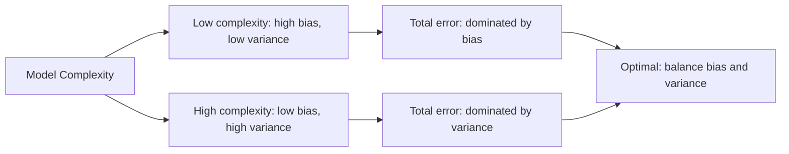

# 11.5 Statistical Learning Theory

Tags: #cs/ml #maths/statistics #maths/probability #cs/advanced

## Position in the Course
Prerequisites: [[8.8 Correlation and Regression]], [[8.9 Hypothesis Testing]], [[11.2 Randomised Algorithms]]

Mastery threshold: 90% overall, 100% on New Words.

> [!tip] How to study this note
> Statistical learning theory answers the fundamental question: why does an ML model generalise beyond its training data? Key concepts: empirical risk minimisation (ERM), bias-variance trade-off, VC dimension, PAC learning, and regularisation. The core insight: simpler models generalise better (Occam's razor), but modern overparameterised models challenge this classical view.

## Introduction

**Statistical learning theory** formalises the problem of learning from data. Given training examples (x₁, y₁), ..., (xₘ, yₘ) drawn from an unknown distribution D, we want a hypothesis h that predicts well on new data from D.

From [[8.8 Correlation and Regression]], you know how to model relationships between variables. From [[8.9 Hypothesis Testing]], you understand statistical significance and confidence. From [[11.2 Randomised Algorithms]], you have seen how randomness enables efficient algorithms and probabilistic guarantees.

The central question: **how many samples do we need to guarantee that a hypothesis that performs well on training data will also perform well on test data?**

The answer depends on the **complexity** (capacity) of the hypothesis class:
- **PAC learning** (Probably Approximately Correct): with probability ≥ 1−δ, the generalisation error is at most ε, provided m ≥ O((VC(H) + log(1/δ))/ε²).
- **VC dimension**: a measure of the richness of a hypothesis class — the largest set of points the class can shatter (realise all possible labelings).
- **Bias-variance trade-off**: increasing model complexity reduces bias but increases variance. The optimal point minimises total expected error.
- **Regularisation**: explicit (L1/L2 penalties) or implicit (SGD, early stopping) mechanisms that control effective model complexity.

## New Words

- **[[PAC learning]]** — Probably Approximately Correct: with probability ≥ 1−δ, the generalisation error ≤ ε, given enough training samples.
- **[[VC dimension]]** — the maximum size of a set of points that a hypothesis class can shatter (realise all 2ⁿ labelings).
- **[[empirical risk minimisation]]** — selecting the hypothesis that minimises training error.
- **[[bias-variance trade-off]]** — the decomposition of generalisation error into bias (underfitting), variance (overfitting), and irreducible noise.
- **[[Rademacher complexity]]** — a data-dependent measure of hypothesis class richness based on correlation with random noise.
- **[[shatter]]** — a hypothesis class shatters a set of points if it can realise every possible labeling.

> [!important] You pass this topic only when you can define all six terms without looking.

## Breadcrumbs

### Breadcrumb 1: PAC Learning — Probably Approximately Correct

**Builds on:** [[8.9 Hypothesis Testing]] (confidence intervals, significance), [[11.2 Randomised Algorithms]] (probabilistic guarantees)

PAC learning provides finite-sample guarantees. For a finite hypothesis class H, with probability ≥ 1−δ:

```
error_test(h) ≤ error_train(h) + √((ln|H| + ln(1/δ)) / (2m))
```

The **generalisation gap** −√((ln|H| + ln(1/δ))/(2m)) — shrinks as m grows and grows with |H|.

```mermaid
flowchart LR
    A[Training data m samples] --> B[Pick h ∈ H minimising training error]
    B --> C[Generalisation bound:]
    C --> D[test ≤ train + √ln|H|/m]
    D --> E[More data m → smaller gap]
    D --> F[Larger H → bigger gap]
```

#### Chunked Example — Computing the Generalisation Gap

Question: |H| = 100, m = 1000, δ = 0.05. What is the generalisation gap?

Step 1: gap = √((ln 100 + ln(1/0.05)) / (2 × 1000))

Step 2: ln 100 = 4.605, ln(20) = 2.996. Sum = 7.601.

Step 3: gap = √(7.601 / 2000) = √0.00380 ≈ 0.0616.

Answer: **With 95% confidence, test error ≤ train error + 6.2%.**

#### Chunked Example — Sample Complexity

Question: How many samples needed so gap ≤ 0.05 with δ = 0.01 for |H| = 1000?

Step 1: Set √((ln|H| + ln(1/δ))/(2m)) ≤ 0.05.

Step 2: ln(1000) = 6.91, ln(1/0.01) = 4.61. Sum = 11.52.

Step 3: m ≥ 11.52 / (2 × 0.0025) = 2304.

Answer: **At least 2304 samples needed for gap ≤ 5% with 99% confidence.**

### Breadcrumb 2: VC Dimension — Measuring Model Capacity

**Builds on:** Breadcrumb 1, [[8.8 Correlation and Regression]] (linear models, classifiers)

VC dimension extends PAC bounds to infinite hypothesis classes. The VC dimension d is the maximum number of points that can be shattered (all 2ⁿ labelings realised).

Key results:
- Linear classifiers in ℝᵈ: VC dimension = d + 1.
- Decision stumps (axis-aligned thresholds): VC dimension = 2.
- Neural networks with W parameters: VC dimension = O(W log W).

#### Chunked Example — VC Dimension of Linear Classifiers in ℝ²

Question: What is the VC dimension of half-planes (linear classifiers) in the plane?

Step 1: Can we shatter 3 points? Yes — for any labeling, draw a line separating positive from negative.

Step 2: Can we shatter 4 points? No — if the 4 points form a convex quadrilateral, no line can separate opposite corners (diagonal labeling impossible).

Step 3: Maximum shattered set size = 3.

Answer: **VC dimension of 2D linear classifiers = 3 (= d+1 for d = 2).**

#### Chunked Example — VC Dimension and Sample Complexity

Question: A hypothesis class has VC dimension d. How many samples for PAC guarantee?

Step 1: PAC bound with VC dimension: m ≥ O((d + ln(1/δ))/ε²).

Step 2: For d = 10, ε = 0.1, δ = 0.01: m ≈ (10 + 4.6)/0.01 ≈ 1460.

Step 3: For d = 100: m ≈ 10,460.

Answer: **Sample complexity grows linearly with VC dimension, inversely with ε².**

### Breadcrumb 3: Bias-Variance Trade-Off

**Builds on:** [[8.8 Correlation and Regression]] (MSE, prediction error)

Expected test error decomposes as:

```
E[(ŷ − y)²] = Bias² + Variance + Irreducible Error
```

- **Bias**: error from simplifying assumptions (underfitting). High bias → model misses patterns.
- **Variance**: sensitivity to training data fluctuations (overfitting). High variance → model fits noise.
- **Irreducible error**: inherent noise σ² in the data.



#### Chunked Example — Degree of Polynomial Regression

Question: Fit a polynomial to 10 noisy points. What degree minimises test error?

Step 1: Degree 1 (linear): high bias — underfits curve pattern. Test error large.

Step 2: Degree 2–4: balances bias and variance. Test error low.

Step 3: Degree 9: zero bias (fits training points exactly), but high variance — small changes in data produce wildly different fits. Test error large.

Answer: **Optimal degree balances bias and variance. This is the U-shaped test error curve.**

## Why This Works

The PAC bound reveals the fundamental tension: we want a hypothesis class rich enough to capture the true pattern, but simple enough to learn from limited data.

```
error ≤ training_error + complexity_penalty(m, δ, |H|)
```

Classical learning theory prescribes: pick the simplest class consistent with the data. Modern deep learning challenges this — overparameterised networks generalise well despite huge VC dimension. The resolution lies in:
- **Implicit regularisation**: SGD converges to solutions with specific structure (min-norm, max-margin).
- **Double descent**: as model size increases past the interpolation threshold, test error decreases again.
- **Neural tangent kernel**: infinite-width networks behave like kernel methods with fixed feature maps.

## Worked Examples

### Example 1 — VC Dimension of Axis-Aligned Rectangles in ℝ²

Question: Show that the VC dimension of axis-aligned rectangles in ℝ² is exactly 4 by (a) demonstrating that 4 specific points can be shattered, and (b) explaining why 5 points cannot.

Step 1: Consider 4 points at A(1,0), B(-1,0), C(0,1), D(0,-1) forming a diamond. For any labeling, construct a rectangle that includes exactly the positive points. For example, {A,C} positive: rectangle x∈[0,1], y∈[0,1] contains A and C but not B (x<0) or D (y<0).

Step 2: All 16 labelings work: {A}: tiny rectangle around (1,0); {A,B}: x∈[-1,1], y∈[-ε,ε]; {A,B,C}: x∈[-1,1], y∈[0,1]; all 4: large rectangle. Each labeling has a rectangle that can separate it. So VC dim ≥ 4.

Step 3: For 5 points, let the leftmost, rightmost, bottommost, and topmost define the extremes. The 5th point lies in their convex hull. Any rectangle containing all 4 extremes must contain their convex hull, hence the 5th point. So the labeling with 4 extremes positive and 5th negative is impossible.

Step 4: Therefore, no set of 5 points can be shattered. VC dim = 4.

Answer: **VC dimension of axis-aligned rectangles in ℝ² = 4.**

### Example 2 — Generalisation Bound with VC Dimension

Question: A classifier has training error 0.1 on m = 1000 samples. The hypothesis class has VC dimension d = 10. Using the PAC bound error_test ≤ error_train + √((d + ln(1/δ)) / m), compute the test error bound with confidence 95% (δ = 0.05).

Step 1: ln(1/δ) = ln(1/0.05) = ln(20) = 2.996.

Step 2: d + ln(1/δ) = 10 + 2.996 = 12.996.

Step 3: gap = √(12.996 / 1000) = √0.012996 ≈ 0.114.

Step 4: error_test ≤ 0.1 + 0.114 = 0.214. With 95% confidence, the true test error is at most 21.4%.

Answer: **error_test ≤ 0.214 (21.4%). Gap = 11.4% for 95% confidence.**

### Example 3 — Sample Complexity with VC Dimension

Question: A hypothesis class has VC dimension d = 20. How many training samples m are needed so that with probability 99% (δ = 0.01), the generalisation gap is at most ε = 0.05? Use the bound m ≥ (d + ln(1/δ)) / ε².

Step 1: ln(1/δ) = ln(1/0.01) = ln(100) = 4.605.

Step 2: d + ln(1/δ) = 20 + 4.605 = 24.605.

Step 3: ε² = 0.05² = 0.0025.

Step 4: m ≥ 24.605 / 0.0025 = 9842. So at least 9842 training samples are required.

Answer: **m ≥ 9842 samples needed for ε = 0.05 with 99% confidence.**

### Example 4 — Bias-Variance Trade-Off

Question: Two models are fit to the same noisy data (irreducible noise σ² = 0.04). Model A has bias² = 0.09 and variance = 0.01. Model B has bias² = 0.01 and variance = 0.09. (a) Compute the expected test MSE for each model. (b) Which model overfits more?

Step 1: MSE = bias² + variance + σ². For Model A: MSE = 0.09 + 0.01 + 0.04 = 0.14.

Step 2: For Model B: MSE = 0.01 + 0.09 + 0.04 = 0.14.

Step 3: Both have the same test MSE, but Model B has lower bias (better fit on training data) and higher variance (more sensitive to training set). Model B overfits more — small changes in training data cause large changes in predictions.

Step 4: If we could reduce variance to 0.04 (e.g., via regularisation) while keeping bias² = 0.01, MSE would drop to 0.01 + 0.04 + 0.04 = 0.09, improving generalisation.

Answer: **Both models have MSE = 0.14. Model B overfits more (higher variance). Regularisation can reduce variance to improve test error.**

## Common Mistakes

> [!failure] Mistake pattern: Overfitting to training error
> Training error always decreases with model complexity (until zero). Test error is U-shaped. Stop when validation error increases — not when training error hits zero.

> [!failure] Mistake pattern: Misinterpreting VC dimension
> VC dimension is about worst-case (there exists a set of points that can be shattered). A class with large VC dimension can still generalise well on typical data (e.g., deep networks).

> [!failure] Mistake pattern: Confusing training error with generalisation
> PAC bound: test ≤ train + complexity penalty. Training error alone tells you nothing about generalisation. Regularisation matters.

> [!failure] Mistake pattern: Assuming more data always helps equally
> The PAC bound scales as O(1/√m). To halve the gap, quadruple the data. Diminishing returns are fundamental.

## Where This Shows Up in CS

### Deep Learning Theory
```text
- Overparameterisation: models with more params than data still generalise
- Double descent: test error peaks at the interpolation threshold, then decreases
- Implicit bias: SGD converges to min-norm/max-margin solutions
- Neural tangent kernel: infinite-width NNs = kernel methods
```

### Model Selection and AutoML
```text
- Cross-validation: estimate test error without held-out set
- Bayesian optimisation: tune hyperparameters efficiently
- Information criteria: AIC, BIC for model comparison
```

### Regularisation Techniques
```text
- L1/L2 weight decay (explicit regularisation)
- Dropout: random neuron masking (implicit ensemble)
- Data augmentation: virtual samples (increases effective m)
- Early stopping based on validation loss
- Batch normalisation: reduces internal covariate shift
```

### Active Learning and Experiment Design
```text
- Query most uncertain points (reduces VC dimension)
- Optimal experiment design (minimise D-optimality criterion)
- Bandit problems: explore-exploit trade-off
```

## Checkpoint Questions

1. What is PAC learning and what guarantee does it provide?
2. What does VC dimension measure and how does it relate to sample complexity?
3. What is the bias-variance trade-off and how does model complexity affect it?
4. What is ERM (empirical risk minimisation)?
5. How does regularisation improve generalisation?
6. What is Rademacher complexity and how does it differ from VC dimension?
7. Why do large-margin SVMs generalise well?
8. What is the generalisation gap bound for finite hypothesis classes?
9. How does implicit regularisation in deep learning challenge classical theory?
10. What is double descent?

## Mini-Quiz

1. PAC: with probability ≥ 1−δ, error ≤ \_\_\_.
2. VC dimension of ℝ² linear classifiers = \_\_\_.
3. Bias-variance: complex model = low bias, high \_\_\_.
4. True or false: Training error perfectly predicts test error.
5. SVM margin γ = 2 / ||\_\_\_||.
6. Rademacher complexity measures \_\_\_ of hypothesis class.
7. Double descent: test error peaks at the \_\_\_ threshold.
8. True or false: Deep networks have infinite VC dimension.
9. ERM minimises \_\_\_ error.
10. Regularisation primarily reduces (bias / variance).
11. Generalisation gap for finite |H| scales as O(√(ln|H| / \_\_\_)).
12. True or false: VC dimension of decision stumps in ℝᵈ is d + 1.

## Pass Gate

You may move to [[11.6 Probabilistic Graphical Models]] only when you can:

- define every term in [[#New Words]]
- state the PAC bound for finite hypothesis classes
- compute VC dimension of simple classes (linear classifiers, stumps)
- explain the bias-variance trade-off with a concrete example
- answer at least 11 out of 12 mini-quiz questions correctly
- complete [[11.5 Statistical Learning Theory - Mastery Test]]

## Related Notes

Backward links: [[8.8 Correlation and Regression]], [[8.9 Hypothesis Testing]], [[11.2 Randomised Algorithms]]

Assessment links: [[11.5 Statistical Learning Theory - Worked Examples]], [[11.5 Statistical Learning Theory - Practice Questions]], [[11.5 Statistical Learning Theory - Mastery Test]], [[11.5 Statistical Learning Theory - Answers]]
