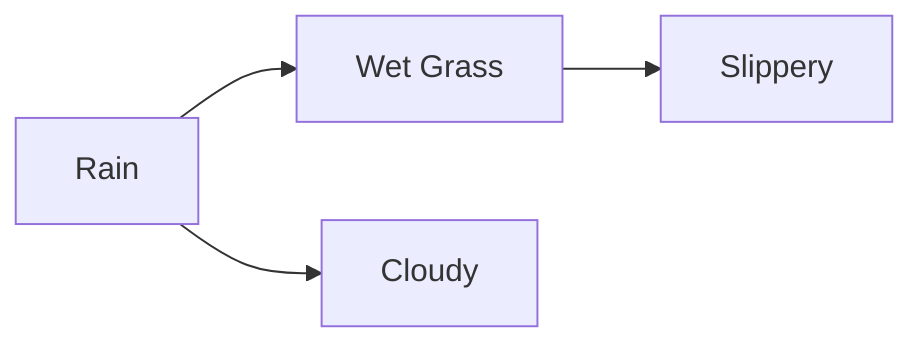

# 11.6 Probabilistic Graphical Models

Tags: #cs/ml #maths/probability #maths/graph-theory #cs/advanced

## Position in the Course
Prerequisites: [[11.5 Statistical Learning Theory]], [[8.3 Bayes Theorem]], [[6.7 Graph Theory Basics]]

Mastery threshold: 90% overall, 100% on New Words.

> [!tip] How to study this note
> PGMs represent probability distributions over many variables using graphs. Nodes = random variables. Edges = dependencies. Two main types: Bayesian networks (directed acyclic graphs) and Markov random fields (undirected). Key tasks: inference (compute P(query | evidence)) and learning (estimate parameters from data). Practise constructing factorisations from graph structure — the factorisation is the core of what makes PGMs tractable.

## Introduction

**Probabilistic graphical models** (PGMs) combine probability theory with graph theory to represent and reason about uncertain systems with many variables. The central idea: exploit **conditional independence** structure to make inference tractable.

From [[11.5 Statistical Learning Theory]], you understand the challenge of learning from data and the need to manage model complexity. From [[8.3 Bayes Theorem]], you know how to update beliefs given evidence. From [[6.7 Graph Theory Basics]], you understand graph structure — directed vs undirected, paths, cycles.

Without structure, the joint distribution over n binary variables requires storing 2ⁿ−1 probabilities. With PGM structure, we factorise the joint into local pieces — each depending on only a few variables — reducing complexity from exponential to linear or polynomial.

The two main families:

- **Bayesian networks (BNs)**: directed acyclic graphs (DAGs). Edge A→B means A causally influences B. Each node has a conditional probability table (CPT) given its parents.
- **Markov random fields (MRFs)**: undirected graphs. Edges represent symmetric dependencies (correlation, constraint). Used in computer vision, spatial statistics, and statistical physics.

Key tasks:
- **Inference**: given evidence (observed variables), compute posterior distribution of hidden variables.
- **Learning**: estimate the CPTs or potential functions from data.
- **Structure learning**: discover the graph structure itself from data.

## New Words

- **[[Bayesian network]]** — a DAG where nodes are random variables and edges represent direct conditional dependencies; the joint distribution factorises as ∏P(variable | parents).
- **[[Markov random field (MRF)]]** — an undirected graph where nodes are random variables and edges represent symmetric dependencies; the joint distribution factorises as (1/Z)∏ψ_clique(clique).
- **[[conditional independence]]** — X ⟂ Y | Z if P(X,Y|Z) = P(X|Z)P(Y|Z), meaning Z separates X from Y.
- **[[d-separation]]** — a graphical criterion to determine conditional independence in Bayesian networks based on path blocking.
- **[[variable elimination]]** — exact inference algorithm that sums out variables one at a time, exploiting factorisation.
- **[[belief propagation]]** — message-passing algorithm for exact inference in tree-structured graphs and approximate inference in loopy graphs.
- **[[treewidth]]** — a measure of how "tree-like" a graph is; inference complexity grows exponentially with treewidth.

> [!important] You pass this topic only when you can define all seven terms without looking.

## Breadcrumbs

### Breadcrumb 1: Bayesian Networks and Factorisation

**Builds on:** [[8.3 Bayes Theorem]] (conditioning, marginalisation), [[6.7 Graph Theory Basics]] (DAGs, paths)

A **Bayesian network** represents the joint distribution as a product of conditional probabilities:

```
P(X₁, X₂, ..., Xₙ) = ∏_{i=1}^{n} P(Xᵢ | Parents(Xᵢ))
```

Each node's CPT specifies P(Xᵢ | parents). The graph must be a DAG.



Factorisation: P(R,W,S,C) = P(R)P(C|R)P(W|R)P(S|W)

#### Chunked Example — Computing with Factorisation

Question: Network R→W→S. P(R)=0.3, P(W|R)=0.9, P(W|¬R)=0.2, P(S|W)=0.7, P(S|¬W)=0.01. Compute P(S|R).

Step 1: P(S|R) = ∑_W P(S|W) P(W|R).

Step 2: P(W|R) = 0.9, P(¬W|R) = 0.1. P(S|W) = 0.7, P(S|¬W) = 0.01.

Step 3: P(S|R) = 0.9 × 0.7 + 0.1 × 0.01 = 0.63 + 0.001 = 0.631.

Answer: **P(Slippery | Rain) = 0.631. The factorisation avoids enumerating all 2³ = 8 states.**

### Breadcrumb 2: d-Separation and Conditional Independence

**Builds on:** Breadcrumb 1, [[6.7 Graph Theory Basics]] (paths, connectivity)

**d-separation** determines whether X ⟂ Y | Z in a Bayesian network. A path between X and Y is blocked by Z if:
- **Chain** X→...→Y: middle node is in Z (or any node on the path).
- **Fork** X←...→Y: middle node is in Z.
- **V-structure** X→...←Y: middle node is NOT in Z and neither are its descendants.

```mermaid
flowchart LR
    subgraph Chain
        A1[A] --> B1[B] --> C1[C]
    end
    subgraph Fork
        A2[A] <-- B2[B] --> C2[C]
    end
    subgraph VStructure
        A3[A] --> B3[B] <-- C3[C]
    end
```

#### Chunked Example — V-Structure Explaining Away

Question: A→B←C. Are A and C independent? Are they independent given B?

Step 1: Path A→B←C. No conditioning: B is a v-structure, not conditioned → path blocked. A ⟂ C.

Step 2: Condition on B: v-structure is ACTIVE (B is observed). Path unblocked. A ̸⟂ C | B.

Step 3: Intuition: "Explaining away" — if B is true, learning that A is true makes C less likely.

Answer: **A ⟂ C (unconditionally), but A ̸⟂ C | B (v-structure activation).**

### Breadcrumb 3: Markov Random Fields and Undirected Models

**Builds on:** Breadcrumb 1, [[6.7 Graph Theory Basics]] (cliques, graph separation)

In an **MRF**, the joint distribution factorises over cliques (maximal fully connected subgraphs):

```
P(X) = (1/Z) ∏_{cliques c} ψ_c(X_c)
```

Where ψ_c ≥ 0 are potential functions (not probabilities — they are not normalised), and Z = ∑_X ∏ψ_c(X_c) is the partition function.

Conditional independence: X ⟂ Y | Z if Z separates X and Y in the graph (removing Z disconnects X from Y).

#### Chunked Example — MRF for Image Denoising

Question: Each pixel Xᵢ has observed noisy value Yᵢ. MRF: edges between neighbouring pixels. What is the model?

Step 1: Each pixel Xᵢ connected to neighbours Xⱼ (smoothness prior). Each Xᵢ connected to observation Yᵢ.

Step 2: Potential functions: ψ_ij(Xᵢ, Xⱼ) = exp(−β[Xᵢ ≠ Xⱼ]) — penalise adjacent pixels differing.

Step 3: Unary potential: ψ_i(Xᵢ, Yᵢ) = exp(−γ(Xᵢ − Yᵢ)²) — prefer Xᵢ close to observed Yᵢ.

Step 4: Inference: find most likely X given Y. Solved via graph cuts or BP.

Answer: **MRF models image denoising as a trade-off between data fidelity and smoothness.**

## Why This Works

The graph structure encodes factorisation, and factorisation enables tractable computation:

```
Without structure: P(X₁...Xₙ) requires storing 2ⁿ−1 numbers
With BN structure: P(X₁...Xₙ) = ∏P(Xᵢ|Parents) requires ∑2^{|Parents|+1} numbers
```

If each node has at most k parents, the BN requires O(n·2ᵏ) numbers — linear in n.

For inference, **variable elimination** exploits factorisation to avoid enumerating the full joint. The complexity depends on **treewidth** — the size of the largest clique in a triangulated version of the graph. Tree-structured graphs (treewidth = 1) are tractable; high-treewidth graphs may be intractable.

## Worked Examples

### Example 1 — Variable Elimination with Concrete CPTs

Question: Given Bayesian network A→B→C→D with all binary variables. CPTs: P(A=1)=0.4; P(B=1|A=1)=0.7, P(B=1|A=0)=0.2; P(C=1|B=1)=0.8, P(C=1|B=0)=0.3; P(D=1|C=1)=0.9, P(D=1|C=0)=0.1. Compute P(D=1) by eliminating variables in order A, C, B.

Step 1: Factorisation: P(D=1) = ∑_A ∑_B ∑_C P(A)P(B|A)P(C|B)P(D=1|C).

Step 2: Eliminate A: ψ₁(B) = ∑_A P(A)P(B|A). P(B=1) = 0.4×0.7 + 0.6×0.2 = 0.40. P(B=0) = 0.60.

Step 3: Eliminate C: ψ₂(D=1,B) = ∑_C P(D=1|C)P(C|B). At B=1: 0.9×0.8 + 0.1×0.2 = 0.74. At B=0: 0.9×0.3 + 0.1×0.7 = 0.34.

Step 4: Eliminate B: P(D=1) = ∑_B ψ₁(B)ψ₂(D=1,B) = 0.40×0.74 + 0.60×0.34 = 0.296 + 0.204 = 0.50.

Answer: **P(D=1) = 0.50. Three intermediate factors reduced the computation from 2⁴=16 states to O(k²) per elimination.**

### Example 2 — Forward Algorithm for HMM

Question: HMM with 2 hidden states {S₁, S₂} and 2 observations {O₁, O₂}. Transition: P(Z₂=S₁|Z₁=S₁)=0.7, P(Z₂=S₂|Z₁=S₁)=0.3, P(Z₂=S₁|Z₁=S₂)=0.4, P(Z₂=S₂|Z₁=S₂)=0.6. Emission: P(O₁|S₁)=0.8, P(O₂|S₁)=0.2, P(O₁|S₂)=0.3, P(O₂|S₂)=0.7. Initial: P(Z₁=S₁)=0.5, P(Z₁=S₂)=0.5. Observations: [O₁, O₂]. Compute α₁ and α₂.

Step 1: α₁(S₁) = P(Z₁=S₁)P(O₁|S₁) = 0.5 × 0.8 = 0.40. α₁(S₂) = 0.5 × 0.3 = 0.15.

Step 2: α₂(S₁) = [α₁(S₁)P(Z₂=S₁|Z₁=S₁) + α₁(S₂)P(Z₂=S₁|Z₁=S₂)] × P(O₂|S₁) = [0.40×0.7 + 0.15×0.4] × 0.2 = [0.28 + 0.06] × 0.2 = 0.068.

Step 3: α₂(S₂) = [α₁(S₁)P(Z₂=S₂|Z₁=S₁) + α₁(S₂)P(Z₂=S₂|Z₁=S₂)] × P(O₂|S₂) = [0.40×0.3 + 0.15×0.6] × 0.7 = [0.12 + 0.09] × 0.7 = 0.147.

Step 4: Likelihood of observations: P(O₁,O₂) = α₂(S₁) + α₂(S₂) = 0.068 + 0.147 = 0.215.

Answer: **α₁ = [0.40, 0.15], α₂ = [0.068, 0.147]. P(O₁,O₂) = 0.215.**

### Example 3 — d-Separation in the Alarm Network

Question: Given Bayesian network with Burglary(B)→Alarm(A)←Earthquake(E), Alarm(A)→JohnCalls(J), Alarm(A)→MaryCalls(M). Determine whether each pair is d-separated given the evidence set:

(a) B ⟂ E | ∅   (b) B ⟂ E | A   (c) B ⟂ J | A   (d) B ⟂ M | {A, J}

Step 1: (a) Path B→A←E is a v-structure with A not conditioned. V-structure blocks when middle node not in evidence. B ⟂ E unconditionally. ✓

Step 2: (b) Same path B→A←E but now A is conditioned. V-structure becomes active. B ̸⟂ E | A (explaining away). ✗

Step 3: (c) Path B→A→J is a chain with A in evidence. Chain is blocked when middle node is observed. B ⟂ J | A. ✓

Step 4: (d) Path B→A→M is a chain with A in evidence (blocked). The evidence J does not affect this path. B ⟂ M | A, J. ✓

Answer: **(a) Yes. (b) No. (c) Yes. (d) Yes.**

### Example 4 — MRF Partition Function and Marginals

Question: MRF with two binary variables X₁, X₂ connected by a single edge. Potential function ψ(x₁,x₂)=[[2,1],[1,3]] (ψ(0,0)=2, ψ(0,1)=1, ψ(1,0)=1, ψ(1,1)=3). No unary potentials. Compute the partition function Z and the marginal P(X₁=1).

Step 1: Z = ∑_{x₁,x₂} ψ(x₁,x₂) = ψ(0,0) + ψ(0,1) + ψ(1,0) + ψ(1,1) = 2 + 1 + 1 + 3 = 7.

Step 2: P(X₁=1) = ∑_{x₂} ψ(1,x₂) / Z = (ψ(1,0) + ψ(1,1)) / 7 = (1 + 3) / 7 = 4/7.

Step 3: P(X₂=1) = (ψ(0,1) + ψ(1,1)) / 7 = (1 + 3) / 7 = 4/7.

Step 4: P(X₁=1,X₂=1) = ψ(1,1)/7 = 3/7. Check independence: P(X₁=1)P(X₂=1) = (4/7)² = 16/49 ≠ 3/7 = 21/49. Not independent.

Answer: **Z = 7. P(X₁=1) = 4/7 ≈ 0.571. X₁ and X₂ are dependent.**

## Common Mistakes

> [!failure] Mistake pattern: Confusing marginalisation with conditioning
> P(A) = ∑_B P(A,B) — sum over B. P(A|B) = P(A,B)/P(B) — conditioning. Marginalisation sums out a variable; conditioning restricts to a specific value.

> [!failure] Mistake pattern: Misreading v-structures
> A→B←C: A and C are independent UNCONDITIONALLY, but dependent GIVEN B (explaining away). This is the opposite of chain/fork patterns.

> [!failure] Mistake pattern: Assuming BP always converges on loopy graphs
> Loopy BP may not converge. Use damping, convergent variants (truncated BP, tree-reweighted BP), or alternative inference (variational, sampling).

> [!failure] Mistake pattern: Confusing BN and MRF expressiveness
> Not every distribution can be represented compactly by both. Some distributions are more natural as BNs (causal), others as MRFs (spatial/symmetric).

## Where This Shows Up in CS

### Machine Learning
```text
- HMMs: speech recognition, POS tagging, gesture recognition
- CRFs: NER, image segmentation, information extraction
- LDA: topic modelling (latent Dirichlet allocation)
- Deep learning: attention mechanisms as latent variable inference
- Variational autoencoders: amortised variational inference
```

### Computer Vision
```text
- Image denoising/deblurring: MRF over pixels
- Stereo matching: MRF with disparity labels
- Semantic segmentation: CRF over pixel labels
- Optical flow: MRF over displacement vectors
- All solved with graph cuts or loopy BP
```

### Error-Correcting Codes
```text
- LDPC codes: factor graph + BP decoding
- Turbo codes: iterative decoding via BP
- Tanner graphs: represent code structure as bipartite graph
```

### Bioinformatics
```text
- Gene regulatory networks: Bayesian network structure learning
- Protein structure prediction: MRF over residue contacts
- Phylogenetics: tree-structured models of evolution
```

## Checkpoint Questions

1. What is the difference between a Bayesian network and a Markov random field?
2. What does d-separation determine and how do chain/fork/v-structure differ?
3. How does variable elimination work and what does its complexity depend on?
4. What is belief propagation and when does it give exact results?
5. What is the forward-backward algorithm in HMMs?
6. When does loopy BP fail and how can it be stabilised?
7. What is a v-structure and what are its conditional independence properties?
8. What is treewidth and why does it matter for inference?
9. How are BN parameters learned from complete data?
10. Why is parameter learning harder in MRFs than in BNs?

## Mini-Quiz

1. Bayesian network uses (directed / undirected) edges.
2. MRF uses (directed / undirected) edges.
3. Chain A→B→C: A ⟂ C | B? (T / F).
4. V-structure A→B←C: A ⟂ C unconditionally? (T / F).
5. Variable elimination complexity depends on \_\_\_.
6. HMM inference uses (forward / backward / both) algorithms.
7. Loopy BP may not \_\_\_ on graphs with cycles.
8. True or false: CRF is a discriminative PGM.
9. Belief propagation on trees gives (exact / approximate) marginals.
10. Explaining away occurs in a (chain / v-structure / fork).
11. The partition function Z appears in (BNs / MRFs / both).
12. Treewidth of a tree-structured graph = \_\_\_.

## Pass Gate

You may move to [[11.7 Advanced Optimisation for ML]] only when you can:

- define every term in [[#New Words]]
- factorise a Bayesian network given its graph structure
- determine conditional independence via d-separation
- explain variable elimination and its complexity
- run belief propagation on a simple tree
- answer at least 11 out of 12 mini-quiz questions correctly
- complete [[11.6 Probabilistic Graphical Models - Mastery Test]]

## Related Notes

Backward links: [[11.5 Statistical Learning Theory]], [[8.3 Bayes Theorem]], [[6.7 Graph Theory Basics]]

Assessment links: [[11.6 Probabilistic Graphical Models - Worked Examples]], [[11.6 Probabilistic Graphical Models - Practice Questions]], [[11.6 Probabilistic Graphical Models - Mastery Test]], [[11.6 Probabilistic Graphical Models - Answers]]
