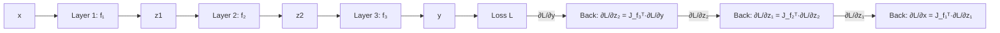

# 11.8 Multivariable Calculus for Deep Learning

Tags: #cs/ml #maths/calculus #cs/deep-learning #cs/advanced

## Position in the Course
Prerequisites: [[9.8 Multivariable Functions]], [[9.3 Differentiation Rules]], [[7.3 Matrix Multiplication]]

Mastery threshold: 90% overall, 100% on New Words.

> [!tip] How to study this note
> Deep learning requires Jacobians (vector-valued function derivatives), Hessians (curvature), and the chain rule in matrix form. Backpropagation computes gradients via the chain rule through hundreds of layers. The key: understand how to differentiate with respect to vectors and matrices. Practise deriving gradients of common operations (linear layers, softmax, MSE loss).

## Introduction

**Multivariable calculus for deep learning** extends single-variable differentiation to the vector and matrix parameters that appear in neural networks. Every neural network training loop computes gradients — this is the mathematics behind it.

From [[9.8 Multivariable Functions]], you understand functions of multiple variables and partial derivatives. From [[9.3 Differentiation Rules]], you know the product rule, chain rule, and quotient rule for scalar functions. From [[7.3 Matrix Multiplication]], you can work with matrix operations.

Key objects:
- **Jacobian matrix** J_f: for f: ℝⁿ → ℝᵐ, J_f ∈ ℝ^{m×n} where J_{ij} = ∂f_i/∂x_j.
- **Hessian matrix** H: for scalar f: ℝⁿ → ℝ, H ∈ ℝ^{n×n} where H_{ij} = ∂²f/∂x_i∂x_j.
- **Gradient**: the vector of first partial derivatives of a scalar function.
- **Backpropagation**: efficient application of the chain rule through a computational graph.

The fundamental operation in deep learning: compute ∂L/∂w for every parameter w, where L is the loss (scalar) and the forward pass is a composition of differentiable functions.

## New Words

- **[[Jacobian matrix]]** — J_f ∈ ℝ^{m×n} where J_{ij} = ∂f_i/∂x_j for a function f: ℝⁿ → ℝᵐ.
- **[[Hessian matrix]]** — H ∈ ℝ^{n×n} where H_{ij} = ∂²f/∂x_i∂x_j for a scalar function f: ℝⁿ → ℝ.
- **[[matrix calculus]]** — rules for differentiating with respect to vectors and matrices using Kronecker products and vectorisation.
- **[[backpropagation]]** — reverse-mode automatic differentiation; efficient chain rule through sequential functions.
- **[[automatic differentiation]]** — computing derivatives by tracking operations in a computational graph; forward mode (tangent) and reverse mode (adjoint).

> [!important] You pass this topic only when you can define all five terms without looking.

## Breadcrumbs

### Breadcrumb 1: Jacobian of Common Neural Network Operations

**Builds on:** [[9.8 Multivariable Functions]] (partial derivatives), [[7.3 Matrix Multiplication]] (matrix-vector products)

The **Jacobian** of a function f: ℝⁿ → ℝᵐ is the m × n matrix of all first-order partial derivatives:

```
J_f = [∂f_i/∂x_j]  for i=1..m, j=1..n
```

#### Chunked Example — Jacobian of a Linear Layer

Question: f(x) = Wx + b where W ∈ ℝ^{3×2}, x ∈ ℝ². What is J_f?

Step 1: f₁ = W₁₁x₁ + W₁₂x₂. ∂f₁/∂x₁ = W₁₁, ∂f₁/∂x₂ = W₁₂.

Step 2: For each output i: ∂f_i/∂x_j = W_{ij}.

Step 3: J_f = W ∈ ℝ^{3×2}.

Answer: **Jacobian of a linear layer is the weight matrix W.**

#### Chunked Example — Jacobian of Elementwise Operations

Question: f(x) = ReLU(x) (elementwise max(0, xᵢ)). What is J_f?

Step 1: f(x) = [ReLU(x₁), ReLU(x₂), ..., ReLU(xₙ)]ᵀ.

Step 2: ∂ReLU(xᵢ)/∂xⱼ = 1 if i=j and xᵢ > 0; = 0 otherwise.

Step 3: J_f = diag(1_{x>0}) — a diagonal matrix with 1s where xᵢ > 0.

Answer: **Jacobian of ReLU = diag(1_{x>0}).**

### Breadcrumb 2: Chain Rule in Matrix Form

**Builds on:** Breadcrumb 1, [[9.3 Differentiation Rules]] (chain rule)

For composition h(x) = g(f(x)) with f: ℝⁿ → ℝᵐ and g: ℝᵐ → ℝᵖ:

```
J_h(x) = J_g(f(x)) · J_f(x)   (p × n matrix = p × m times m × n)
```

This is exactly backpropagation: multiply Jacobians from the output back to the input.



#### Chunked Example — Three-Layer Network Gradient

Question: f: ℝ² → ℝ³ (linear), g: ℝ³ → ℝ (MSE loss). Compute J_{g∘f}.

Step 1: J_f ∈ ℝ^{3×2} (the weight matrix W). J_g ∈ ℝ^{1×3} (gradient row vector).

Step 2: J_{g∘f}(x) = J_g(f(x)) · J_f(x) ∈ ℝ^{1×2}.

Step 3: This row vector is ∇_{x}(g(f(x))), the gradient with respect to input x.

Answer: **J_{g∘f} = J_g · J_f. Backpropagation multiplies Jacobians from output to input.**

## Why This Works

Backpropagation computes gradients in O(n) time for n parameters, while naive differentiation (forward mode) would require O(n²). The key insight: the function L: ℝⁿ → ℝ is scalar-valued (loss). Reverse-mode AD computes the gradient in one forward pass and one backward pass — regardless of n.

```
Forward mode: 1 pass per input dimension → O(n²) for n parameters
Reverse mode: 1 forward + 1 backward pass → O(n) for n parameters
```

This efficiency is why training networks with millions of parameters is feasible. Each parameter gets its gradient computed in O(1) amortised time.

## Worked Examples

### Example 1 — Gradient of MSE Loss

Question: L(w) = ½||Wx − y||². Compute ∇_w L.

Step 1: Let z = Wx − y. Then L = ½zᵀz.

Step 2: ∂L/∂z = zᵀ ∈ ℝ^{1×m}. ∂z/∂W: treating W as a matrix, the derivative of z = Wx wrt W_{ij} is xⱼ in position (i, j).

Step 3: ∂L/∂W_{ij} = z_i · xⱼ. In matrix form: ∇_W L = (Wx − y)xᵀ.

Answer: **∇_W L = (Wx − y)xᵀ, an outer product of error and input.**

### Example 2 — Hessian of a Neural Network

Question: Why is the full Hessian infeasible for deep networks?

Step 1: For a scalar function f: ℝⁿ → ℝ, the Hessian H ∈ ℝ^{n×n} has n² entries.

Step 2: A network with n = 10⁶ parameters → H has 10¹² entries = 4 TB (float32).

Step 3: Solution: Hessian-vector products Hv can be computed in O(n) time via Pearlmutter's trick (forward-over-reverse AD).

Step 4: Used in KFAC (Kronecker-factored curvature), L-BFGS, and curvature estimation.

Answer: **Full Hessian is n×n. Hessian-vector products cost O(n) — never store the full matrix.**

### Example 3 — Jacobian of Softmax Cross-Entropy

Question: Compute ∇_z L where L = −log(softmax(z)_y) (cross-entropy loss with softmax).

Step 1: Softmax: f_i(z) = e^{z_i} / ∑_j e^{z_j}. Cross-entropy: L = −log(f_y(z)).

Step 2: ∂L/∂z_i = f_i − 1_{i=y}. Derivation uses the softmax Jacobian: ∂f_i/∂z_j = f_i(δ_{ij} − f_j).

Step 3: The gradient is simply: ∇_z L = f − e_y (predicted distribution minus one-hot true label).

Answer: **∇_z L = softmax(z) − one_hot(y) — the simplest and most elegant gradient in deep learning.**

### Example 4 — Automatic Differentiation in Practice

Question: Compute dy/dx where y = sin(x²).

Step 1: Forward: t₁ = x, t₂ = t₁², t₃ = sin(t₂), y = t₃.

Step 2: Forward mode: ṫ₁ = ẋ, ṫ₂ = 2t₁ṫ₁, ṫ₃ = cos(t₂)ṫ₂, ẏ = ṫ₃. Set ẋ = 1 → dy/dx computed.

Step 3: Reverse mode: ȳ = ∂y/∂y = 1. t̄₃ = ȳ·∂y/∂t₃ = 1. t̄₂ = t̄₃·cos(t₂) = cos(x²). t̄₁ = t̄₂·2t₁ = 2x·cos(x²).

Step 4: Reverse mode needs 1 forward + 1 backward pass for ALL derivatives — regardless of input dimension.

Answer: **Forward: O(n) for n inputs. Reverse (backprop): O(1) pass for any number of inputs.**

## Common Mistakes

> [!failure] Mistake pattern: Confusing Jacobian dimensions
> For f: ℝⁿ → ℝᵐ, Jacobian ∈ ℝ^{m×n}. Rows = outputs, columns = inputs. NOT the transpose (which is n×m).

> [!failure] Mistake pattern: Forgetting chain rule order
> J_{g∘f} = J_g(f(x)) · J_f(x). Matrix multiplication order: function composition = right-to-left. The last function in composition → leftmost Jacobian.

> [!failure] Mistake pattern: Computing full Hessian when HVP suffices
> Never compute the full Hessian for deep networks. Hessian-vector products via two autodiff calls are O(n) and sufficient for optimisation and curvature estimation.

## Where This Shows Up in CS

### Backpropagation in Practice
```python
# PyTorch autograd
x = torch.randn(3, requires_grad=True)
W = torch.randn(2, 3, requires_grad=True)
z = W @ x
loss = z.sum()
loss.backward()  # computes all gradients in O(n)
print(W.grad)    # ∂loss/∂W
```

### Advanced Architectures
```text
- Transformers: Jacobian of self-attention (O(n²) attention matrix)
- Residual networks: Jacobian of identity + F(x) = I + ∇F
- Normalisation: batch norm Jacobian stabilises training
- Meta-learning: gradient through gradient (second-order)
```

### Optimisation
```text
- KFAC: Kronecker-factored Hessian approximation
- Natural gradient: precondition with Fisher information matrix
- Gradient clipping: ||∇L|| > threshold → rescale
- Lookahead: maintains fast/slow parameter copies
```

## Checkpoint Questions

1. What is the Jacobian matrix and what are its dimensions for f: ℝⁿ → ℝᵐ?
2. How does the chain rule work in matrix form?
3. What is backpropagation and why is it efficient?
4. Why is the Hessian expensive to compute for deep networks?
5. What is a Hessian-vector product and how is it computed?
6. How does automatic differentiation work in forward and reverse modes?
7. What is the gradient of softmax cross-entropy loss?
8. What is the Jacobian of a ReLU activation?
9. How does reverse-mode AD scale with the number of parameters?
10. What is the Jacobian of a linear layer f(x) = Wx + b?

## Mini-Quiz

1. f: ℝⁿ → ℝᵐ → J_f ∈ ℝ^{\_\_\_}.
2. Linear layer f(x) = Wx + b: J_f = \_\_\_.
3. Softmax gradient: ∇_z L(softmax, cross-entropy) = f − \_\_\_.
4. ReLU Jacobian = diag(\_\_\_).
5. True or false: Backpropagation is the chain rule applied efficiently.
6. Full Hessian of 10⁶ params has \_\_\_ entries.
7. Hessian-vector products cost O(\_\_\_).
8. Reverse mode AD needs \_\_\_ forward pass(es) and one backward pass.
9. True or false: Jacobian rows correspond to outputs.
10. MSE loss: ∇_W ||Wx − y||² = \_\_\_.
11. Forward mode AD: n inputs requires (1 / n) forward passes.
12. The gradient of cross-entropy + softmax is (exact / approximate).

## Pass Gate

You may move to [[11.9 Linear Algebra for Representation Learning]] only when you can:

- define every term in [[#New Words]]
- compute Jacobians of common operations (linear, ReLU, softmax)
- apply the chain rule in matrix form
- explain why Hessian storage is infeasible but HVPs are feasible
- differentiate forward and reverse mode autodiff
- answer at least 11 out of 12 mini-quiz questions correctly
- complete [[11.8 Multivariable Calculus for Deep Learning - Mastery Test]]

## Related Notes

Backward links: [[9.8 Multivariable Functions]], [[9.3 Differentiation Rules]], [[7.3 Matrix Multiplication]]

Assessment links: [[11.8 Multivariable Calculus for Deep Learning - Worked Examples]], [[11.8 Multivariable Calculus for Deep Learning - Practice Questions]], [[11.8 Multivariable Calculus for Deep Learning - Mastery Test]], [[11.8 Multivariable Calculus for Deep Learning - Answers]]
